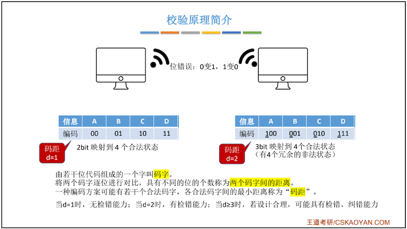
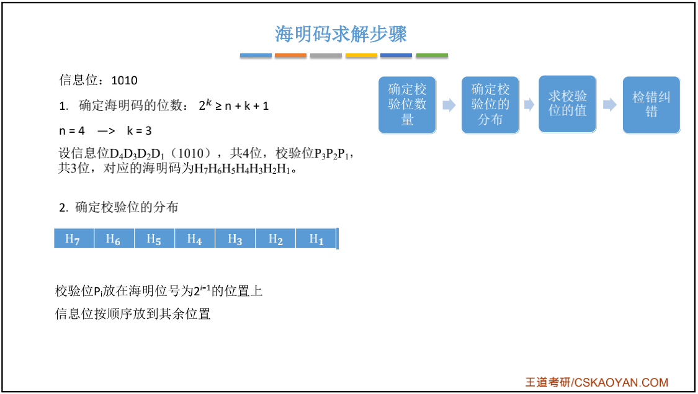

# 第一章：计算机系统概述

## 1.1 硬件的发展

## 1.2 计算机硬件基本组成

### 冯.诺依曼计算机

> 存储程序
>
> 以运算器为核心

### 现代计算机

> 以存储器为核心
>
> CPU = 运算器 + 控制器

> 主存：内存
>
> 辅存：硬盘

## 1.3 各硬件工作原理

### 主存储器（内存）

> 宽带100Mbps = 100/8 MBps
>
> 
>
> MAR / MDR 理论上属于主存，但现在计算机通常把他们集成到CPU中。

### 运算器

### 控制器

### 计算机工作过程

## 1.4 计算机层级结构

## 1.5 计算机性能指标

### 主存储器（内存）的性能指标

* MAR位数反映存储单元个数，MAR长度 = PC的长度，MDR位数 = 存储字长

    * 如：MAR为10位。210 = 1024 = 1K

* MDR位数 = 存储字长bit = 每个存储单元的大小

* 总容量 = 存储单元个数 * 存储字长bit（1Byte = 8bit） = 存储单元个数 * 存储字长 / 8  Byte

    * Eg: MAR为32位，MDR为8位

        总容量 = 232 * 8 bit = 232 B = 22 GB = 4GB

### CPU的性能指标*

> 电脑性能参数：i5 - 9400F - 2.9GHz - 6核6线程 
>
> * CLK：Clock Cycle 时钟周期
>
> * CPU主频（时钟频率）：CPU内数字脉冲信号振荡的频率。（单位：赫兹 Hz）
>     * 3GHz = 3*109 Hz，而不是230
>
> * CPU时钟周期： 与『CPU主频』互为倒数。（单位：微秒，纳秒）
>     * eg：10Hz = 10个脉冲信号 / s
>
> * CPI (Clock cycle Per Instruction):执行一条指令所需的时钟周期数。
>
>     * 执行一条指令的耗时 = CPI* CPU时钟周期
>
>     * CPU执行时间（整个程序耗时）= CPU时钟周期数 / 主频 = ( 指令条数 * CPI ) / 主频
>
>         * 例题：某CPU主频为1000Hz，某程序包含100条指令，平均来看指令的CPI=3，该程序在该CPU上执行需要多久？
>
>             解：CPU时钟周期 = 1 / 1000
>
>             ​		总时间 = 100 * 3 * 1/1000 = 0.3s
>
> * IPS (Instruction Per Second)：每秒执行多少条指令。
>     IPS = 主频 / 平均CPI。
>
> * FLOPS (Float-point Operate Per Second)：每秒执行多少次浮点运算
>
>     * KFLOPS、MFLOPS、GFLOPS、TFLOPS
>         这里为数量单位：K=Kilo=千=103、M=Million=百万=106、G=Giga=十亿=109、T=Tera=万亿=1012
>
>         

### 系统整体性能指标

> 数据通路带宽：数据总线一次能传输的数据位数。
>
> 吞吐量：系统单位时间内处理请求的数量。
>
> 响应时间：从用户向计算机发送一个请求，到系统对该请求做出响应并获得结果的等待时间。（包括：CPU时间 与等待时间，存储器访问时间、I/O操作时间等）

# 第二章：数据的运算与表示

问：数据如何在计算机中表示？ 

问：运算器如何实现数据的算数、逻辑运算？

## 2.1 进位计数制

### [《进制转换》](进制转换.md)

> 练习：
>
> 二进制 101.1
>
> 八进制 5.4

## 2.2 数字的编码 - BCD码（408大纲已删除）

**BCD ：Binary-Coded Decimal，用二进制编码的十进制**：用4位`二进制数`来表示1位`十进制数`中的0~9这10个数码。

> 8421 有权码：xxxx 每一位分别代表 8 4 2 1
>
> 余3码 无权码
>
> 2421 改变权值  xxxx 每一位分别表示 2 4 2 1

## 2.3 字符与字符串

问：1.英文字符在计算机内的表示？

问：2.中文字符在计算机内的表示？

问：3.字符串的存储？

### 2.3.1 英文字符 - ASCII码

​		[ASCII](https://zh.wikipedia.org/wiki/ASCII)编码：**American Standard Code for information Interchange（美国信息交换标准码）**，是基于**拉丁字母**的一套电脑[编码](https://baike.baidu.com/item/编码/80092)系统，主要用于显示现代 *英语*，而其扩展版本[EASCII](https://zh.wikipedia.org/wiki/EASCII)则可以部分支持其他[西欧](https://zh.wikipedia.org/wiki/西欧)[语言](https://zh.wikipedia.org/wiki/语言)，并等同于国际标准[ISO/IEC 646](https://zh.wikipedia.org/wiki/ISO/IEC_646)。ASCII第一次以规范标准的类型发表是在1967年，最后一次更新则是在1986年，到目前为止共定义了128个字符 。

​		ASCII码是7位编码，它的二进制取值范围：`0000000 ~ 1111111` ，对应十六进制为：`00h ~ 7Fh`，一共规定了128个字符的编码，ASCII码虽然是7位，但存储依旧是8位存储。只占用了一个字节的后面7位，最前面的一位统一规定为`0`。

​		标准的ASCII至今为止共定义了128个字符，其中33个不可显示字符，95个可现实字符。

### 2.3.2 汉字的表示与编码

#### 中文字符集介绍

**GB2312–80编码**：1980年发布，1981年5月1日实施的简体中文汉字编码国家标准《信息交换用汉字编码字符集–基本集》即**国标码**。GB2312对汉字采用双字节编码，收录7445个图形字符，其中包括6763个汉字。

**BIG5编码**：台湾地区繁体中文标准字符集，采用双字节编码，共收录13053个中文字，1984年实施。

**GBK编码**：1995年12月发布的汉字编码国家标准，是对GB2312编码的扩充，对汉字采用双字节编码。GBK字符集共收录21003个汉字，包含国家标准GB13000-1中的全部中日韩汉字，和BIG5编码中的所有汉字。

**GB18030编码**：2000年3月17日发布的汉字编码国家标准，是对GBK编码的扩充，覆盖中文、日文、朝鲜语和中国少数民族文字，其中收录27484个汉字。GB18030字符集采用单字节、双字节和四字节三种方式对字符编码。兼容GBK和GB2312字符集。

**Unicode编码**：国际标准字符集，它将世界各种语言的每个字符定义一个唯一的编码，以满足跨语言、跨平台的文本信息转换。

#### 汉字的表示和编码

参考文档：[汉字编码表示与显示](chrome-extension://cdonnmffkdaoajfknoeeecmchibpmkmg/assets/pdf/web/viewer.html?file=https%3A%2F%2Fd1.amobbs.com%2Fbbs_upload782111%2Ffiles_35%2Fourdev_606868FF22L8.pdf)

汉字编码分为输入码、国标码、区位码、机内码和字形码。

* 输入码（外码）：是用来将汉字输入到计算机中的一组键盘符号。按输入码编码的主要依据，大体可分为顺序码、音码、形码、音形码四类，常用的输入码有拼音码、五笔字型码等，如“保”字，用全拼，输入码为“BAO”，用区位码，输入码为“1703 ”，用五笔字型则为“WKS”。

* 区位码：是国标码的另一种表现形式。在国标GB2312-80中，国标码除了用双七位二进制表示外，还可以表示成区位码的形式。即在国标代码表中，将行号称为区号，列号称为位号，分别有94个区和94个位。区号和位号用十进制表示，不足两位前面补0。这样每个汉字或符号都可用4位十进制表示。区位码因此可以用来作输入码。是汉字输入的基本编码方法之一。如“保”字在二维代码表中处于17区第3位，区位码即为“1703 ”。

* 国标码：我国国家标准局于1981年5月颁布了《信息交换用汉字编码字符集——基本集》，代号为GB2312-80，共对6763个汉字和682个图形字符进行了编码，其编码原则为：汉字用两个**字节**表示，每个字节用七位码（高位为0）。

* 机内码：国标码是汉字信息交换的标准编码，但因其前后字节的最高位为0，与ASCII码发生冲突，如“保”字，国标码为31H和23H，而西文字符“1”和“#”的ASCII也为31H和23H，现假如内存中有两个字节为31H和23H，这到底是一个汉字?还是两个西文字符“1”和“#”于是就出现了二义性，显然，国标码是不可能在计算机内部直接采用的，于是，汉字的机内码采用变形国标码，其变换方法为：将国标码的每个字节都加上128，即将两个字节的最高位由0改1，其余7位不变，如：由上面我们知道，“保”字的国标码为3123H，前字节为00110001B，后字节为00100011B，高位改1为10110001B和10100011B 即为B1A3H，因此，汉字的机内码就是B1A3H。

    显然，汉字机内码的每个字节都大于128，这就解决了与西文字符的ASCII码冲突的问题。

* 字形码：是汉字的输出码，输出汉字时都采用图形方式，无论汉字的笔画多少，每个汉字都可以写在同样大小的方块中。通常用16×16点阵来显示汉字。

##### 区位码与国标码的转换

> 十进制区位码 转 十六进制 
>
> 国标码 = 区位码16 ＋ 2020H
>
> eg：“保”字的国标码为3123H，它是经过下面的转换得到的：1703D -> 1103H -> +2020H -> 3123H。

##### 国标码与机内码的转换

>  机内码 = 国标码 + 8080H
>
>  eg：“保”字的国标码为3123H，转换得到机内码：3123H + 8080H = B1A3H

### 2.3.3 字符串

## 2.4 数据校验

#### 校验原理

[计算机考研中的三种数据检错编码方式小结](https://zhuanlan.zhihu.com/p/21544800)

[数据校验码 - 1.基本原理](https://zhuanlan.zhihu.com/p/147536255)

​		由于元件故障和噪声干扰等因素常常导致计算机在处理信息的过程中出现错误。为了防止信息在传输过程的错误，将信号采用专门的逻辑电路进行编码以检测错误，甚至校正错误。

​		通常的方法是在每个字上添加一些校验位，用来确定字中出现错误的位置。

​		在计算机中有三种常见的检验码，分别是：奇偶校验码，海明校验码，循环冗余码。

**码距**

> 通常把一组编码中任何两个编码之间代码不同的位数称为这两个编码的距离。而码距是指在一组编码中任何两个编码之间最小的距离。

### 2.4.1 奇偶校验码

奇偶校验码的**码距为2**，所以可以**检出1位错或奇数位错，无法检测出偶数位错误，是一种错误检测码，不能定位错误，无纠错能力**。

* 优点：奇偶校验优点也很明显，它很简单，因此可以用硬件来实现，这样可以减少软件的负担。因此，奇偶校验也被广泛的应用着。

* 缺点：奇偶校验的缺点也很明显，首先，它对错误的检测概率大约只有50%。也就是只有一半的错误它能够检测出来。另外，每传输一个字节都要附加一位校验位，对传输效率的影响很大。因此，在高速数据通讯中很少采用奇偶校验。

### 2.4.2 海明校验码 *

[海明码的编码和校验方法](https://www.cnblogs.com/scrutable/p/6052127.html)

题目：计算1010110海明码？

**第一步：确定校验码的位数x**

　　设数据有n位，校验码有k位。则校验码一共有2k种取值方式。其中需要一种取值方式表示数据正确，剩下2k-1种取值方式表示有一位数据出错。因为编码后的二进制串有n+x位，因此x应该满足 `2x-1 ≥ n+x`，使不等式成立的k的最小值就是校验码的位数。在本例中，n=7，解得x=4。

**第二步：确定校验码的位置**

**第三步：求出校验位的值**

**最后：校验**

### 2.4.3 循环冗余码

## 2.5 定点数

### 定点数 VS 浮点数

> 定点数：小数点的位置固定，Eg：996.007 ——常规计数
>
> 浮点数：小数点的位置不固定，Eg：9.96007*102 ——科学计数法

## 定点数的表示

* 定点数
    * 无符号数：
        * 整个机器字长的全部二进制位均为数值位，没有符号位，相当于数的绝对值。
        * 只有无符号整数，而没有无符号小数。
        * n位无符号数表示范围：0 ~ 2n-1
    * 有符号数
        * 有符号数的定点表示
            * 定点整数
            * 定点小数

## 2.6 浮点数

# 第三章：存储系统

## 3.1 存储系统基本概念

## 3.2 主存储器的组成

### 3.2.1 半导体元件的原理

### 3.2.2 存储芯片的基本原理

### 3.2.3 如何实现不同的寻址方式

