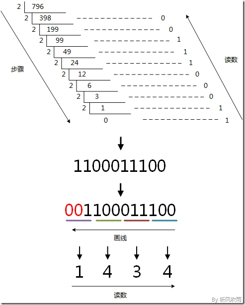
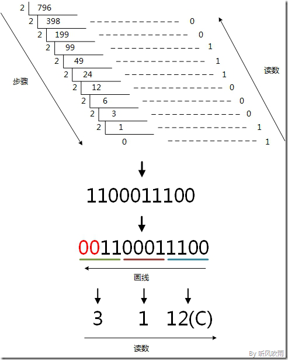
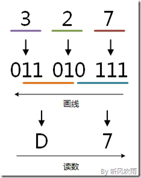
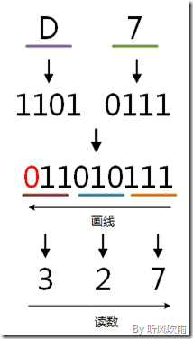

[二、八、十、十六进制转换（图解篇）](https://www.cnblogs.com/gaizai/p/4233780.html)

1. （二、八、十六进制） → （十进制）
   1. [二进制 → 十进制](https://www.cnblogs.com/gaizai/p/4233780.html#_labelConvert11)
   2. [八进制 → 十进制](https://www.cnblogs.com/gaizai/p/4233780.html#_labelConvert12)
   3. [十六进制 → 十进制](https://www.cnblogs.com/gaizai/p/4233780.html#_labelConvert13)
2. （十进制） → （二、八、十六进制）
   1. [十进制 → 二进制](https://www.cnblogs.com/gaizai/p/4233780.html#_labelConvert21)
   2. [十进制 → 八进制](https://www.cnblogs.com/gaizai/p/4233780.html#_labelConvert22)
   3. [十进制 → 十六进制](https://www.cnblogs.com/gaizai/p/4233780.html#_labelConvert23)
3. （二进制） ↔ （八进制）
   1. [二进制 → 八进制](https://www.cnblogs.com/gaizai/p/4233780.html#_labelConvert31)
   2. [八进制 → 二进制](https://www.cnblogs.com/gaizai/p/4233780.html#_labelConvert32)

1. （二进制） ↔ （十六进制）
   1. [二进制 → 十六进制](https://www.cnblogs.com/gaizai/p/4233780.html#_labelConvert33)
   2. [十六进制 → 二进制](https://www.cnblogs.com/gaizai/p/4233780.html#_labelConvert34)
2. （八进制） ↔ （十六进制）
   1. [八进制 → 十六进制](https://www.cnblogs.com/gaizai/p/4233780.html#_labelConvert41)
   2. [十六进制 → 八进制](https://www.cnblogs.com/gaizai/p/4233780.html#_labelConvert42)

### 二进制→十进制

例：将二进制的 (101011)B 转换为十进制的步骤如下：

1. 第0位 1 x 2^0 = 1；

2. 第1位 1 x 2^1 = 2；

3. 第2位 0 x 2^2 = 0；

4. 第3位 1 x 2^3 = 8；

5. 第4位 0 x 2^4 = 0；

6. 第5位 1 x 2^5 = 32；

7. 读数，把结果值相加，1+2+0+8+0+32=43，即 (101011)B = (43)D。

 

### 八进制 → 十进制

例：将八进制的 (53)O 转换为十进制的步骤如下：

1. 第0位 3 x 8^0 = 3；

2. 第1位 5 x 8^1 = 40；

3. 读数，把结果值相加，3+40=43，即(53)O=(43)D。

 

### 十六进制 → 十进制

> 十六进制就是逢16进1，十六进制的16个数为0123456789ABCDEF。

例：将十六进制的 (2B)H 转换为十进制的步骤如下：

1. 第0位 B x 16^0 = 11；

2. 第1位 2 x 16^1 = 32；

3. 读数，把结果值相加，11+32=43，即 (2B)H = (43)D。

### 十进制 → 二进制

例：将十进制的 (43)D 转换为二进制的步骤如下：

1. 将商43除以2，商21余数为1；

2. 将商21除以2，商10余数为1；

3. 将商10除以2，商5余数为0；

4. 将商5除以2，商2余数为1；

5. 将商2除以2，商1余数为0； 

6. 将商1除以2，商0余数为1； 

7. 读数，因为最后一位是经过多次除以2才得到的，因此它是最高位，读数字从最后的余数向前读，101011，即(43)D=(101011)B。

### 十进制 → 八进制

例：将十进制的 (796)D 转换为八进制的步骤如下：

1. 将商796除以8，商99余数为4；

2. 将商99除以8，商12余数为3；

3. 将商12除以8，商1余数为4；

4. 将商1除以8，商0余数为1；

5. 读数，因为最后一位是经过多次除以8才得到的，因此它是最高位，读数字从最后的余数向前读，1434，即 (796)D = (1434)O。

方法2：使用间接法，先将十进制转换成二进制，然后将二进制又转换成八进制；

### 十进制 → 十六进制

例：将十进制的(796)D转换为十六进制的步骤如下：

1. 将商796除以16，商49余数为12，对应十六进制的C；

2. 将商49除以16，商3余数为1；

3. 将商3除以16，商0余数为3；

4. 读数，因为最后一位是经过多次除以16才得到的，因此它是最高位，读数字从最后的余数向前读，31C，即(796)D=(31C)H。

方法2：使用间接法，先将十进制转换成二进制，然后将二进制又转换成十六进制；

### 二进制 → 八进制

例：将二进制的(11010111.0100111)B转换为八进制的步骤如下：

1. 小数点前111 = 7；

2. 010 = 2；

3. 11补全为011，011 = 3；
4. 小数点后010 = 2；

5. 011 = 3；

6. 1补全为100，100 = 4；

7. 读数，读数从高位到低位，即 (11010111.0100111)B = (327.234)O。

### 八进制 → 二进制

例：将八进制的(327)O转换为二进制的步骤如下：

1. 3 = 011；

2. 2 = 010；
3. 7 = 111；

4. 读数，读数从高位到低位，011010111，即(327)O=(11010111)B。

### 二进制 → 十六进制

例：将二进制的(11010111)B转换为十六进制的步骤如下：

1. 0111 = 7；

2. 1101 = D；

3. 读数，读数从高位到低位，即(11010111)B=(D7)H。

### 十六进制 → 二进制

例：将十六进制的(D7)H转换为二进制的步骤如下：

1. D = 1101；

2. 7 = 0111；

3. 读数，读数从高位到低位，即(D7)H=(11010111)B。

### 八进制 → 十六进制

例：将八进制的(327)O转换为十六进制的步骤如下：

1. 3 = 011；

2. 2 = 010；

3. 7 = 111；

4. 0111 = 7；

5. 1101 = D；

6. 读数，读数从高位到低位，D7，即(327)O=(D7)H。

### 十六进制 → 八进制

例：将十六进制的(D7)H转换为八进制的步骤如下：

1. 7 = 0111；

2. D = 1101；

3. 0111 = 7；

4. 010 = 2；

5. 011 = 3；

6. 读数，读数从高位到低位，327，即(D7)H=(327)O。

