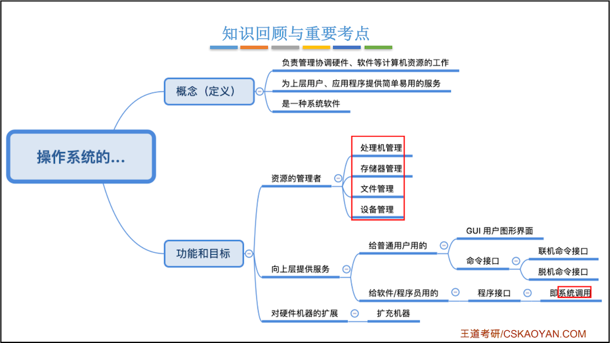
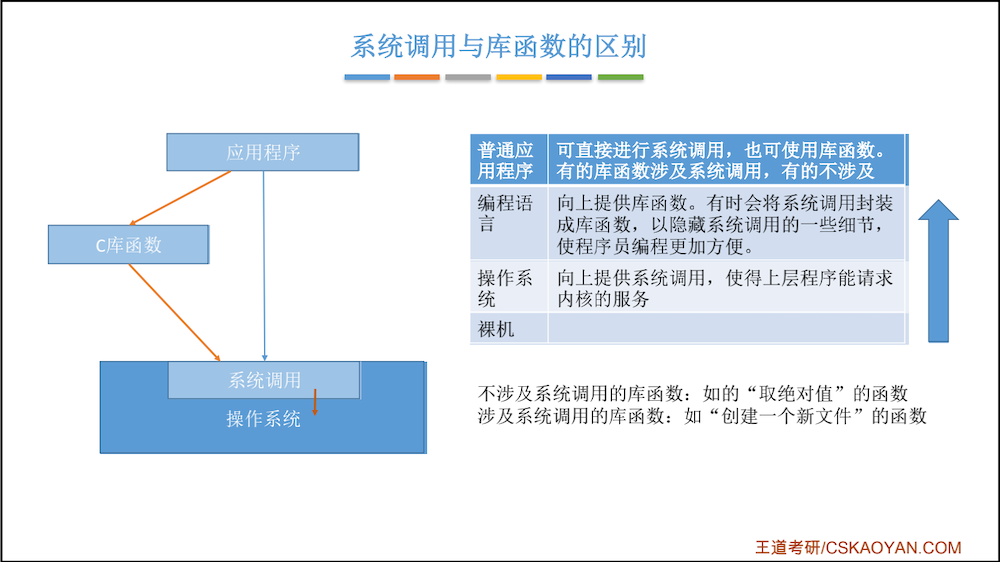
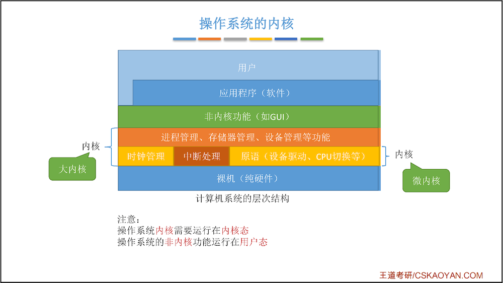
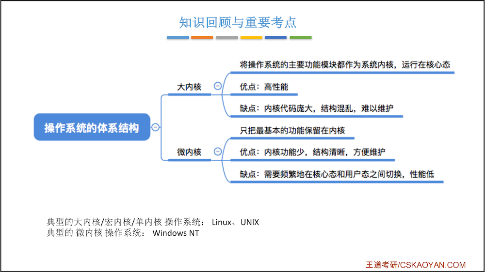

[TOC]

# 第一章 计算机系统概述


## 1.0 概览


## 1.1 操作系统基本概念

### 1.1.1 什么是操作系统


### 1.1.2 操作系统的特征

* 并发
* 共享
* 虚拟
* 异步

> 其中 **并发** 与 **共享** 是两个最基本的特征，二者互为存在条件。


#### 并发

##### 并发 VS 并行

> 并发：指两个或多个事件在 **同一时间间隔内** 发生。这些事件 **宏观上是同时发生** 的，但 **微观上是交替发生** 的。 
>
> 并行：指两个或多个事件在 **同一时刻 同时发生**。


##### 并发

> 操作系统的并发性：指计算机系统中“同时”运行着多个程序，这些程序 **宏观上看是同时运行** 着的，而 **微观上看是交替运行** 的。 
>
> 操作系统就是伴随着 “多道程序技术” 而出现的。因此，操作系统和程序并发是一起诞生的。


##### 并发考点*

> 注意（重要考点）： 
>
> **单核CPU** 同一时刻只能执行一个程序，各个程序只能 **并发** 地执行。
>
> **多核CPU** 同一时刻可以同时执行多个程序，多个程序可以 **并行** 地执行。


#### 共享

> **共享 即 资源共享**，是指系统中的资源可供内存中多个并发执行的进程共同使用。 

* 两种资源共享方式：
    * 互斥共享：系统中的某些资源，虽然可以提供给多个进程使用，但一个时间段内只允许一个进程访问该资源
    * 同时共享：系统中的某些资源，允许一个时间段内由多个进程“同时”对它们进行访问

```
所谓的“同时”往往是宏观上的，而在微观上，这些进程可能是交替地对该资源进行访问的（即分时共享） 

生活实例： 
互斥共享方式：使用QQ和微信视频。同一时间段内摄像头只能分配给其中一个进程。 
同时共享方式：使用QQ发送文件A，同时使用微信发送文件B。宏观上看，两边都在同时读取并发送文件，说明两个进程都在访问硬盘资源，从中读取数据。微观上看，两个进程是交替着访问硬盘的。
```


#### 虚拟

>  **虚拟** 是指把一个物理上的实体变为若干个逻辑上的对应物。物理实体（前者）是实际存在的，而逻辑上对应物（后者）是用户感受到的。

* 虚拟技术

    * 空分复用技术（如：虚拟存储器技术）

        * 多个程序同时运行占用的CPU远远超过内存物理大小

        * 问题：这些程序同时运行需要的内存远大于4GB，那么为什么它们还可以在我的电脑上同时运行呢？ 

            答：这是 **虚拟存储器技术**。实际只有4GB的内存，在用户看来似乎远远大于4GB

    * 时分复用技术（如：虚拟处理器）

        * 某单核CPU的计算机中，用户打开多款软件时，正常运行。

        * 问题：既然一个程序需要被分配CPU才能正常执行，那么为什么单核CPU的电脑中能同时运行这么多个程序呢？

            答：这是 **虚拟处理器技术**。实际上只有一个单核CPU，在用户看来似乎有 6个CPU在同时为自己服务。

```
显然，如果失去了并发性，则一个时间段内系统中只需运行一道程序，那么就失去了实现虚拟性的意义了。因此，没有并发性，就谈不上虚拟性。
```


#### 异步

> **异步**：指在多道程序环境下，允许多个程序并发执行，但由于资源有限，进程的执行不是一贯到底的， 而是走走停停，以不可预知的速度向前推进，这就是进程的异步性。


##### 同步 VS 异步

```
同步异步，举个例子来说，一家餐厅吧来了5个客人，同步的意思就是说，来第一个点菜，点了个鱼，好， 厨师去捉鱼杀鱼，过了半小时鱼好了给第一位客人，开始下位一位客人，就这样一个一个来，按顺序来

相同， 异步呢，异步的意思就是来第一位客人，点什么，点鱼，给它一个牌子，让他去一边等吧，下一位客人接着点菜，点完接着点让厨师做去吧，哪个的菜先好就先端出来，

同步的优点是：同步是按照顺序一个一个来，不会乱掉，更不会出现上面代码没有执行完就执行下面的代码， 
缺点：是解析的速度没有异步的快；

异步的优点是：异步是接取一个任务，直接给后台，在接下一个任务，一直一直这样，谁的先读取完先执行谁的，
缺点：没有顺序 ，谁先读取完先执行谁的，会出现上面的代码还没出来下面的就已经出来了，会报错；
```


#### 小结


### 1.1.3 操作系统的功能与作用




## 1.2 操作系统发展与分类


## 1.3 操作系统运行机制

* 两种程序
    * 内核程序
    * 应用程序
* 两种指令
    * 特权指令
    * 非特权指令
* 两种处理器状态
    * 核心态：=内核态=管态
    * 用户态：=目态

```
『应用程序』只能使用『非特权指令』，如：加法指令、减法指令等；
『操作系统内核』作为 “管理者”，有时会让CPU执行一些『特权指令』，如：内存清零指令。这些指令影响重大， 只允许“管理者”——即操作系统内核来使用。

在CPU设计和生产的时候就划分了『特权指令』和『非特权指令』，因此CPU执行一条指令前就能判断出其类型。

问题：
 CPU 能判断出指令类型，但是它怎么区分此时正在运行的是内核程序 or 应用程序？
解决：
 CPU 有两种状态，“内核态”和“用户态” 
 处于内核态时，说明此时正在运行的是内核程序，此时可以执行特权指令 
 处于用户态时，说明此时正在运行的是应用程序，此时只能执行非特权指令

拓展：
 CPU 中有一个寄存器叫 程序状态字寄存器（PSW），其中有个二进制位，1表示 “内核态”，0表示“用户态” 
 
别名：
内核态 = 核心态 = 管态；
用户态 = 目态
```


### 1.3.1 内核态、用户态 切换

> **内核态 —> 用户态**：执行一条 **特权指令**——**修改PSW的标志位为“用户态”**，这个动作意味着 **操作系统将主动让出CPU使用权**。
>
> **用户态 —> 内核态**：由 **“中断”** 引发，**硬件自动完成变态过程**，触发中断信号意味着 **操作系统将强行夺回CPU的使用权**。
>
> 补充：除了非法使用特权指令之外，还有很多事件会触发中断信号。一个共性是，**但凡需要操作系统介入的地方，都会触发中断信号。**


### 1.3.2 中断与异常

#### 中断的作用

> CPU 上会运行两种程序，一种是操作系统 **内核程序**，一种是 **应用程序**。
>
> 作用：**中断** 会使CPU由 **用户态** 变为 **内核态**，使操作系统重新夺回对CPU的控制权。
>
> **“中断”** 是让操作系统内核夺回CPU使用权的 **唯一途径**。 
>
> 如果没有“中断”机制，那么一旦应用程序上CPU运行，CPU就会一直运行这个应用程序。既如此，何来 “并发”！？

#### 中断的类型

* 内中断（异常）：与当前执行的指令 **有关**， 中断信号来源于CPU **内部**
    * 例子 1：试图在**用户态**下执行**特权指令 **
    * 例子 2：执行除法指令时发现除数为 0
    * 例子 3：有时候应用程序想请求操作系统内核的服务，此时会 **执行一条特殊的指令——陷入指令**，该指令会引发一个内部中断信号。
        * 执行 **“陷入指令”**，意味着应用程序主动地将CPU控制权还给操作系统内核。 **"系统调用”**就是通过陷入指令完成的
        * **执行陷入指令时，还在用户态**
* 外中断（中断）：与当前执行的指令 **无关**， 中断信号来源于CPU **外部**
    * 例子1：时钟中断——由时钟部件发来的中断信号
        * 时钟部件每隔一个时间片（如 50ms）会给CPU发送一个时钟中断信号，**操作系统内核决定接下来让另一个应用程序上CPU运行。**
    * 例子2：I/O中断——由输入/输出设备发来的中断信号
        * 当输入输出任务完成时，向CPU发送中断信号


#### 中断的原理

* 查询 **“中断向量表”**
* 中断处理程序一定是内核程序，需要运行在“内核态”


#### 小结


## 1.4 系统调用

### 什么是系统调用，有何作用？


### 系统调用与库函数的区别？




### 为什么系统调用是必须的？

* 思考：

    如果两个进程可以随意地、并发地共享打印机资源，会发生什么情况？ （Word与WPS同时打印）

    两个进程并发运行，打印机设备交替地收到 WPS 和 Word 两个进程发来的打印请 求，结果两篇论文的内容混杂在一起了… 

* 解决方法：

    **由操作系统内核对共享资源进行统一的管理**，并向上提供 “系统调用” ，用户进程想要使用打印机这种 **共享资源**，只能通过 **系统调用** 向操作系统内核发出请求。内核会对各个请求进行协调处理。


### 系统调用的分类


### **什么功能要用到系统调用？** 

​		应用程序通过系统调用请求操作系统的服务。而系统中的各种共享资源都由操作系统内核统一掌管，因此 **凡是与共享资源有关的操作（如存储分配、I/O操作、文件管理等），都必须通过系统调用** 的方式向操作系统内核提出服务请求，由操作系统内核代为完成。这样可以 **保证系统的稳定性和安全性**，防止用户进行非法操作。


### 系统调用的过程

> 重点：
>
> 1. **陷入指令** 是在 **用户态** 执行的，执行陷入指令之后立即引发一个 **内中断**，使 **CPU进入核心态**；
> 2. **发出系统调用请求是在用户态**，而对 **系统调用的相应处理在核心态下进行**。


## 1.5 操作系统的体系结构

**内核** 是操作系统  **最基本、最核心** 的部分。

实现操作系统内核功能的那些程序就是 **内核程序**。


### 大内核与微内核




### 大内核 VS 微内核





# 难点：并发、并行、串行、同步、异步

并发编程又叫多线程编程，并发当有多个线程在操作时,如果系统只有一个CPU,则它根本不可能真正同时进行一个以上的线程，它只能把CPU运行时间划分成若干个时间段,再将时间 段分配给各个线程执行，在一个时间段的线程代码运行时，其它线程处于挂起状。.这种方式我们称之为并发(Concurrent)。


“并行”指两个或两个以上事件或活动在同一时刻发生。在多道程序环境下，并行性使多个程序同一时刻可在不同CPU上同时执行。


串行、并行：

​		并行和串行指的是任务的执行方式。串行是指多个任务时，各个任务按顺序执行，完成一个之后才能进行下一个。并行指的是多个任务可以同时执行，异步是多个任务并行的前提条件。


