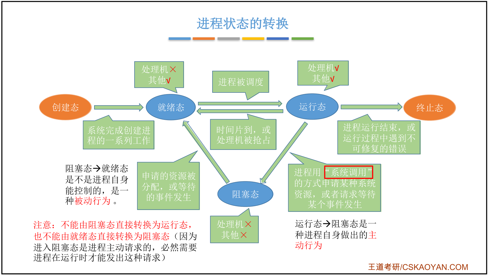

[Linux内核源码](https://elixir.bootlin.com/linux/latest/source)


# 第二章、进程管理

# 一、进程与线程

## 1.1 进程的概念、组成、特征

### 1.基本概念

程序 VS 进程

* 程序：是 <font color=red>**静态的**</font>，就是个存放在磁盘里的 **可执行文件**，就是一系列的指令集合。 
* 进程（Process）：是 <font color=red>**动态的**</font>，是程序的一 次执行过程。
    * 同一个程序多次执行会对应多个进程
    * 进程是系统进行 **资源分配** 和 **调度** 的一个独立单位。

```
思考：操作系统是这些进程的管理者，它要怎么区分各个进程？

当进程被创建时，操作系统会为该进程 分配一个唯一的、不重复的“身份证 号”—— PID（Process ID，进程ID）
```

### 2.操作系统的组成

* 进程
    * PCB：是给操作系统用的
    * 程序段、数据段：是给进程自己用的


### 3. 程序如何运行？


### 4.进程的特征


## 1.2 进程的状态及转换

### 1.进程的状态


### 2.进程状态的转换



### 3.进程的组织方式

* 链接方式

    

* 索引方式

    


### 4.小结


## 1.3 进程控制


# 二、处理机调度

## 2.1 调度的概念


# 三、进程同步

## 3.1 进程同步的概念


# 四、死锁

## 4.1 死锁的概念


