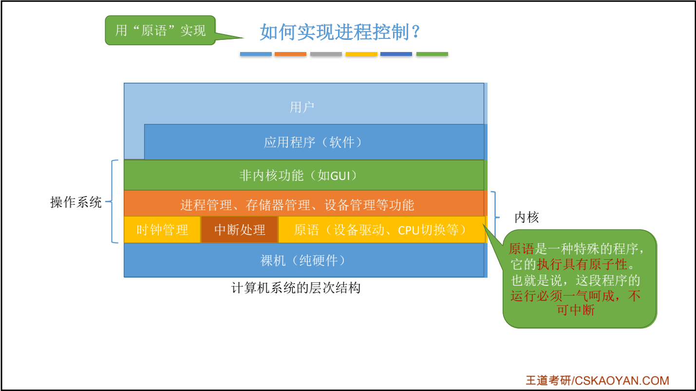

[Linux内核源码](https://elixir.bootlin.com/linux/latest/source)


# 第二章、进程管理

# 一、进程与线程

## 1.1 进程的概念、组成、特征

### 1.基本概念

程序 VS 进程

* 程序：是 <font color=red>**静态的**</font>，就是个存放在磁盘里的 **可执行文件**，就是一系列的指令集合。 
* 进程（Process）：是 <font color=red>**动态的**</font>，是程序的一 次执行过程。
    * 同一个程序多次执行会对应多个进程
    * 进程是系统进行 **资源分配** 和 **调度** 的一个独立单位。

```
思考：操作系统是这些进程的管理者，它要怎么区分各个进程？

当进程被创建时，操作系统会为该进程 分配一个唯一的、不重复的“身份证 号”—— PID（Process ID，进程ID）
```

### 2.操作系统的组成

* 进程
    * PCB：是给操作系统用的
    * 程序段、数据段：是给进程自己用的


### 3. 程序如何运行？


### 4.进程的特征


## 1.2 进程的状态及转换

### 1.进程的状态


### 2.进程状态的转换


### 3.进程的组织方式

* 链接方式

    

* 索引方式

    


### 4.小结


## 1.3 进程控制

### 1.什么是进程控制？

进程控制的主要功能是对系统中的所有进程实施有效的管理，它具有 **创建新进程、撤销已有进程、实现进程状态转换** 等功能。

简化理解：**进程控制就是要实现进程状态转换。**


### 2.如何实现进程控制？

> 用 **『原语』** 实现
>
> **原语** 是一种特殊的 **程序**，它的执行具有<font color=red>**原子性**</font> 。也就是说，这段程序的运行必须一气呵成，不可中断。

```
思考一：
为何进程控制（状态转换）的过程要“一气呵成”？

答：
如果不能“一气呵成”，就有可能导致操作系统中的某些关键数据结构信息不统一的情况，这会影响操作系统进行别的管理工作。


思考二：
如何实现原语的“原子性”？

答：
可以用 “关中断指令” 和 “开中断指令” 这两个特权指令实现原子性。
两个『特权指令』中间的指令不可被中断，即可实现原子性。
```




### 3.进程控制相关原语

> 学习技巧：进程控制会导致进程状态的转换。无论哪个进程控制原语，要做的无非三类事情：
>
> 1. 更新PCB中的信息
>
>     a. 所有的进程控制原语一定都会修改进程状态标志
>
>     b. 剥夺当前运行进程的CPU使用权必然需要保存其运行环境
>
>     c. 某进程开始运行前必然要恢复期运行环境
>
> 2. 将PCB插入合适的队列
>
> 3. 分配/回收资源

#### a.创建原语


#### b.撤销原语


#### c.阻塞原语、唤醒原语


#### d.切换原语


## 1.4 进程通信

> **进程通信** 就是指进程之间的信息交换。 
>
> 进程是分配系统资源的单位（包括内存地址空间），因此各进程拥有的内存地址空间 **相互独立**。为了保证安全，一个进程不能直接访问另一个进程的地址空间。

### 1.共享存储

> 两个进程对共享空间的访问必须是 **互斥的**（互斥访问通过操作系统提供的工具实现）。 操作系统只负责提供共享空间和同步互斥工具（如P、V操作）


#### a.基于数据结构的共享

> **基于数据结构的共享**：比如共享空间里只能放一个长度为10的数组。
>
> 这种共享方式速度慢、限制多，是一种 **低级通信方式**。

#### b.基于存储区的共享

> **基于存储区的共享**：在内存中画出一块共享存储区，数据的形式、存放位置都由进程控制，而不是操作系统。
>
> 相比之下，这种共享方式速度更快，是一种高级通信方式。


### 2.管道通信

> “管道”是指用于连接读写进程的一个共享文件，又名pipe文件。
>
> 1. 半双工通信
> 2. 互斥地访问
> 3. 如果没写满，就不允许读。如果没读空，就不允许写。


### 3.消息传递

> 1. 格式化的消息（Message）
>
> 2. 进程通过操作系统提供的 **“发送消息/接收消息”** 两个 **原语** 进行数据交换。


## 1.5 线程

### 什么是线程，为什么要引入线程？

> 第一阶段：还没引入进程之前，系统中各个程序只能串行执行。
>
> 第二阶段：引入了进程之后，各个程序可以并发执行。
>
> 第三阶段：QQ程序包含视频、文字、文件多种任务，引入线程使得同一个程序并发度更高。


# 二、处理机调度

## 2.1 调度的概念


# 三、进程同步

## 3.1 进程同步的概念


# 四、死锁

## 4.1 死锁的概念


