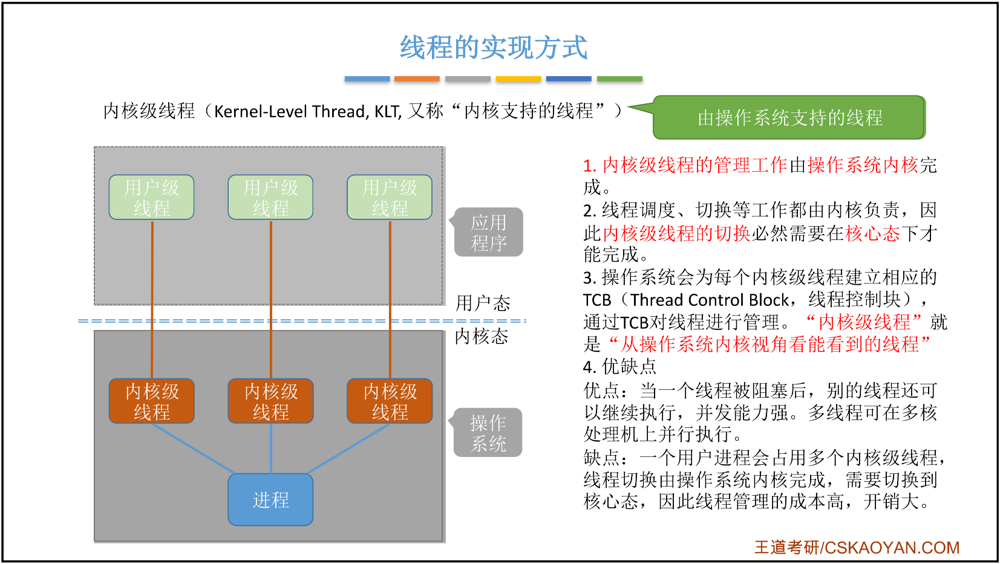
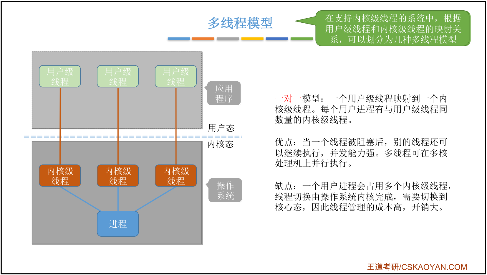

[TOC]


[Linux内核源码](https://elixir.bootlin.com/linux/latest/source)


# 第二章、进程管理

# 一、进程与线程

## 1.1 进程的概念、组成、特征

### 1.基本概念

程序 VS 进程

* 程序：是 <font color=red>**静态的**</font>，就是个存放在磁盘里的 **可执行文件**，就是一系列的指令集合。 
* 进程（Process）：是 <font color=red>**动态的**</font>，是程序的一 次执行过程。
    * 同一个程序多次执行会对应多个进程
    * 进程是系统进行 **资源分配** 和 **调度** 的一个独立单位。

```
思考：操作系统是这些进程的管理者，它要怎么区分各个进程？

当进程被创建时，操作系统会为该进程 分配一个唯一的、不重复的“身份证 号”—— PID（Process ID，进程ID）
```

### 2.操作系统的组成

* 进程
    * PCB：是给操作系统用的
    * 程序段、数据段：是给进程自己用的


### 3. 程序如何运行？


### 4.进程的特征


## 1.2 进程的状态及转换

### 1.进程的状态


### 2.进程状态的转换


### 3.进程的组织方式

* 链接方式

    

* 索引方式

    

### 4.小结


## 1.3 进程控制

### 1.什么是进程控制？

进程控制的主要功能是对系统中的所有进程实施有效的管理，它具有 **创建新进程、撤销已有进程、实现进程状态转换** 等功能。

简化理解：**进程控制就是要实现进程状态转换。**

#### a.五状态模型


#### b.七状态模型

> 就绪态、阻塞态进程映像还在 **内存** 中。
>
> 暂时调到 **外存** 等待的进程状态为 **挂起状态（挂起态，suspend）**。挂起态又可以进一步细分为 **就绪挂起、阻塞挂起** 两种状态


### 2.如何实现进程控制？

> 用 **『原语』** 实现
>
> **原语** 是一种特殊的 **程序**，它的执行具有<font color=red>**原子性**</font> 。也就是说，这段程序的运行必须一气呵成，不可中断。

```
思考一：为何进程控制（状态转换）的过程要“一气呵成”？
答：如果不能“一气呵成”，就有可能导致操作系统中的某些关键数据结构信息不统一的情况，这会影响操作系统进行别的管理工作。

思考二：如何实现原语的“原子性”？
答：可以用 “关中断指令” 和 “开中断指令” 这两个特权指令实现原子性。
两个『特权指令』中间的指令不可被中断，即可实现原子性。
```


### 3.进程控制相关原语

> 学习技巧：进程控制会导致进程状态的转换。无论哪个进程控制原语，要做的无非三类事情：
>
> 1. 更新PCB中的信息
>
>     a. 所有的进程控制原语一定都会修改进程状态标志
>
>     b. 剥夺当前运行进程的CPU使用权必然需要保存其运行环境
>
>     c. 某进程开始运行前必然要恢复期运行环境
>
> 2. 将PCB插入合适的队列
>
> 3. 分配/回收资源

#### a.创建原语


#### b.撤销原语


#### c.阻塞原语、唤醒原语


#### d.切换原语


## 1.4 进程通信

> **进程通信** 就是指进程之间的信息交换。 
>
> 进程是分配系统资源的单位（包括内存地址空间），因此各进程拥有的内存地址空间 **相互独立**。为了保证安全，一个进程不能直接访问另一个进程的地址空间。


### 1.共享存储

> 两个进程对共享空间的访问必须是 **互斥的**（互斥访问通过操作系统提供的工具实现）。 操作系统只负责提供共享空间和同步互斥工具（如P、V操作）


#### a.基于数据结构的共享

> **基于数据结构的共享**：比如共享空间里只能放一个长度为10的数组。
>
> 这种共享方式速度慢、限制多，是一种 **低级通信方式**。

#### b.基于存储区的共享

> **基于存储区的共享**：在内存中画出一块共享存储区，数据的形式、存放位置都由进程控制，而不是操作系统。
>
> 相比之下，这种共享方式速度更快，是一种高级通信方式。


### 2.管道通信

> “管道”是指用于连接读写进程的一个共享文件，又名pipe文件。
>
> 1. 半双工通信
> 2. 互斥地访问
> 3. 如果没写满，就不允许读。如果没读空，就不允许写。


### 3.消息传递

> 1. 格式化的消息（Message）
>
> 2. 进程通过操作系统提供的 **“发送消息/接收消息”** 两个 **原语** 进行数据交换。


## 1.5 线程

### 1. 什么是线程，为什么要引入线程？

> 第一阶段：还没引入进程之前，系统中各个程序只能串行执行。
>
> 第二阶段：引入了进程之后，各个程序可以并发执行。
>
> 第三阶段：QQ程序包含视频、文字、文件多种任务，引入线程使得同一个程序并发度更高。
>
> 所以，有的进程可能需要“同时”做很多事，而传统的进程只能串行地执行一系列程序。为此，引入了“线程”，来增加并发度。


> 线程是一个 **基本的CPU执行单元**，也是 **程序执行流的最小单位。**


#### a. 线程的属性（特点）


### 2. 线程的实现方式

#### a.用户级线程（User-Level Thread, ULT）

> 1. 线程的管理工作由谁来完成？
>
>     答：用户级线程由应用程序通过 **线程库** 实现， 所有的线程管理工作都由 **应用程序负责**（包括线程切换）。
>
>     很多编程语言提供了强大的线程库，可以实现线程的创建、销毁、调度等功能。
>
> 2. 线程切换是否需要CPU变态？
>
>     答：用户级线程中，**线程切换可以在用户态下即可完成**，无需操作系统干预。
>
> 3. 操作系统是否能意识到用户级线程的存在？
>
>     在用户看来，是有多个线程。但是在操作系统内核看来，并意识不到线程的存在。“用户级线程”就是“从用户视角看能看到的线程”
>
> 4. 这种线程的实现方式有什么优点和缺点？
>
>     优点：用户级线程的切换在用户空间即可完成，不需要切换到核心态，线程管理的系统 **开销小，效率高**。
>
>     缺点：当一个用户级线程被 **阻塞** 后，整个进程都会被阻塞，并发度不高。多个线程不可在多核处理机上并行运行。


#### b.内核级线程（Kernel-Level Thread, KLT）

> 1. 线程的管理工作由谁来完成？
>
>     答：由 **操作系统内核** 完成。
>
> 2. 线程切换是否需要CPU变态？
>
> 3. 操作系统是否能意识到内核级线程的存在？
>
> 4. 这种线程的实现方式有什么优点和缺点？




### 3. 多线程模型

> 在支持内核级线程的系统中，根据 **用户级线程** 和 **内核级线程** 的 **映射关系**，可以划分为几种多线程模型：

#### a.一对一模型



#### b.多对一模型


#### c.多对多模型


#### d.小结


# 二、处理机调度

> 问：什么是调度？
>
> 答：当有一堆任务要处理，但由于资源有限，这些事情没法同时处理。这就需要确定 **某种规则来决定处理这些任务的顺序**，这就是“调度”研究的问题。


## 2.1 三种调度


### 1.高级调度（作业调度）

> 高级调度（作业调度）：按一定的原则从 **外存** 的作业后备队列中挑选一个作业调入内存，并**创建进程**。每个作业只调入一次，调出一次。作业调入时会建立PCB，调出时才撤销PCB。
>
> 简而言之：用户向系统提交一个作业 ≈ 用户让操作系统启动一个程序

### 2.中级调度（内存调度）

> 中级调度（内存调度）：按照某种策略决定将哪个处于 **挂起状态** 的进程 **重新调入内存**。
>
> 一个进程可能会被多次调出、调入内存，因此中级调度发生的频率要比高级调度更高。

### 3.低级调度（进程调度）

> 低级调度（进程调度 / 处理机调度）：按照某种策略从 **就绪队列** 中选取一个进程，将处理机分配给它。
>
> 进程调度是操作系统中 **最基本** 的一种调度，在一般的操作系统中都必须配置进程调度。进程调度的频率很高，一般几十毫秒一次。


## 2.2 进程调度（低级调度）非重点

1. 进程调度的时机

2. 进程调度的切换与过程

3. 进程调度的 方式


## 2.3 调度算法的评价指标


### a. CPU利用率


### b. 系统吞吐量


### c. 周转时间

>  <font color=red>**周转时间**</font> 是指从 **作业被提交** 给系统开始，到 **作业完成** 为止的这段时间间隔。
>
> 它包括四个部分：作业在外存后备队列上等待作业调度（高级调度）的时间、进程在就绪队列上等待进程调度（低级调度）的时间、进程在CPU上执行的时间、进程等待I/O操作完成的时间。后三项在一个作业的整个处理过程中，可能发生多次。


### d. 等待时间


### e. 响应时间

> <font color=red>**响应时间**</font>：指从<font color=red>**用户提交**</font>请求到<font color=red>**首次响应**</font>所需要的时间。


## 2.4 典型的调度算法

> 基本思路：
>
> 1. 算法思想
> 2. 算法规则
> 3. 这种调度算法是用于 作业调度 还是 进程调度？
> 4. 抢占式？非抢占式？
> 5. 优点和缺点
> 6. 是否会导致<font color=red>饥饿</font>？

### 1. 先来先服务算法 - FCFS

> FCFS：First Come First Serve


### 2. 短作业调度 - SJF


### 3. 高响应比优先 - HRRN

 


### 4. 时间片轮转调度算法


### 5. 优先级调度算法


### 6. 多级反馈队列调度算法


# 三、进程同步

## 3.1 进程同步的概念


# 四、死锁

## 4.1 死锁的概念


