[TOC]

# 1. 操作系统的概念、功能和目标

## 1.1 直观体会与图解

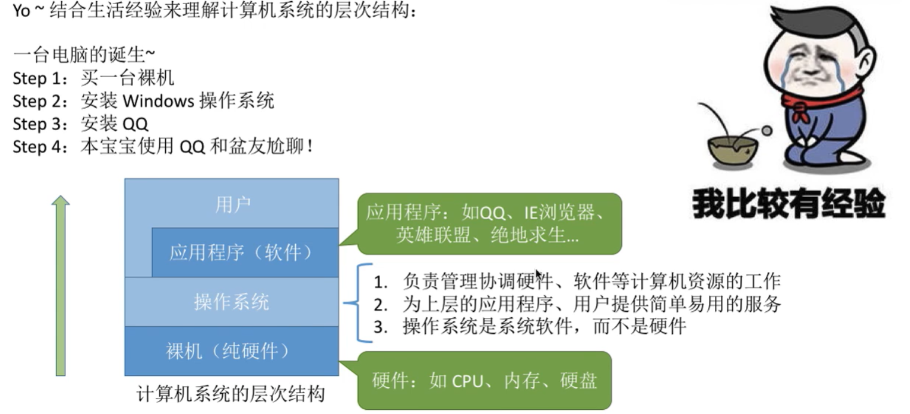

## 1.2 概念

> `操作系统【Operating System，OS】`：指控制和管理整个计算机系统的硬件和软件资源，并合理地组织调度计算机的工作和资源的分配，以提供给用户和其他软件方便的接口和环境，是计算机系统中最基本的`系统软件`

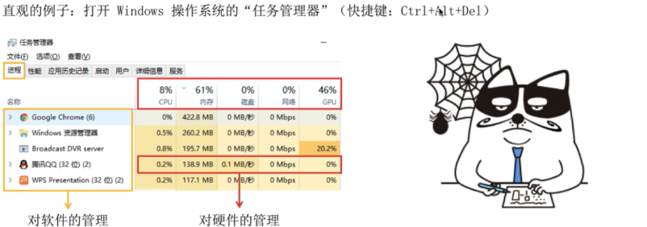

## 1.3 功能和目标

> 问题描述：
>
> 1. 操作系统作为`系统资源的管理者`【包括软件、硬件、文件等】需要提供什么功能？
> 2. 操作系统`作为用户与计算机硬件之间的接口`，要为其上层的用户、应用程序提供简单易用的服务，需要实现什么功能？
> 3. 操作系统`作为最接近硬件的层次`，需要在纯硬件的基础上实现什么功能？
>
> 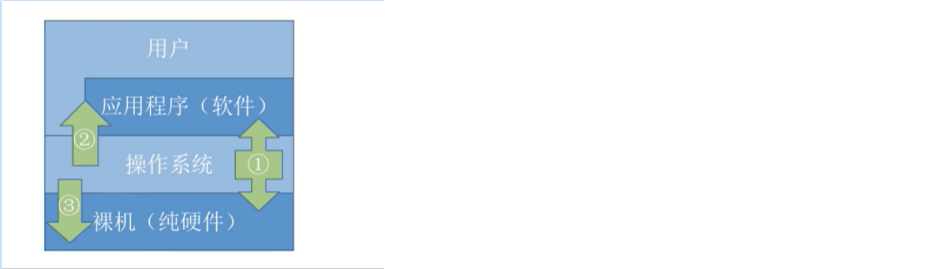

### 1.3.1 作为系统资源的管理者

补充知识：进程是一个程序的执行过程。执行前`需要将该程序放到内存中`，才能被CPU处理。

> 举个栗子：用QQ和朋友视频聊天的过程==>
>
> 1. 在各个文件夹中找到QQ安装的位置【文件管理】
> 2. 双击打开QQ.exe，需要把该程序相关数据从硬盘导入内存【存储器管理】
> 3. QQ程序正常运行，对应的进程被处理机(CPU)处理【处理机管理】
> 4. 开始和朋友视频聊天，需要将摄像头设备分配给进程【设备管理】
>
> `在实现以上过程中，需要保证操作系统需要保证其安全性、高效性`

### 1.3.2 作为用户和计算机硬件之间的接口

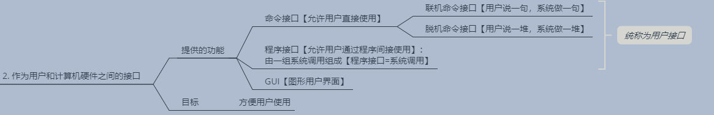

* `命令接口`：允许用户直接使用
  * 联机命令接口【用户说一句，系统执行一句】
  * 脱机命令接口【用户说一堆，系统执行一堆】

* `程序接口`：允许用户通过程序间接使用：由一组系统调用组成【程序接口=系统调用】

* GUI：现代操作系统中最流行的图形用户接口

> **联机命令接口与脱机命令接口实例：**
>
> 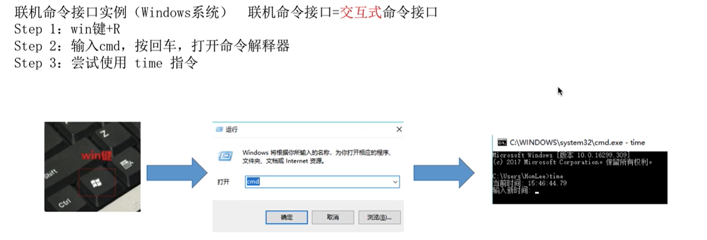
>
> 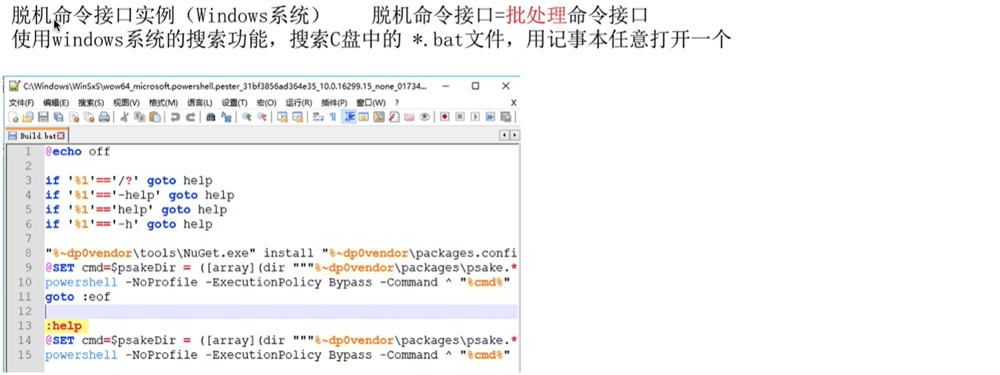
>
> 
>
> **程序接口实例：**
>
> 
>
> 系统调用==系统调用命令==`广义指令`

### 1.3.3 作为最接近硬件的层次

1. 需要提供的功能和目标：实现对硬件机器的拓展
2. 没有任何软件支持的计算机称为`裸机`。在裸机上安装的操作系统可以提供资源管理功能和方便用户的服务功能，将裸机改造成功能更强、使用更方便的机器
3. 通常把覆盖了软件的机器称为`扩充机器`，又称为`虚拟机`

# 2. 操作系统的特征

## 2.1 知识总览

`没有并发和共享，就谈不上虚拟和异步【详情请看以下介绍】`，因此，并发和共享是操作系统两个最基本的特征。

## 2.2 并发

`并发`：指两个或多个事件在同一时间间隔内发生。这些事件宏观上是同时发生的，但微观上是交替发生的。

`并行`：指两个或多个事件在同一时刻同时发生

> 并发 & 并行：
>
> * 某一时刻同时进行多个任务 ==》 并行
> * 同一时段内进行多个任务，但某一时刻最多进行一个任务 ==》并发

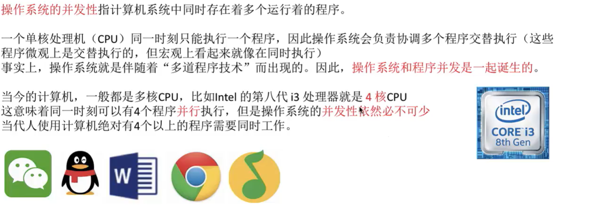

## 2.3 共享

`共享`即资源共享，是指系统中的资源可供内存中多个并发执行的进程共同使用。

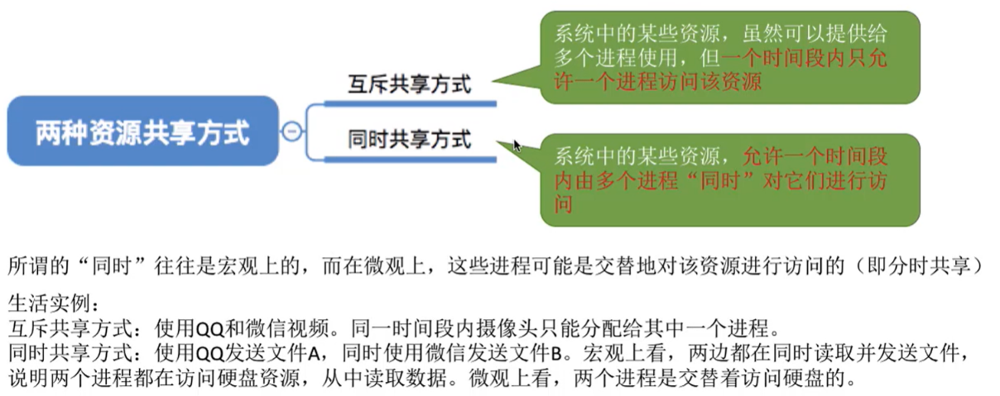

## 2.4 并发 & 共享

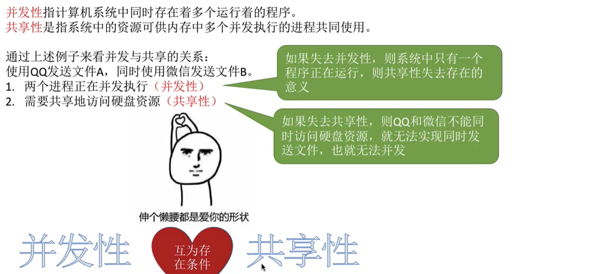

## 2.5 虚拟

`虚拟`指把一个物理上的实体变为若干个逻辑上的对应物。物理实体【前者】是实际存在的，而逻辑上的对应物【后者】是用户感受到的。

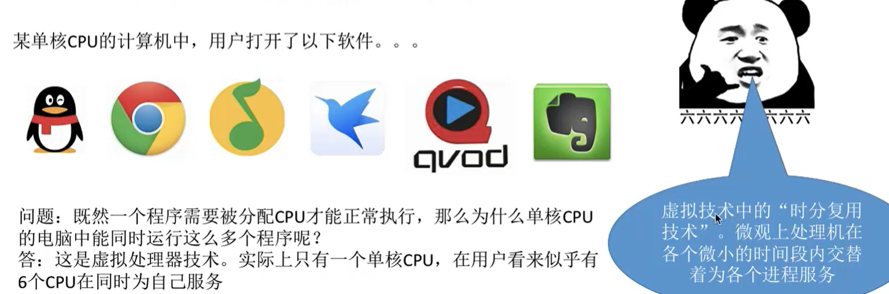

## 2.6 异步

`异步`指在多道程序环境下，允许多个程序并发执行，但由于资源有限，进程的执行不是一管到底的，而是走走停停，以不可预知的速度向前推进，这就是进程的异步性。

`只有系统拥有并发性，才有可能导致异步性`【如果失去了并发性，则系统只能串行地处理各个进程，每个进程的执行会一贯到底】

# 3. 操作系统的发展与分类

## 3.1 知识总览

`各阶段的主要优点都是为了解决上一阶段的主要缺点`

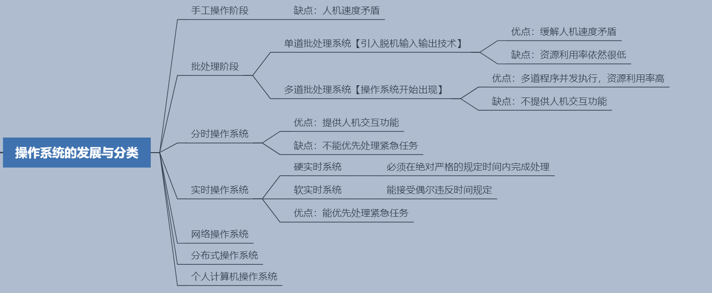

## 3.2 手工操作阶段

> `缺点`：用户独占全机、人机速度矛盾导致资源利用率极低

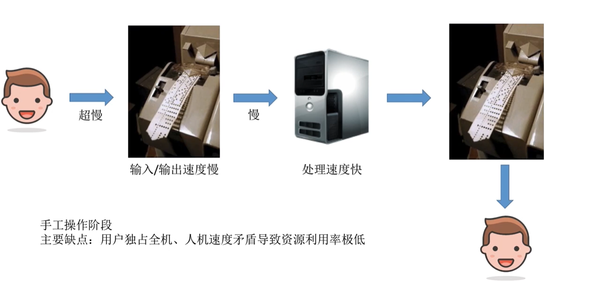

## 3.3 批处理阶段-单道批处理系统

> 引入`脱机输入/输出技术`【用磁带完成】，并使用`监督程序`【操作系统的雏形】负责控制作业的输入、输出
>
> 
>
> 单道批处理系统：
>
> 主要优点：缓解了一定程度的人机速度矛盾，资源利用率有所提升。
>
> 主要缺点：`内存中仅能有一道程序运行`，只有该程序运行结束后才能调入下一道程序。`CPU有大量时间是在空闲等待I/O完成`。资源利用率依然很低。

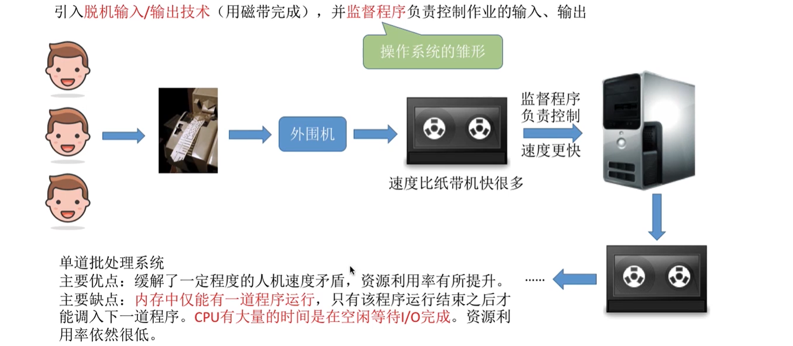

## 3.4 批处理阶段-多道批处理系统

> 多道批处理系统：
>
> 主要优点：多道程序`并发`执行，`共享`计算机资源。`资源利用率大幅提升`，CPU和其他资源保持“忙碌”状态，系统吞吐量增大
>
> 主要缺点：用户响应应时间长，`没有人机交互功能`【用户提交自己的作业之后，就只能等待计算机处理完成，中间不能控制自己的作业执行】

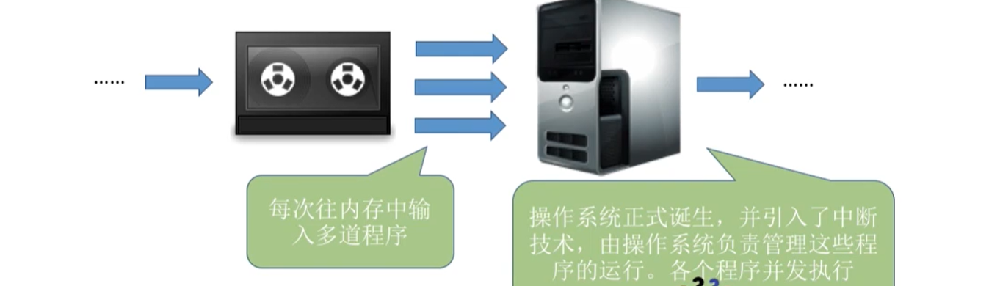

> :grey_question:多道批处理系统为什么能使系统资源利用率大幅提升：
>
> 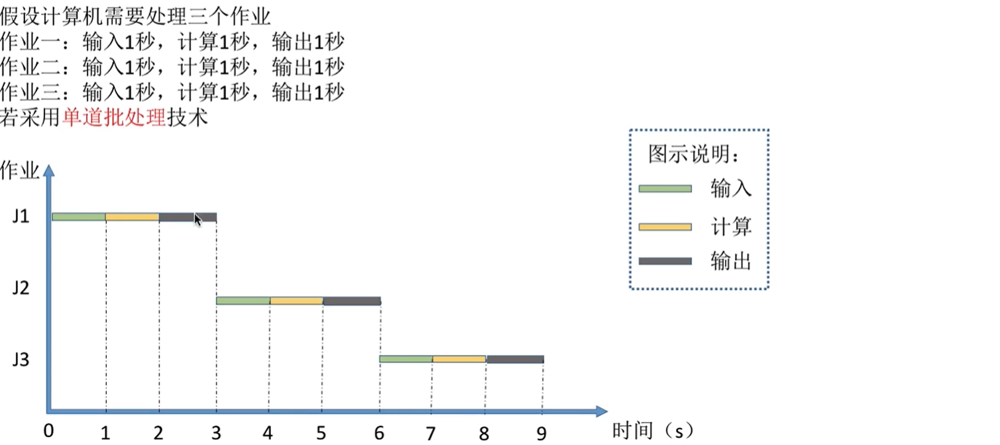
>
> 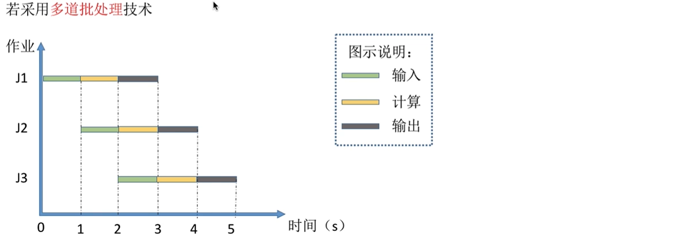

## 3.5 分时操作系统

> 分时操作系统：计算机以`时间片`为单位`轮流为各个用户/作业服务`，各个用户可通过终端与计算机进行交互。
>
> 主要优点：用户请求可以被即时响应，`解决了人机交互问题`。允许多个用户同时使用一台计算机，并且用户对计算机的操作相互独立，感受不到别人的存在。
>
> 主要缺点：`不能优先处理一些紧急任务`。操作系统对各个用户/作业都是完全公平的，循环地为每个用户/作业服务一个时间片，不区分任务的紧急性。

## 3.6 实时操作系统

> 主要优点：能够优点响应一些紧急任务，某些紧急任务不需要时间片排队
>
> 在实时操作系统的控制下，计算机系统接收到外部信号后及时进行处理，并且`要在严格的时限内处理完事件`。实时操作系统的主要特点是`及时性和可靠性`

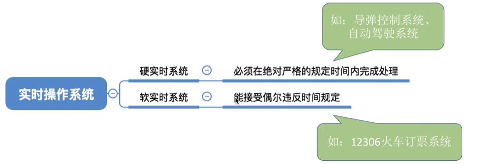

## 3.7 其他几种操作系统

1. 网络操作系统：伴随着计算机网络的发展而诞生，能把网络中各个计算机有机地结合起来，实现数据传送等功能，`实现网络中各种资源的共享【如文件共享】和各台计算机之间的通信`。【如：Windows NT就是一种典型的网络操作系统，网站服务器就可以使用】

2. 分布式操作系统：主要特点是`分布式和并行性`。系统中的各台计算机地位相同，`任何工作都可以分布在这些计算机上，由它们并行、协同完成这个任务`。
3. 个人计算机操作系统：如Windows XP、MacOS，方便个人使用

# 4. 操作系统的运行机制及体系结构

## 4.1 知识总览

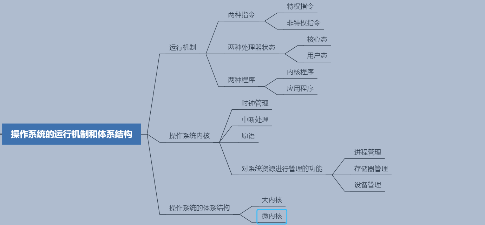

`指令`：处理器【CPU】能识别、执行的最基本命令

## 4.2 运行机制

### 4.2.1 两种指令

### 4.2.2 两种处理器状态

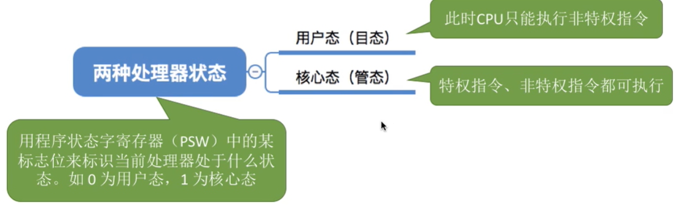

### 4.2.3 两种程序

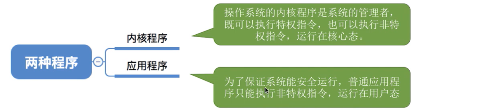

## 4.3 操作系统内核

> `安装完Windows操作系统后，会发现操作系统提供了许多功能，如“记事本”、“任务管理器”。然而，这些功能并不是必不可少的。即使没有“任务管理器”，我们仍然可以使用计算机。`

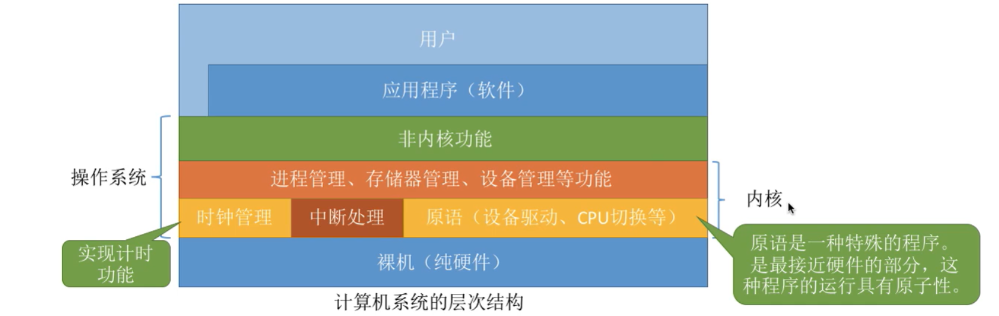

> `内核`是计算机上配置的底层`软件`，是操作系统最基本、最核心的部分。实现操作系统内核功能的那些程序就是`内核程序`。

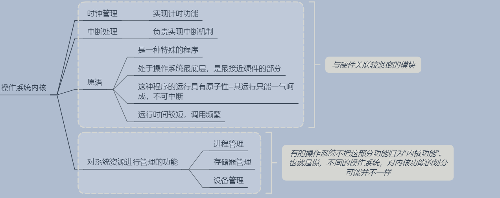

## 4.4 操作系统的体系结构

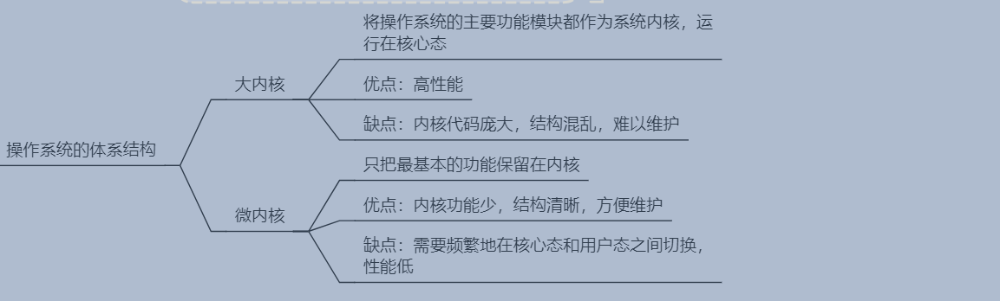

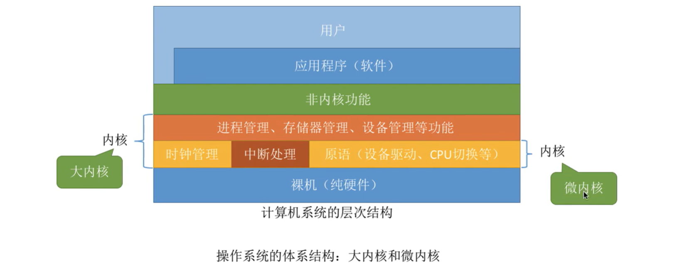

# 5. 中断和异常

## 5.1 知识概览

## 5.2 中断机制的诞生

1. 早期计算机：各程序只能串行执行，系统资源利用率低
2. 为了解决上诉问题，人们发明了操作系统【作为计算机的管理者】，引入中断机制，实现了多道程序并发执行`【本质：发生中断就意味着需要操作系统接入，执行管理工作】`

> 中断处理与用户态、核心态切换：
>
> 1. 进程1时间片用完，CPU收到计时部件发出的`中断信号`，切换为`核心态`对中断进行处理
>
> 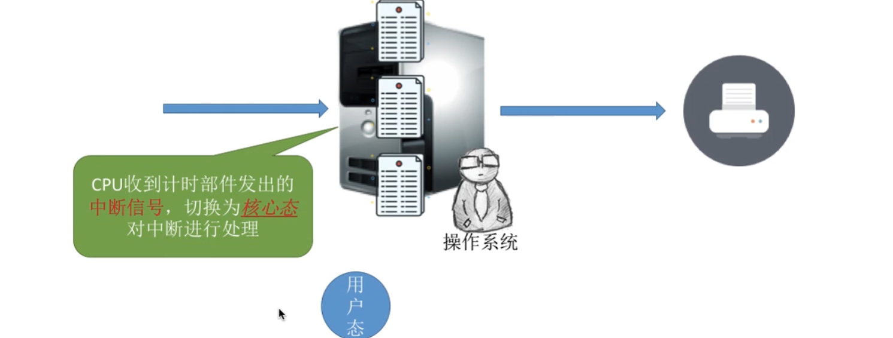
>
> 2. 操作系统内核负责对中断信号进行处理
>
> 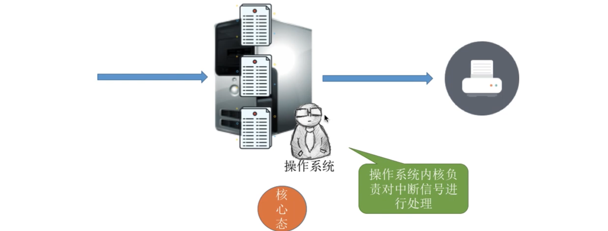
>
> 3. 进程1的时间片已用完，换进程2运行
>
> 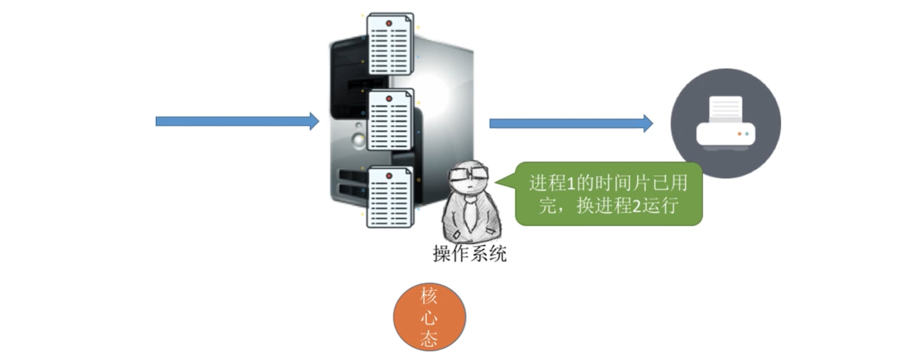
>
> 4. CPU把使用权交给进程2，CPU切换为`用户态`。进程2发出系统调用【`内中断信号`】，请求输出。CPU切换为`核心态`,对中断进行处理
>
> 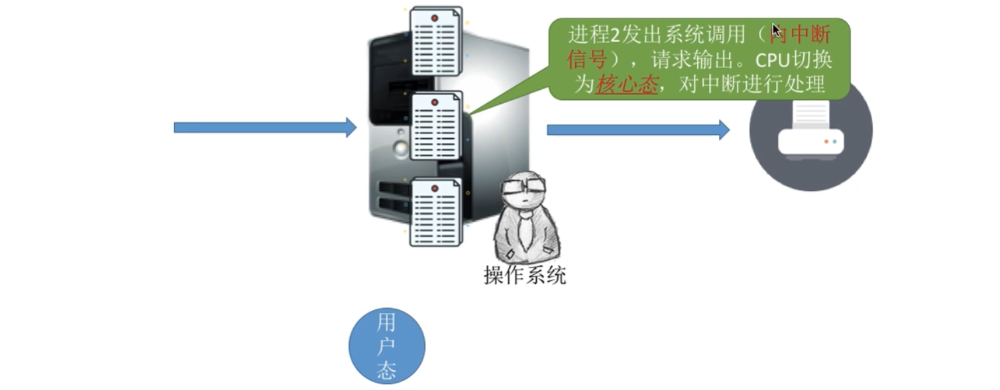
>
> 5. 操作系统内核负责对中断信号进行处理
>
> 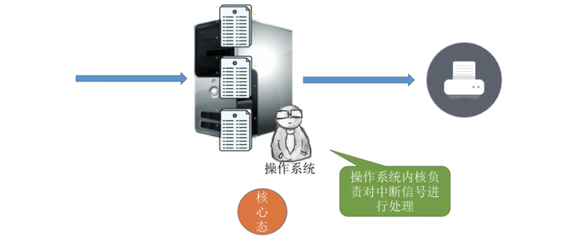
>
> 6. CPU要求打印机进行工作，进程2暂停运行等待IO完成，换进程3运行
>
> 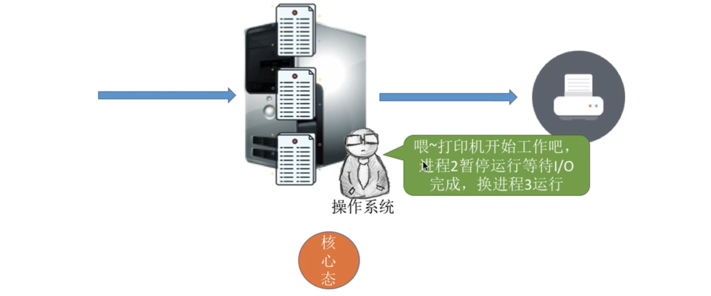
>
> 7. 此时进程3与IO操作并行执行，当IO完成，设备向CPU发出`中断信号`。CPU收到IO设备发出的中断信号，切换为核心态对中断进行处理
>
> 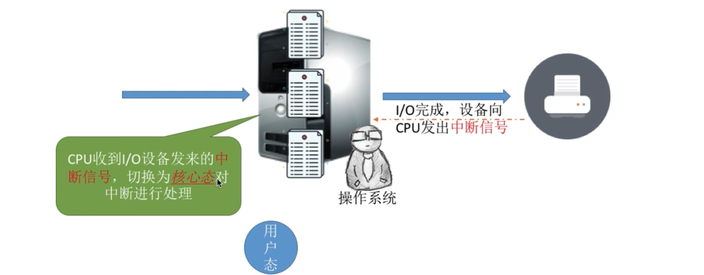
>
> 8. 操作系统内核负责对中断进行处理。由于进程2 IO完成，CPU让进程2恢复运行，以完成后续工作
>
> 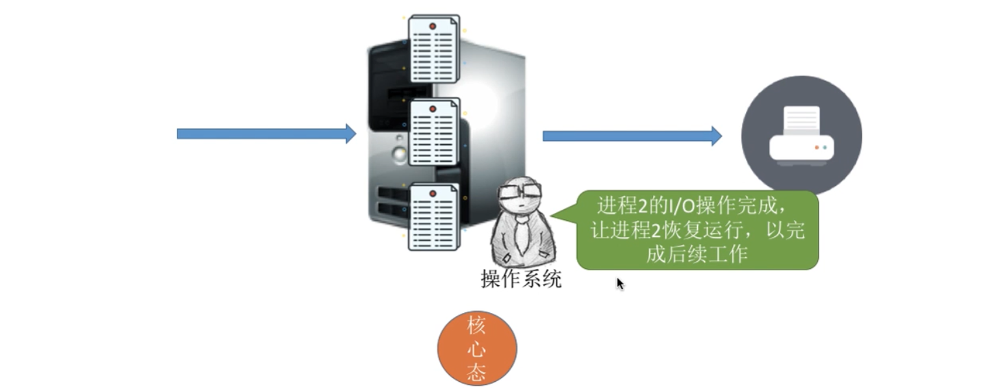

## 5.3 中断的概念和作用

> 1. 当中断发生时，CPU立即进入`内核态`
> 2. 当中断发生后，当前运行的进程暂停运行，并由操作系统内核对中断进行处理
> 3. 对于不同的中断信号，会进行不同的处理
> 4. 发生了中断，就意味着需要操作系统介入，开展管理工作。由于操作系统的管理工作【比如进程切换、分配IO设备等】需要使用特权指令，因此CPU要从用户态转为核心态。`中断`可以使CPU从`用户态切换为核心态，使操作系统获得计算机的控制权`。有了中断，才能实现多道程序并发执行。

> :grey_question:用户态、核心态之间的切换是怎么实现的
>
> 答：`用户态==>核心态`是 通过`中断`实现的。并且`中断`是`唯一`途径
>
> `核心态==>用户态`的切换是通过`执行一个特权指令`，将程序状态字【PSW】的标志位设置为“用户态”

## 5.4 中断的分类

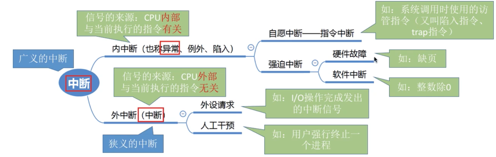

【另一种分类】

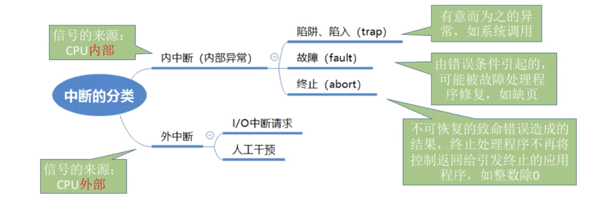

## 5.5 外中断的处理过程

> `Step 1：`执行完每个指令之后，CPU都要检查当前是否有外部中断信号
>
> `Step 2：`如果检测到外部中断信号，则需要保护被中断进程的CPU环境【如程序状态字PSW、程序计数器PC、各种通用寄存器】
>
> `Step 3：`根据中断信号类型转入相应的中断处理程序
>
> `Step 4：`恢复原进程的CPU环境并退出中断，返回原进程继续往下执行

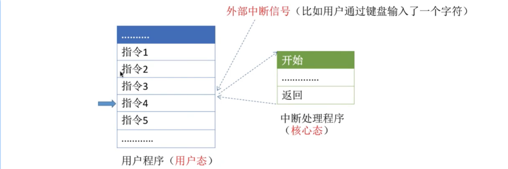

# 6. 系统调用

## 6.1 知识总览

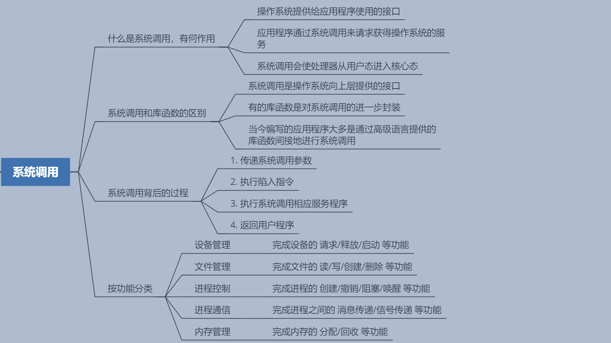

## 6.2 什么是系统调用，有何作用

> `系统调用`：是操作系统提供给应用程序【程序员/编程人员】使用的`接口`，可以理解为一种`可供应用程序调用的特殊函数`，应用程序可以发出系统调用请求来获得操作系统的服务

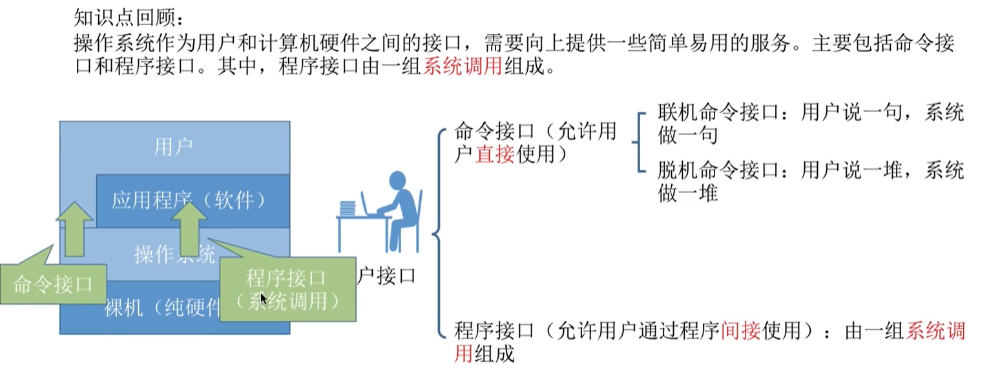

## 6.3 为什么需要系统调用

> 1. 通过对在`并发情况下可能出现错误的共享资源`进行使用上的统一管理【封装接口】，来达到共享资源正常工作的目的。
> 2. 应用程序通过`系统调用`请求操作系统的服务。系统中的各种共享资源都由操作系统统一掌管，因此在用户程序中，凡是与资源有关的操作【存储分配、IO操作、文件管理等】，都必须通过系统调用的方式向操作系统提出服务请求，由操作系统代为完成。这样`可以保证系统的稳定性和安全性`，防止用户进行非法操作。
> 3. 系统调用相关处理涉及到对系统资源的管理、对进程的控制，这些功能需要执行一些`特权指令`才能完成，因此`系统调用的相关处理`需要在`核心态`下进行

## 6.4 系统调用的分类

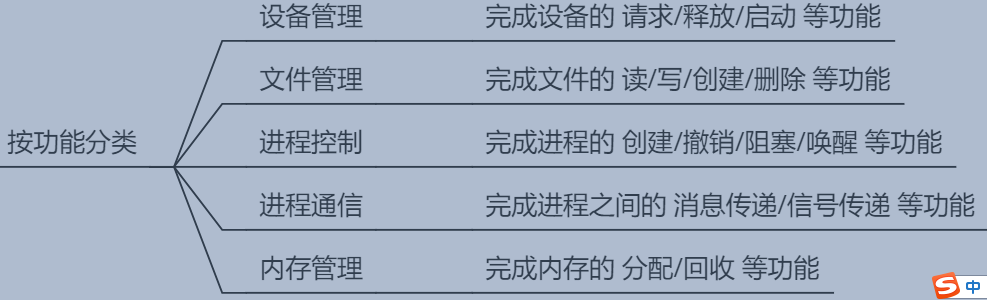

## 6.5 系统调用与库函数的区别

> `库函数`是对系统调用的一层封装，以隐藏系统调用的一些细节，使上层进行系统调用更为方便。

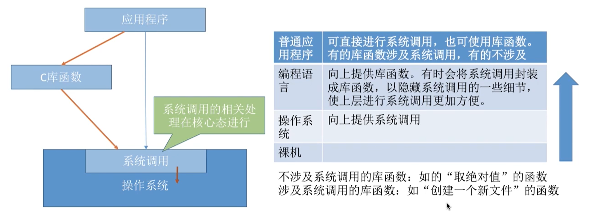

## 6.6 系统调用背后的过程

> 举个栗子：高级语言【C语言】调用库函数`write()`，而write()函数包含了系统调用。当执行到中断指令，CPU使用权由程序转交给操作系统，用户态转为核心态，CPU开始执行系统调用的内容。

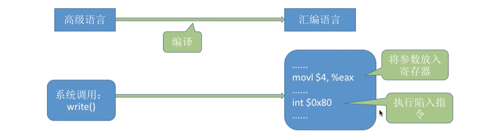

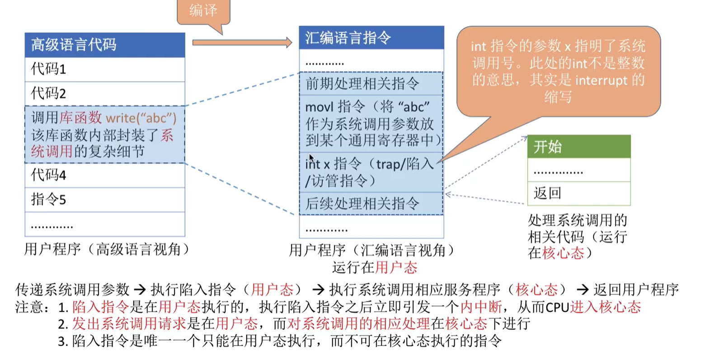