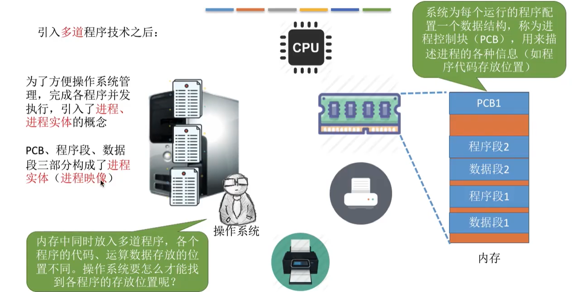
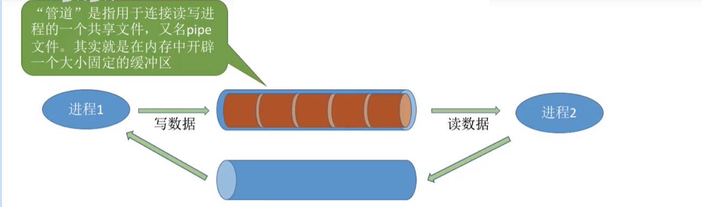
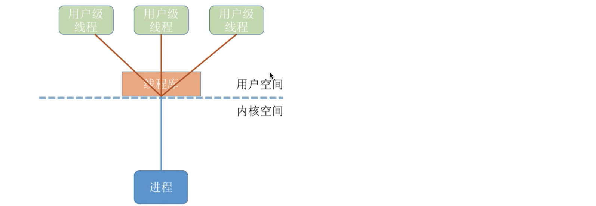
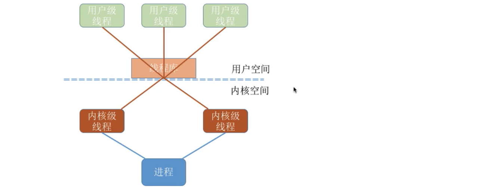
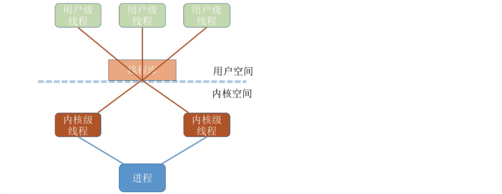
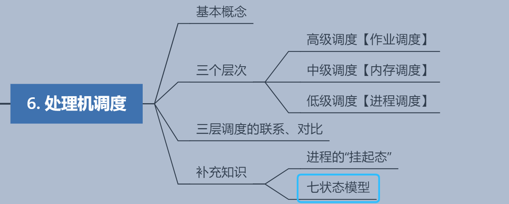
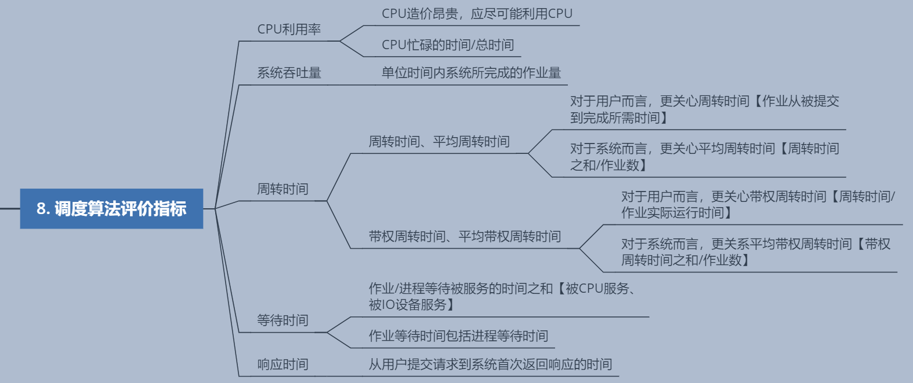

1. 进程概述

## 1.1 知识概览

## 1.2 进程的引入

> `程序`：一个指令序列
>
> 1. 早期的计算机【只支持`单道程序`】：
>
> 
>
> 2. 引入多道程序技术之后
>
> * 为了方便操作吸引管理，完成各程序并发执行，引入了`进程、进程实体`的概念
> * 系统为每个运行的程序配置一个数据结构，称为进程控制块【PCB】，用来描述进程的各种信息【如程序代码存放位置】
> * PCB、程序段、数据段三部分构成了进程实体【进程映像】
>
> 

## 1.3 进程的定义

> ​	`程序段、数据段、PCB`三部分组成了`进程实体【进程映像】`。一般情况下，进程实体也简称为进程。所谓创建进程，实际上是创建进程实体中的PCB；而撤销进程，实际上是撤销进程实体中的PCB。`PCB是进程存在的唯一标志！`
>
> 
>
> 从不同角度，进程可以有不同的定义，比较典型的定义有：
>
> 1. 进程是程序的一次`执行过程`
> 2. 进程是一个程序及其数据在处理机上顺序执行时所`发生的活动`
> 3. 进程是具有独立功能的程序在数据集合上`运行的过程`，是系统进行资源分配和调度的一个独立单位
>
> 
>
> `可见，在谈到进程时，更加强调进程的动态性`
>
> 
>
> 引入进程实体的概念后，可把进程定义为：
> 	`进程`是进程实体的`运行过程`，是系统进行`资源分配`和`调度`的一个独立单位
>
>  
>
> 注：严格来说，进程实体和进程并不一样，进程实体是`静态的`，进程则是`动态的`。

## 1.4 进程的组成

> 进程【进程实体】由三部分组成：程序段、数据段、PCB【程序控制块】

## 1.5 进程的组织

> 在一个系统中，通常有数十、数百、乃至数千个PCB。为了能对它们加以有效的管理，应该用适当的方式把这些PCB组织起来。
>
> 注：进程的`组成`讨论的是一个`进程内部`由哪些部分构成的问题，而进程的`组织`讨论的是`多个进程之间`的组织方式问题

### 1.5.1 链接方式

### 1.5.2 索引方式

## 1.6 进程的特征

> 进程和程序是两个截然不同的概念，相比于程序，进程拥有以下特征：
>
> 

# 2. 进程的状态与转换

## 2.1 知识总览

## 2.2 状态简介

### 2.2.1 三种基本状态

### 2.2.2 另外两种状态

> 【创建态】
>
> ​	操作系统为该进程分配所需的内存空间等系统资源，并为其创建、初始化PCB

> 【终止态】
>
> * 进程运行结束【或由于bug导致进程无法继续执行，比如数组越界错误】，需要撤销进程
> * 操作系统需要完成撤销进行相关的工作。完成将分配给进程的资源回收，撤销进程PCB等工作

## 2.3 进程状态的转换

## 2.4 小结

# 3. 进程控制

## 3.1 知识概览

## 3.2 什么是进程控制

> 进程控制的主要功能是对系统中的所有进程实施有效的管理，进程控制具有`创建新进程`、`撤销已有进程`、`实现进程状态转换`等功能
>
> 简单理解：进程控制就是要实现进程状态转换

## 3.3 如何实现进程控制

### 3.3.1 进程在CPU的执行流程

> `创建进程`：初始化PCB、分配系统资源
>
> `创建态》》就绪态`：修改PCB内容和相应队列
>
> `就绪态》》运行态`：恢复进程运行环境、修改PCB内容和相应队列
>
> `运行态》》终止态`：回收进程拥有的资源，撤销PCB
>
> `运行态》》就绪态`：【进程切换】保存进程运行环境，修改PCB内容和相应队列
>
> `运行态》》阻塞态`：保存进程运行环境，修改PCB内容和相应队列
>
> `阻塞态》》就绪态`：修改PCB内容和相应队列，如果等待的是资源，则还需为进程分配系统资源

## 3.2 实现进程控制

> * 用`原语`实现进程控制，原语的特点是执行期间`不允许中断`，只能一气呵成。
>
> * 这种不可被中断的操作即`原子操作`。
>
> * 原语采用`关中断指令`和`开中断指令`实现
> * `开/关中断指令`的权限非常大，是只允许在`核心态`下执行的特权指令

## 3.3 进程控制相关原语

### 3.3.1 理解方式

> 进程控制会导致进程状态的转换。无论哪个原语，要做的无非三类事情：
>
> 1. 更新PCB中的信息【如修改进程状态标志、将运行环境保存到PCB、从PCB恢复运行环境】
>    1. 所有的进程控制原语一定都会修改进程状态标志
>    2. 剥夺当前运行进程的CPU使用权必然需要保存其运行环境
>    3. 某进程开始运行前必然要恢复其运行环境
> 2. 将PCB插入合适的队列
> 3. 分配/回收资源

### 3.3.2 进程创建原语

### 3.3.3 进程撤销原语

`就绪态/阻塞态/运行态 》》 终止态 》》 无`

### 3.3.4 进程阻塞和唤醒原语

### 3.3.5 进程切换原语

# 4. 进程通信

## 4.1 知识总览

## 4.2 什么是进程通信

> * 进程通信就是指进程之间的信息交换。
>
> * 进程是分配系统资源的单位，因此`各进程`拥有的`内存地址空间相互独立`。
> * 为了保证安全，`一个进程不能直接访问另一个进程的地址空间`
> * 但是进程之间的信息交换又是必须实现的。为了保证进程间的安全通信，操作系统提供了一些方法。

## 4.3  共享存储

> 1. 两个进程对共享空间的`访问`必须是`互斥`的【互斥访问通过操作系统提供的工具实现】
> 2. 操作系统只负责提供共享空间和同步互斥工具【如P、V操作】
> 3. `基于数据结构的共享`：比如共享空间里只能放一个长度为10的数组。这种共享方式速度慢、限制多，是一种`低级通信`方式
> 4. `基于存储区的共享`：在内存中划出一块共享存储区，数据的形式、存放位置都由进程控制，而不是操作系统。相比之下，这种共享方式速度更快，是一种`高级通信`方式

## 4.4 管道通信

> 1. `管道`是指用于连接读写进程的一个共享文件，又名pipe文件。其实就是在内存中开辟一个大小固定的缓冲区
> 2. 管道只能采用`半双工通信`，某一时间段只能实现单向的传输。如果要实现`双向同时通信`，则`需要设置两个管道`。
> 3. 各进程要`互斥`地访问管道
> 4. 数据以字符流的形式写入管道，当`管道写满`时，`写进程`的write()系统调用将被`阻塞`，等待读进程将数据取走。当读进程将数据全部取走后，`管道变空`，此时`读进程`的read()系统调用将被`阻塞`。
> 5. 如果`没写满，就不允许读`。如果`没读空，就不允许写`。
> 6. 数据一旦被读出，就从管道中被抛弃，这就意味着`读进程最多只能有一个`，否则可能会有读错数据的情况。

## 4.5 消息传递

> ​	进程间的数据交换以`格式化的消息`为单位。进程通过操作系统提供的“发送消息/接收消息”两个`原语`进行数据交换。

## 4.6 小结

# 5. 线程概念与多线程模型

## 5.1 知识概览

## 5.2 线程概述

> 1. QQ可以同时进行视频聊天、文字聊天、传输文件等。`进程`是程序的一次执行。但这些功能显然不可能是由一个程序顺序处理就能实现的。为此引入了`线程`，来增加并发度。
>
> 2. 传统的进程是程序执行的最小单位，引入线程后，线程成为了程序执行流的最小单位。

> 1. 可以把线程理解为`轻量级进程`
> 2. `线程`是一个`基本的CPU执行单元`，也是`程序执行流的最小单位`。
> 3. 引入线程后，不仅是进程之间可以并发，进程内的`各线程之间`也可以`并发`，从而进一步`提升了系统的并发度`，使得一个进程内也可以并发处理各种任务【如QQ视频、文字聊天、传文件】
> 4. 引入线程后，`进程`只作为`除CPU之外的系统资源的分配单位`【如打印机、内存地址空间等都是分配给进程的】

## 5.3 引入线程后的变化

## 5.4 线程的属性

## 5.5 线程的实现方式

### 5.5.1 用户级线程

> 1. 用户级线程由应用程序通过线程库实现
> 2. 所有的`线程管理工作`都由`应用程序负责`【包括线程切换】
> 3. 用户级线程中，`线程切换`可以在`用户态下即可完成`，无需操作系统干预
> 4. 在用户看来，是有多个线程。但是在操作系统内核看来，并意识不到线程的存在。【用户级线程对用户不透明，对操作系统透明】
> 5. `用户级线程`就是`从用户视角看能看到的线程`

### 5.5.2 内核级线程

> 1. 内核级线程的管理工作由`操作系统内核`完成。线程调度、切换等工作都由内核负责。因此，`内核级线程的切换`需要在`核心态`下才能完成。
> 2. `内核级线程`就是`从操作系统内核视角看能看到的线程`。

### 5.5.3 二者组合

> 1. 在同时支持用户级线程和内核级线程的系统中，可采用二者组合的方式：`将n个用户级线程映射到m个内核级线程上【n >= m】`
> 2. 操作系统只`看得见`内核级线程，因此只有`内核级线程才是处理机分配的单位`【例如：下面这个模型中，该进程由两个内核级线程，三个用户级线程构成。在用户看来，这个进程由三个线程。但即使该进程在一个4核处理机的计算机上运行，也最多只能被分配到两个核，最多只能有两个用户线程并行执行】

### 5.5.4 多线程模型

> ​	在同时支持用户级线程和内核级线程的系统中，由几个用户级线程映射到几个内核级线程的问题引出了`多线程模型`问题。

#### 5.5.4.1 多对一模型

> `多对一模型`：多个用户级线程映射到一个内核级线程。每个用户进程只对应一个内核级线程。
>
> * 优点：用户级线程的切换在用户空间即可完成，不需要切换到核心态，线程管理的系统开销小、效率高
> * 缺点：当一个用户级线程被阻塞后，整个进程都会被阻塞，并发度不高。多个线程不可在多核处理机上并行运行

#### 5.5.4.2 一对一模型

> `一对一模型`：一个用户级线程映射到一个内核级线程。每个用户进程有与用户级线程同数量的内核级线程
>
> * 优点：当一个线程被阻塞后，别的线程还可以继续执行，并发能力强。多线程可在多核处理机上并行执行。
> * 缺点：一个用户进程会占用多个内核级线程，线程切换由操作系统内核完成，需要切换到核心态，因此线程管理的成本高，开销大。

#### 5.5.4.3 多对多模型

> `多对多模型`：n个用户级线程映射到m个内核级线程【n>=m】。每个用户进程对应m个内核级线程。
>
> * 克服了多对一模型并发度不高的缺点，又克服了一对一模型中一个用户进程占用太多内核级线程，开销太大的缺点。

# 6. 处理机调度的概念、层次

## 6.1 知识概念

## 6.2 调度的基本概念

> 1. 当有一堆任务要处理，但由于资源有限，这些事情没法同时处理。这就需要确定`某种规则`来`决定`处理这些任务的顺序，这就是“调度”研究的问题。
> 2. 在多道程序系统中，进程的数量往往是多于处理机的个数的，这样不可能同时并行地处理各个进程。`处理机调度`，就是从就绪队列中按照`一定的算法`选择一个进程并将处理机分配给他运行，以实现进程的并发执行。

## 6.3 处理机调度的三个层次

### 6.3.1 高级调度【作业调度】

> 1. 由于内存空间有限，有时无法将用户提交的作业全部放入内存，因此就需要确定某种规则来决定将作业调入内存的顺序。
> 2. `高级调度【作业调度】`是按照一定的原则从外存上处于后备队列的作业中挑选一个【或多个】作业，给他们分配内存等必要资源，并`建立相应的进程【建立PCB】`，以使它们`获得竞争处理机的权限`。
> 3. 高级调度是外存与内存之间的调度。每个作业只调入一次，调出一次。`作业调入时会建立相应的PCB，作业调出时才撤销PCB`。高级调度主要是指调入的问题，因为只有调入的时机才需要操作系统来确定，但调出时机必然是作业运行结束才调出。

### 6.3.2 中级调度【内存调度】

> 1. 引入虚拟存储技术之后，可将暂时不能运行的进程调至外存等待。等它重新具备运行条件且内存又有空闲时，再重新调入内存。
>
> 2. 这么做的目的是为了提高`内存的利用率`和`系统的吞吐量`。
>
>       `提高内存利用率`：暂时无法运行的进程占用内存空间，会导致内存的利用率降低，将其调出内存，可以使内存能接纳更多的可运行进程。
>
>       `增加系统吞吐量`：把无法运行的进程移出内存空间，可以使内存能接纳更多的作业，从而增大系统吞吐量。
>
> 3. 暂时调到外存等待的进程状态称为`挂起状态`，但`PCB`并不会被调出到外存，而是会常驻内存。
>
>       `PCB`会记录进程数据在外存的存放位置、当前进程的状态等信息，操作系统将根据PCB来管理和监控各个进程。被挂起的进程PCB将被放到`挂起队列`中。
>
> 4. `中级调度【内存调度】`就是要决定哪个处于被挂起的进程重新被调入内存。
> 5. 一个进程可能会被多次调入、调出内存，因此中级调度发生的频率将大于高级调度。

### 6.3.3 低级调度【进程调度】

> 1. `低级调度`：按照某种算法从就绪队列中选择一个进程，为其分配CPU资源。
> 2. 是操作系统中`最基本的一种调度`，每个操作系统都必须具备。
> 3. 调度批量很高，一般几十毫秒调度一次。

### 6.3.4 【补充】进程的挂起态与七状态模型

> 1. 暂时调到外存等待的进程状态称为`挂起态`
> 2. 挂起态也可细分为`就绪挂起`与`阻塞挂起`两种状态
> 3. `七状态模型`是在`五状态模型`之上增加上述两个状态
> 4. `挂起`与`阻塞`的区别：两种状态都是暂时不能获得CPU资源。但是`挂起态`中的进程实体被移到了外存，`阻塞态`中的进程实体还存留在内存中。
> 5. 有的操作系统会把`就绪挂起`和`阻塞挂起`分为两个不同的挂起队列，甚至会根据不同的阻塞原因把阻塞挂起细分为多个队列。

### 6.3.5 三层调度的联系与区别

| 名称                 | 任务                                                         | 调度发送位置             | 发送频率           | 状态转换             |
| -------------------- | ------------------------------------------------------------ | ------------------------ | ------------------ | -------------------- |
| 高级调度【作业调度】 | 按照某种算法，从后备队列中选择一个作业调入内存，并为其创建进程。 | 外存=》内存 【面向作业】 | 调入一次、调出一次 | 无=》创建态=》就绪态 |
| 中级调度【内存调度】 | 按照某种算法，从挂起队列中选择合适的进程，将其数据重新调入内存。 | 外存=》内存【面向进程】  | 多次调入、调出     | 挂起=》就绪          |
| 低级调度【进程调度】 | 按照某种算法，从就绪队列中选择合适的进程，为其分配CPU资源    | 内存=》CPU【面向进程】   | 几十毫秒一次       | 就绪=》运行          |

## 6.4 小结

# 7. 进程调度

## 7.1 知识概览

## 7.2 进程调度的时机

> 1. `进程调度【低级调度】`：按照某种算法，从就绪队列中选择一个进程并为其分配处理机。

> 【对比】
>
> 1. 进程在`操作系统内核程序临界区`内不能进行调度和切换【√】
>
> 2. 进程处于`临界区`时，不能进行`处理机调度`【×】
>
> 3. `临界资源`：一个时间段内只允许一个进程使用的资源，各进程需要互斥地访问临界资源
>
> 4. `临界区`：访问临界资源的那段代码
>
> 5. `内核程序临界区`：一般用来`访问内核数据结构`的，比如进程的就绪队列【由各就绪进程的PCB组成】
>
> 6. `内核程序临界区`访问的`临界资源`如果不尽快释放，极有可能会影响到操作系统内核的其他管理工作、因此在执行`内核资源临界区`时是不允许进行进程调度和切换的。
>
>    
>
>    如上图所示，就绪队列就是一个临界资源。内核程临界区访问就绪队列时，会给该临界资源上锁。
>
> 7. 如下图所示，打印机是临界资源，在打印机打印完成之前，进程将一直处于临界区内，临界资源不会解锁。由于打印机是慢速设备，如果此时不允许进行进程调度和切换，则CPU将一直处于空闲状态。`普通临界区访问临界资源不会对操作系统内核的管理工作产生影响，因此，可以在此时进行进程调度和切换`。
>
>    

## 7.3 进程调度的方式

> 1. 有的系统只允许进程主动放弃CPU【非抢占式进程调度】
> 2. 有的系统既允许进程主动放弃CPU，也会在有更紧急的任务需要处理时，强行剥夺正在运行的进程的CPU使用权。【抢占式进程调度】
> 3. `非抢占调度方式【非剥夺调度方式】`：只允许进程主动放弃CPU。在运行过程中，即使有更紧急的任务，也无法强迫当前运行进程放弃CPU，只有该进程运行结束或者主动请求进入阻塞态，才会让出CPU使用权。【实现简单，系统开销小，但无法及时处理紧急任务，适用于早期的批处理系统】
> 4. `抢占式调度方法【剥夺式调度方式】`：当有更紧急的任务需要处理时，会迫使当前运行进程放弃CPU使用权，从而让该任务能立即获得CPU资源。【可以优先处理更紧急的任务，也可通过时钟中断的方式实现按时间片轮流执行的功能。适用于分时操作系统和实时操作系统】

## 7.4 进程的切换与过程

> `狭义的进程调度`和`进程切换`的区别：
>
> 1. 狭义的进程调度，指的是从就绪队列中选择一个进程并分配CPU资源。【该选中的进程可以是`刚刚被暂停的进程`，也可以是`其他就绪进程`，而后者就需要`进程切换`】
> 2. `进程切换`值使当前运行进程暂停，由另一个进程占用处理机的过程。
>
>  
>
> `广义的进程调度`指，在就绪队列中选择一个进程及进程切换的过程。
>
>  
>
> 进程切换的过程：
>
> 1. 保存原来运行进程的现场
> 2. 恢复即将运行进程的现场【保存在PCB中的数据，如程序计数器、程序状态字、各寄存器值等信息】
>
>  
>
> `注意`：进程切换是有代价的，过于频繁的进程调度和切换，必然使整个系统的效率变得低下。

# 8. 调度算法评价指标

## 8.1 知识概览

## 8.2 CPU利用率

> CPU忙碌的时间占总时间的比例

## 8.3 系统吞吐量

> 单位时间内完成作业的数量

## 8.4 周转时间

> 1. 作业被提交到系统到作业完成所花时间
>
> 2. 包括`四个部分`：作业在外存后备队列等待调度的时间【高级调度】、进程在就绪队列等待调度的时间【低级调度】、进程在CPU运行的时间、进程等待IO操作所花时间。其中后面三个在一个作业的整个处理过程中，可发生多次。
>
> 3. 对于用户而言，更关心自己的单个作业的周转时间
>
>    
>
> 4. 对于系统而言，更关心系统的整体表现【平均周转时间】
>
>    
>
> 5. 有的作业运行时间短，有的长。故，在相同周转时间下，作业运行时间的长短，给用户的感觉是完全不一样的。
>
> 6. `带权周转时间`用来描述用户的满意度，值越小，用户越满意
>
>    
>
> 7. 系统更关心`平均带权周转时间`
>
>    

## 8.5 等待时间

> 1. `等待时间`：作业/进程处于`等待被服务的时间之和`。
>
> 2. 对`进程`来说，等待时间指的是进程建立之后，等待被服务的时间之和。如在就绪队列的等待时间。但是在阻塞队列的等待时间不全归属于`等待时间`。如，等待IO完成的时间也属于`进程被服务`的时间。
> 3. 对于`作业`来说，等待时间不仅仅包括其进程的等待时间，还包括作业在外存后备队列的等待时间。
> 4. 一个作业总共被CPU及IO设备服务多长时间一般是`固定`的。故，调度算法一般只会影响等待时间。
> 5. 对于系统而言，更关心`平均等待时间`。

## 8.6 响应时间

> 从用户提交请求到首次产生响应的时间

## 8.7 小结

# 9. 调度算法

## 9.1 知识概览

## 9.2 先来先服务【FCFS】

First come first service

> 1. 算法思想：主要从公平的角度考虑【类似排队买东西】
> 2. 算法规则：按照作业/进程到达的先后顺序进行服务
> 3. 用于作业调度时，按照到达后备队列的先后顺序进行服务；用于进程调度时，按照到达就绪队列的先后顺序进行服务。
> 4. 非抢占式算法
> 5. 优点：对用户公平、算法简单
> 6. 缺点：对长作业有利，对短作业不利。【排在长作业后的短作业的带权周转时间很大】
> 7. 不会产生饥饿现象

## 9.3 短作业优先【SJF】

Shortest job first

> 1. 最求最少的平均等待时间、平均周转时间、平均带权周转时间
> 2. 最短的【指要求的服务时间最短】作业/进程，优先得到服务
> 3. 可用于作业调度，也可用于进程调度，用于进程调度时，称为短进程优先调度算法【SPF】
> 4. SJF和SPF是非抢占式算法，但也有抢占式版本--最短剩余时间优先算法【SRTN Shortest remaining time next】
> 5. `最短剩余时间优先调度算法`【两种调度时机】：其一，当有进程进入就绪队列时，进行调度。若该进程的`剩余时间`比正在运行的进程小时，进行抢占。当前运行进程返回就绪队列；其二，当一个进程完成时，进行调度。
> 6. 优点：能获得较短的平均等待时间、平均周转时间
> 7. 缺点：对长作业不友好，当有源源不断的短作业/进程到达时，长作业/进程有可能会出现饥饿现象。

【非抢占式--例题】

【抢占式--例题】

## 9.3 FCFS & SJF

> 1. FCFS只考虑等待时间，不考虑运行时间。则对长作业/进程有利、对短作业不利。
> 2. SJF只考虑运行时间，不考虑等待时间。则对短作业/进程有利，对长作业/进程不利。更糟糕的，有可能出现长作业/进程的`饥饿`现象。
> 3. 解决方案：高响应比优先调度算法

## 9.4 高响应比优先调度算法

> 1. `非抢占式的调度算法`，只有正在运行的进程主动放弃CPU才会进行调度【主动阻塞、正常完成、异常退出】。调度时，选择就绪队列中`响应比最高的`进程进入CPU。
> 2. `响应比` = (等待时间 + 要求服务的时间) / 要求服务的时间

