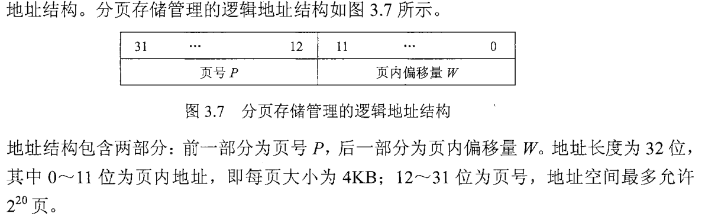
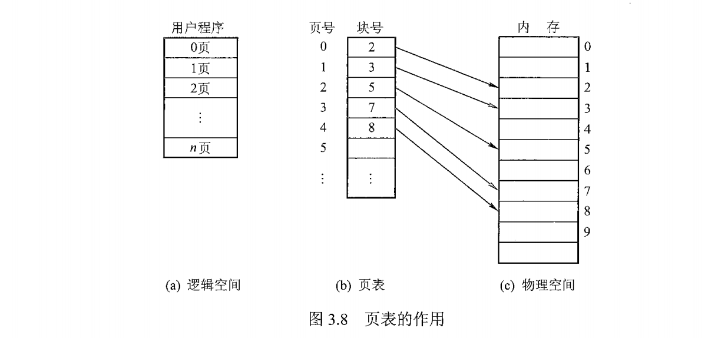
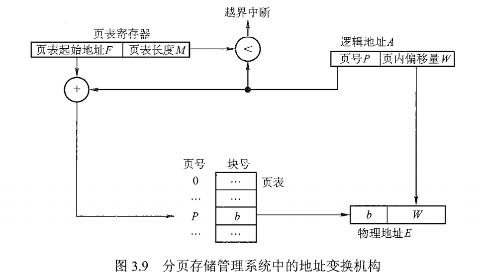
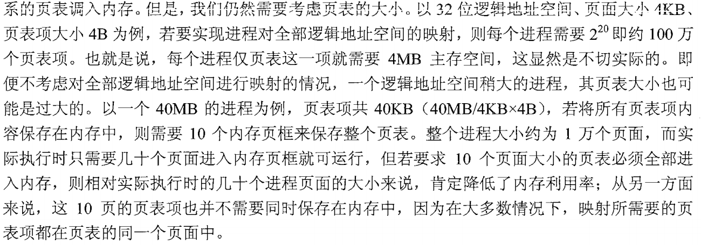
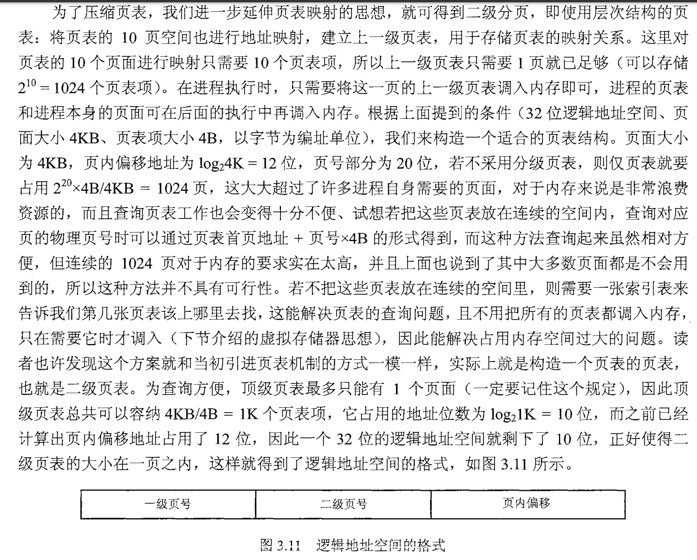
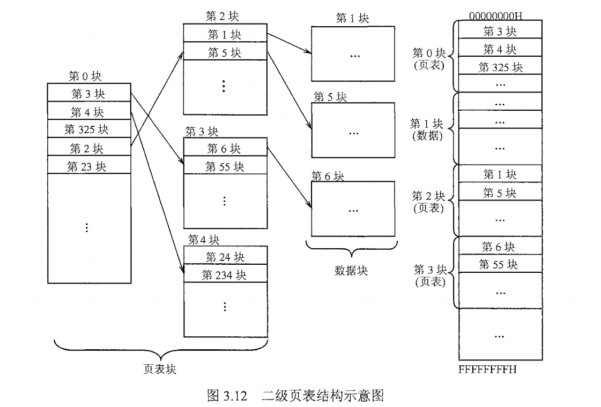
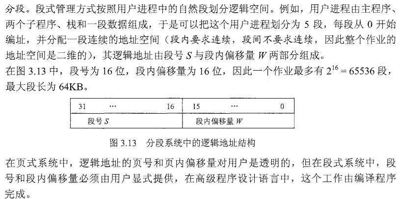
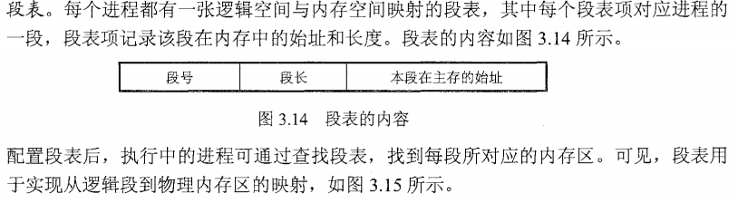
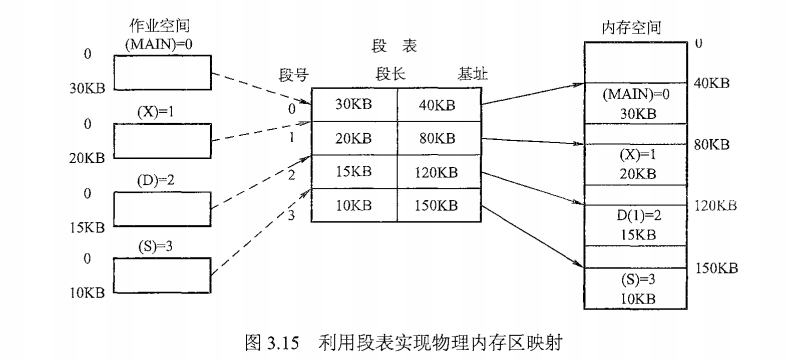
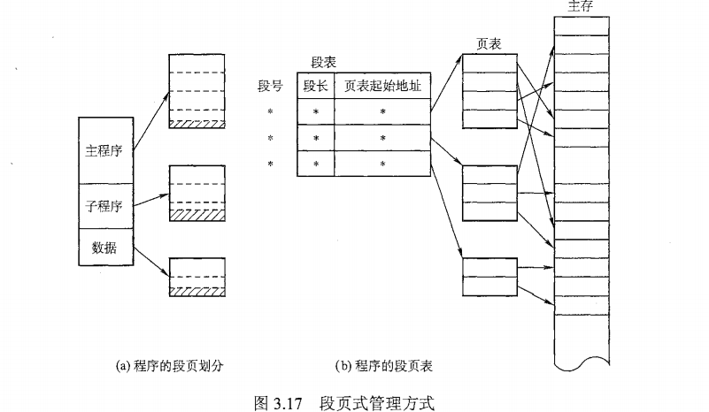

# 内存管理之内存管理的概念

> * 为什么进行内存管理
> * 页式管理中每个页表项大小的下限如何决定
> * 多级页表解决了什么问题，带来了什么问题

## 1. 内存管理的基本原理和要求

### 1.1 定义

> **操作系统对内存的划分和动态分配就是内存管理的概念**

### 1.2 内存管理的功能

> * 内存空间的分配和回收：由操作系统完成对主存的分配和回收，对编程人员透明
> * 地址转换：使逻辑地址转换为真实的物理地址
> * 内存空间的扩充：利用虚拟存储技术或自动覆盖技术，从逻辑上扩充内存
> * 存储保护：保证各道作业在各自的存储空间内运行，互不干扰

### 1.3 程序的装入和链接

> ​	创建进程首先要将程序和数据装入内存。将用户源程序变为可在内存中执行的程序

#### 1.3.1 步骤描述

> * 编译：由编译程序将用户源代码编译为若干目标模块
> * 链接：由链接程序将编译后的一组目标模块和所需的库函数链接在一起，形成一个完整的装入模块
> * 装入：由装入程序将装入模块装入内存运行

#### 1.3.2 程序链接的方式

> * 静态链接：在程序运行之前，先将各目标模块及他们所需的库函数链接成一个可执行程序，此后不再拆开
> * 装入时动态链接：编译后所得的一组目标模块在装入时，边装入边链接
> * 运行时动态链接：对某些目标模块的链接，是在程序执行中需要该目标模块时才进行的。便于修改和更新以及实现对目标模块的共享

#### 1.3.3 装入内存的方式

> * 绝对装入：在编译时即知道程序将装入的内存具体地址，则编译程序将产生绝对地址的目标代码。而后将程序和数据装入内存，只适用于单道程序环境
> * 可重定位装入：在多道程序环境中，多个目标模块的起始地址均为0开始。装入内存时，通过所分配的内存起始地址加上程序内的相对地址进行地址的动态变换，一次完成，又称为静态重定位。【必须一次性全部装入，运行期间不能动态扩充和移动】
> * 动态运行时装入：装入模块装入内存后并不立即进行地址转换，而是等到程序执行时才进行。需要重定位寄存器的支持【可以将程序分哦到不连续的存储区中，程序运行前只需要装入部分代码，运行期间根据需要动态分配内存，便于程序段的共享，可以向用户提供一个比存储空间大得多的地址空间】

### 1.4 逻辑地址空间与物理地址空间

> * 逻辑地址空间：程序编译后的每个模块都是以0开始编址，称为目标模块的逻辑地址。当链接为一个完整的可执行目标程序时，链接程序将按顺序以0开始编址，构造统一的逻辑地址空间。
> * 物理地址空间：内存中物理单元的集合，是地址转换的最终地址，当装入程序将可执行代码装入内存中时，必须将逻辑地址转化为物理地址

### 1.5 内存保护

> 内存分配前，需要保护操作系统不受用户进程的影响，同时保护用户进程不受其他用户进程的影响。

#### 1.5.1 内存保护的两种方式

> * 在CPU中设立一对上、下限寄存器，存放用户作业在主存中的上下限地址，每当CPU要访问一个地址时，先根据这对上下限判断是否越界访问
> * 采用重定位寄存器和限长寄存器来实现这种保护。重定位寄存器保存最小的物理地址，限长寄存器保存逻辑地址的最大值。进行内存访问时，先判断逻辑地址是否大于限长寄存器值，若未越界，则加上重定位寄存器的值映射成物理地址，再进行内存访问。

### 1.6 覆盖与交换

> ​	覆盖与交换技术是在多道程序环境下扩充内存的两种方法。

####  1.6.1 覆盖

> ​	早期系统主存小，仅存放一道用户程序，但存储空间放不下用户进程也时有发生，这一问题可以通过覆盖技术解决。
>
> ​	覆盖技术的具体细节：把用户空间划分为**固定区和覆盖区**，固定区存放用户程序经常活跃的部分，其余部分按调用关系分段，将即将访问的段放在覆盖区，其他放在外存，在需要调用前，系统将其调入覆盖区，替换原有的段。

#### 1.6.2 交换

> * 基本思想：把处于等待状态的进程或者被CPU剥夺运行权限的进程从内存移出到辅存，这一过程称为**换出**；把准备好竞争CPU的进程从辅存移到内存，这一过程称为**换入**

### 1.7 连续分配管理方式

> 包括单一连续分配、固定分区分配和动态分区分配。

#### 1.7.1 单一连续分配

> 主存分为系统区和用户区，用户区中永远只有一道程序，无需进行内存保护。

#### 1.7.2 固定分区分配

> 最简单的多道程序存储管理方式，将用户内存空间划分为若干固定大小的区域，每个分区只装入一道作业。当有空闲分区时，可再从外存的后背作业队列中选择适当大小的作业装入该分区。

> 划分方法：
>
> * 分区大小相等：缺乏灵活性
> * 分区大小不等：较多小分区、适量中分区、少量大分区

#### 1.7.3 动态分区分配

> ​	并不事先划分分区，而是根据装入的作业大小动态建立分区。

> 若装入进程或者换入主存时，若内存有多个足够大的空闲块，则操作系统必须确定分配哪个内存块给进程使用，即动态分区的分配策略：
>
> * 首次适应算法：按地址升序查找
> * 最佳适应算法：按容量升序查找
> * 最坏适应算法：按容量降序查找
> * 邻近适应算法：在按地址升序查找的前提下，查找的起点是上一次查找结束的位置

### 1.8 非连续分配管理方式

> * 允许一个程序分散地装入不相邻的内存分区。
> * 根据分区的大小是否固定，分为**分页存储管理方式和分段存储管理方式**
> * 根据是否把作业的所有页面都放入主存，分为**基本分页存储管理方式和请求分页存储管理方式**

#### 1.8.1 基本分页存储管理方式

##### 1.8.1.1 基本思想

> * 基本思想：把主存空间划分为大小相等且固定的块。块相对较小，作为主存的基本单位。进程也以块为单位进行划分，进程在执行时，以块为单位逐个申请主存中的块空间。

##### 1.8.1.2 一些概念

> * 进程中的块称为 页；内存中的块称为 页框；外存中的块直接称为 块。
> * 为方便地址转移，页面大小应该是 2 的整数幂。
> * 页面大小要适中，过大则会增加业内碎片；过小则会增加页数，页表随之变大，增加硬件地址转换开销

> * 页表：
>
> 
>
> 

#### 1.8.2 基本地址变换机构

> 地址变换机构的任务是将逻辑地址转换为内存中的物理地址，地址变换是借助于页表实现的。

#### 1.8.3 分页存储管理的问题

> * 每次访存操作都需要进行逻辑地址到物理地址的转换，地址转换过程必须足够快，否则访存速度会降低
> * 每个进程引入页表，用于存储映射机制，页表不能太大，否则内存利用率会降低

#### 1.8.4 具有快表的地址变换机构

> * 若页表全部放入主存，则存取一个数据或一条指令至少要访问两次内存：访问页表确定物理地址，根据地址获取数据或指令。比通常执行指令的速度慢了一半。
> * 为此，在地址变换机构中增设一个具有并行查找能力的高速缓冲存储器--快表，用来存放当前访问的若干页表项。主存中的页表称为 慢表。

#### 1.8.5 两级页表

#### 1.8.6 基本分段存储管理方式

> 分段管理方式的提出考虑了用户和程序员，以满足方便编程、信息保护和共享、动态增长及动态链接等多方面的需求

> * 分段：
>
>   
>
> * 段表：
>
>   
>
>   

#### 1.8.7 段页式管理方式

> * 页式管理方式有效提高内存利用率，段式管理方式能反映程序的逻辑结构并有利于段的共享。两者结合形成段页式管理方式
>
> * 段页式存储管理方式，作业空间被分为若干逻辑段，每段分为若干大小固定的页，内存空间的管理仍然是分页存储管理。
>
>   
>
> * 
> * 为了实现地址变换，系统为每个进程设置一张段表，每个分段有一张页表。

### 1.9 小结

> 无论是段式管理、页式管理还是段页式管理，都需要关注三个问题：逻辑地址结构、表项结构和寻址过程。