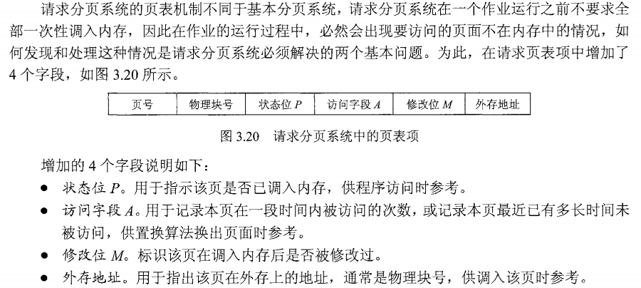
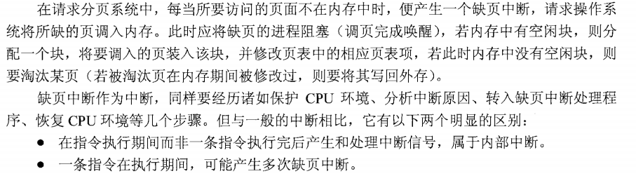
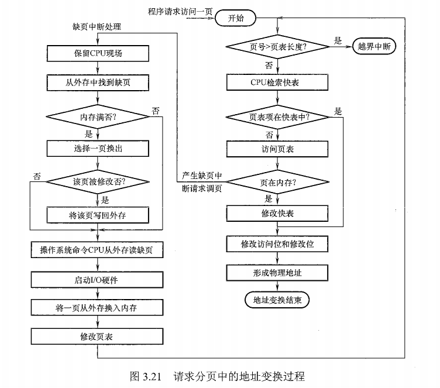

# 内存管理之虚拟内存管理

> * 为什么引入虚拟内存
> * 虚拟内存空间的大小由什么因素决定
> * 虚拟内存怎么解决问题，带来什么问题

## 1. 基本概念

### 1.1 传统存储管理方式的不足

> * 一次性：作业必须一次性装入内存才可以运行。导致大作业可能无法运行；导致当大作业量要求运行时，只能先运行部分
> * 驻留性：作业被装入内存后，其任何部分不能被换出，只能等待作业完成。

### 1.2 局部性原理

> * 时间局部性：由于程序中充满了大量的循环操作，当某段代码或某些数据被执行或访问时，在一定时间内，有可能会被再次执行或访问。
> * 空间局部性：当程序访问了某个存储单元，在一定时间内其附近的存储单元也可能被访问。因为指令和数据通常是顺序存储的。

### 1.3 虚拟存储器的定义

> ​	基于局部性原理，在程序装入内存时，只装入一部分，然后程序开始执行。当需要的内容并未装入时，由操作系统将所需部分装入内容。当部分程序内容暂时不需要使用时，由操作系统将其调出内存，以腾出空间。**如此，系统好像为用户提供了一个比实际内存大得多的存储器，称为虚拟存储器**

### 1.4 虚拟存储器的特征

> * 多次性：允许作业被分为多次装入内存
> * 对换性：允许作业在运行时进行换入和换出
> * 虚拟性：从逻辑上扩充内存容量

## 2. 虚拟内存技术的实现

### 2.1 内存分配方式的选择

> ​	**若采用连续分配的方式，将会使部分内存空间暂时或永久地处于空闲状态，造成内存浪费。**因此，虚拟内存技术的实现需要建立在离散分配的内存管理方式上。

### 2.2 虚拟内存的实现方式

> 虚拟内存的实现有以下三种方式：
>
> * 请求分页存储管理
> * 请求分段存储管理
> * 请求段页式存储管理
>
> **不管采用哪种方式，都要有一定的硬件支持。一般需要的支持有以下几个方面：**
>
> * 一定容量的内存和外存
> * 页表机制【或段表机制】作为主要的数据结构
> * 中断机构，当用户程序需要访问的部分尚未调入内存，则产生中断
> * 地址变换机构，逻辑地址到物理地址的变换

#### 2.2.1 请求分页管理方式

##### 2.2.1.1 简介

> * 建立在基本分页存储管理基础之上，为了支持虚拟存储功能而增加了请求调页、页面置换功能。
> * 初始时，只需要调入部分分页进入内存，便可启动作业。运行期间若发现缺页，则进行请求调页，还可以进行页面置换，以腾出内存空间。

##### 2.2.1.2 页表机制

> 

##### 2.2.1.3 缺页中断机构

##### 2.2.1.4 地址变换机构

#### 2.2.2 页面置换算法

> * 最佳置换算法：选择被淘汰的页面是以后不再使用的页面，或在最长时间内不再被访问的页面，保证最低的缺页率。该算法无法实现
> * 先进先出置换算法：把调入内存的页面连接成队列，按照队列的特性进行淘汰
> * 最近最久未使用置换算法
> * 时钟置换算法【最近未使用算法】