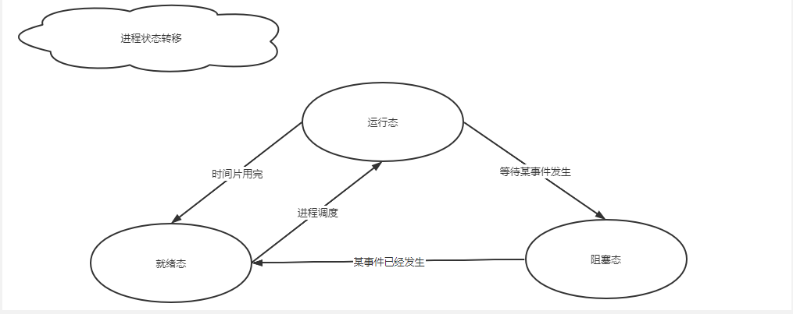

# 进程线程与协程程详解

## 1. 进程

### 1.1 定义

> * 为了能使程序并发执行，且可以对并发执行的程序加以描述和控制，人们引入了“进程”的概念
> * 进程是程序的一次执行过程
> * 进程是一个程序及其数据在处理机上顺序执行时所发生的活动
> * 进程时具有独立功能的程序在一个数据集合上运行的过程，是系统进行资源分配和调度的一个独立单位。

### 1.2 组成

> * 由**程序段、相关的数据段和PCB**三部分构成进程实体【进程映像】，简称进程
> * 所谓创建进程，实际上是创建进程实体的PCB；撤销进程则是撤销进程的PCB
> * 程序段是能被进程调度程序调度到CPU执行的代码段，可被多个进程共享
> * 数据段可以是进程对应的程序加工处理的原始数据，也可以是程序执行时产生的中间结果

### 1.3 特征

> * 动态性：进程的实质是程序在多道程序系统中的一次执行过程，进程是动态产生，动态消亡的。 
> * 并发性：任何进程都可以同其他进程一起并发执行 
> * 独立性：进程是一个能独立运行的基本单位，同时也是系统分配资源和调度的独立单位； 
> * 异步性：由于进程间的相互制约，使进程具有执行的间断性，即进程按各自独立的、不可预知的速度向前推进 
> * 结构特征：进程由程序、数据和进程控制块三部分组成。
> * 多个不同的进程可以包含相同的程序：一个程序在不同的数据集里就构成不同的进程，能得到不同的结果；但是执行过程中，程序不能发生改变。

### 1.4 状态

### 1.5 进程控制块PCB

#### 1.5.1 作用

> * 作为独立运行基本单位的标志：PCB是进程存在于系统的唯一标志
> * 能实现间断性运行方式：保存CPU现场信息
> * 提供进程管理所需要的信息
> * 提供进程调度所需要的信息
> * 实现与其他进程的同步与通信

#### 1.5.2 内容

> * 进程标识符：唯一标识一个进程，一个进程通常有两种标识符：
>   * 外部标识符：方便用户【进程】对进程的访问，由创建者提供
>   * 内部标识：方便系统对进程的使用，赋予每一个进程一个唯一的数字标识符，通常是一个进程的序号
> * 处理机状态【处理机上下文】：主要是由处理机的各种寄存器中的内容组成。寄存器包括：通用寄存器、指令计数器、程序状态字、用户栈指针
> * 进程调度信息：进程状态、进程优先级、进程调度的其他信息、事件
> * 进程控制信息：程序和数据的地址、进程同步和通信机制、资源清单、链接指针

#### 1.5.3 组织方式

> * 线性方式：所有PCB都组织在一张线性表中，将该表的首地址放在内存的一个专用区域
> * 链接方式：把具有相同状态进程的PCB分别通过PCB中的链接字链接成一个队列。可以形成就绪队列、若干阻塞队列和空白队列等。
> * 索引方式：系统根据进程状态的不同，建立几张索引表，如就绪索引表、阻塞索引表等。并把索引表在内存中的首地址记录在内存的一些专用单元中。

## 2. 线程

### 2.1 简介

> * 线程，有时被称为轻量级进程(Lightweight Process，LWP），是程序执行流的最小单元。一个标准的线程由线程ID，当前指令指针(PC），寄存器集合和堆栈组成。
> * 另外，线程是进程中的一个实体，是被系统独立调度和分派的基本单位，线程自己不拥有系统资源，只拥有一点儿在运行中必不可少的资源，但它可与同属一个进程的其它线程共享进程所拥有的全部资源。
> * 线程是程序中一个单一的顺序控制流程。是进程内一个相对独立的、可调度的执行单元，是系统独立调度和分派CPU的基本单位。在单个程序中同时运行多个线程完成不同的工作，称为多线程。

### 2.2 特点

> * 轻型实体：线程中的实体基本上不拥有系统资源，只是有一点必不可少的、能保证独立运行的资源。 
>   线程的实体包括程序、数据和TCB。线程是动态概念，它的动态特性由线程控制块TCB（Thread Control Block）描述。
>   * TCB包括以下信息： 
>     * 线程状态
>     * 当线程不运行时被保存的现场资源
>     * 一组执行堆栈
>     * 存放每个线程的局部变量主存区
>     * 访问同一个进程中的主存和其他资源
>     * 程序计数器、保留局部遍历、少数状态参数和返回地址等的一组寄存器和堆栈
> * 独立调度和分派的基本单位。
>   * 在多线程OS中，线程是能独立运行的基本单位，因而也是独立调度和分派的基本单位。
>   * 由于线程很“轻”，故在同一进程内线程的切换非常迅速且开销小
> * 可并发执行。
>   * 在一个进程中的多个线程之间，可以并发执行，甚至允许在一个进程中所有线程都能并发执行；
>   * 同样，不同进程中的线程也能并发执行，充分利用和发挥了处理机与外围设备并行工作的能力。 
> * 共享进程资源。
>   * 在同一进程中的各个线程，都可以共享该进程所拥有的资源
>   * 这首先表现在：所有线程都具有相同的地址空间（进程的地址空间），这意味着，线程可以访问该地址空间的每一个虚地址；此外，还可以访问进程所拥有的已打开文件、定时器、信号量机构等。由于同一个进程内的线程共享内存和文件，所以线程之间互相通信不必调用内核。

## 3. 协程

### 3.1 简介

> * 协程（Coroutines）是一种比线程更加轻量级的存在，正如一个进程可以拥有多个线程一样，一个线程可以拥有多个协程。
> * 协程不是被操作系统内核所管理的，而是完全由程序所控制，也就是在用户态执行。这样带来的好处是性能大幅度的提升，因为不会像线程切换那样消耗资源。
> * 协程不是进程也不是线程，而是一个特殊的函数，这个函数可以在某个地方挂起，并且可以重新在挂起处外继续运行。所以说，协程与进程、线程相比并不是一个维度的概念。
> * 一个线程内的多个协程虽然可以切换，但是多个协程是串行执行的，只能在一个线程内运行，没法利用CPU多核能力。

> * 协程对计算密集型的任务也没有太大的好处，计算密集型的任务本身不需要大量的线程切换，因此协程的作用也十分有限，反而还增加了协程切换的开销。

## 4. 进程与线程的区别

> 