大纲：

1. 掌握计算机网络的<font color=red>基本概念、基本原理和基本方法</font>；
2. 掌握计算机网络的<font color=green>体系结构、典型的网络协议</font>，了解典型的<font color=green>网络设备</font>的组成与特点，理解<font color=green>网络设备</font>的工作原理；
3. 能够运用计算机网络知识进行<font color=blue>网络系统的分析、设计与应用</font>。


# 第一章、计算机网络体系结构


## 一、计算机网络概述

### 1.1 计算机网络的组成

* 从 **组成部分** 来看

    * 计算机网络 = 硬件 + 软件 + 协议

* 从 **工作方式** 来看

    * 边缘部分：用户的主机
        * C/S 、B/S （Client/Server、Browser/Servier）
        * P2P（peer to peer）
    * 核心部分：网络 + 连接的网线与路由器

* 从 **功能组成** 来看

    * 通信子网：传输介质 + 通信设备 + 相应的网络协议，它使得网络具有**数据传输、交换、控制和存储**的能力，实现联网计算机之间的数据通信。

    * 资源子网：实现资源共享功能的设备和软件的集合，向网络用户提供共享其他计算机上的硬件资源、软件资源、数据资源的服务。

        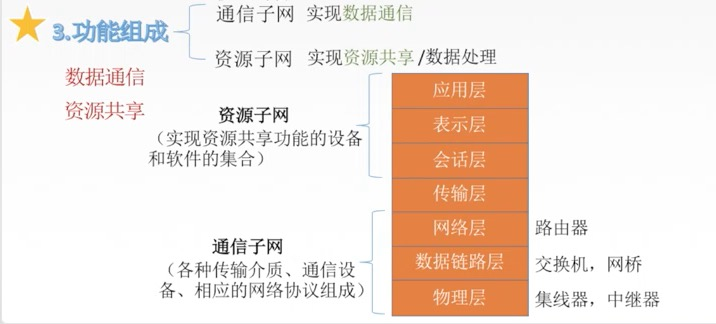


### 1.2 计算机网络的功能

* 数据通信：它是计算机网络**最基本、最重要**的功能。
* 资源共享
* 分布式处理
* 提高可靠性
* 负载均衡


### 1.3 计算机网络的分类

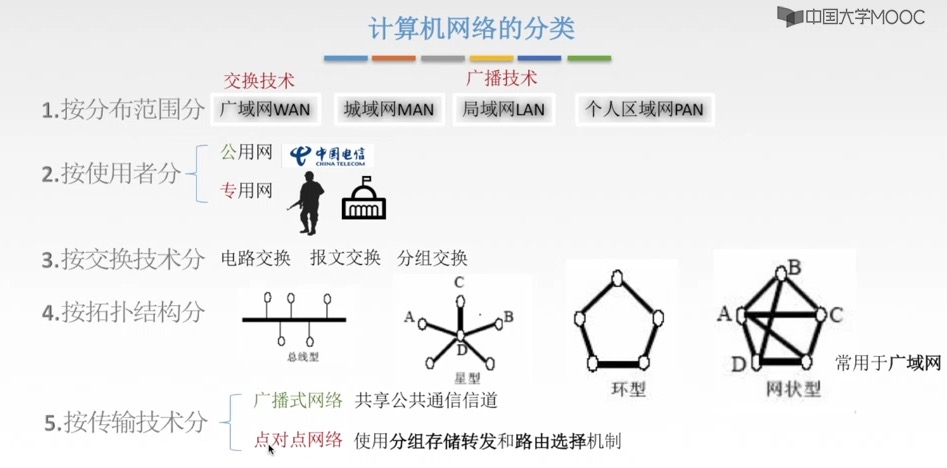

* 按 **分布范文** 分类
    * WAN、MAN、LAN、PAN

* 按 **传输技术** 分类

    * 广播式网络
        * 所有联网计算机共享一个公共信道。当一个计算机发送报文时，所有其他计算机都能『收听』到。接受到后计算机通过检查目的地址来决定是否接收。
        * 应用：局域网，广域网中的无线、卫星通信网络
    * 点对点网络
        * 每条物理线路连接一对计算机。若通讯的两台计算机直接没有直接连接的线路，则它们直接的分组传输就要通过中间结点进行**接收、存储和转发**，直至目的结点。
        * 应用：广域网
    * 区别：**是否采用分组存储转发与路由选择机制** 是点对点网络与广播式网络的重要区别。

* 按 **拓扑结构** 分类

    * 总线形：局域网

    * 星形：局域网

    * 环形：局域网

    * 网状网络：广域网

* 按 **使用者** 分类

    * 公用网
    * 专用网

* 按 **交换技术** 分类

    * 电路交换网络
        * 最典型：传统电话网络
    * 报文交换网络
        * 报文交换是将整个数据封装成一个报文进行 **存储-转发**；
    * 分组交换网络
        * 分组交换是将数据分成较短固定长度的数据块进行 **存储-转发**；
        * 主流网络
    * 区别：
        * 电路交换：占着专线，其他人插入不进来。
        * 报文交换、分组交换：存储-转发，一段一段的转发。

* 按 **传输介质** 分类

    * 有线
    * 无线

​	

### 1.4 计算机网络的标准化工作和相关组织

#### 1. 标准化工作

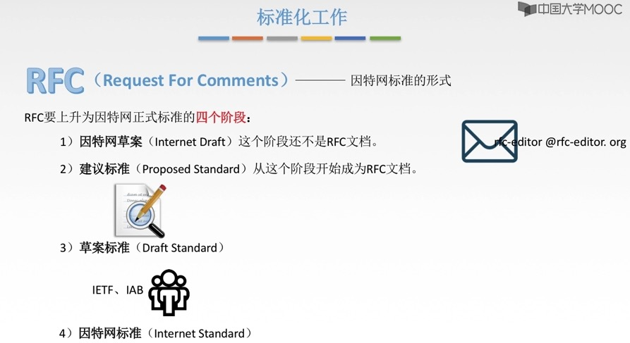


#### 2. 标准化组织

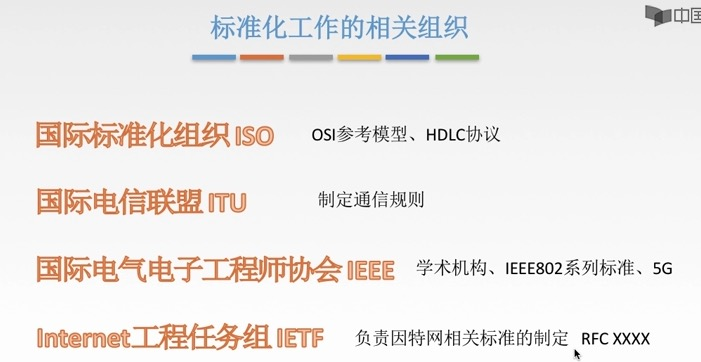


### 1.5 计算机网络的性能指标

* 速率
* 带宽
* 吞吐量
* 时延
* 时延带宽积
* 往返直接RTT
* 利用率

#### a. 速率 带宽 吞吐量

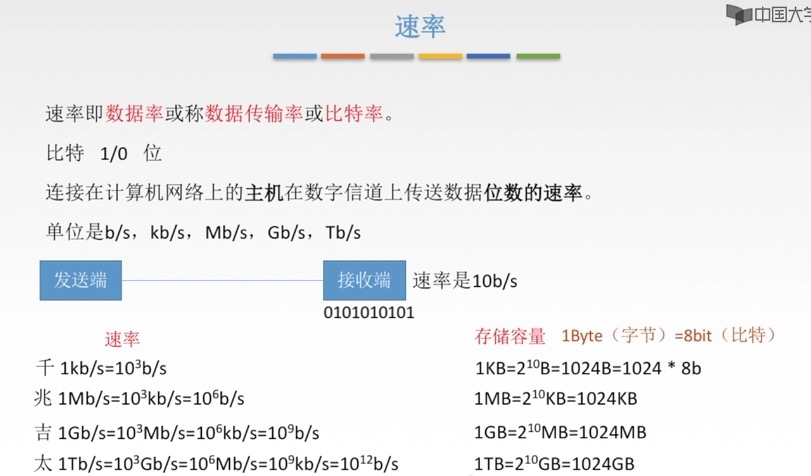

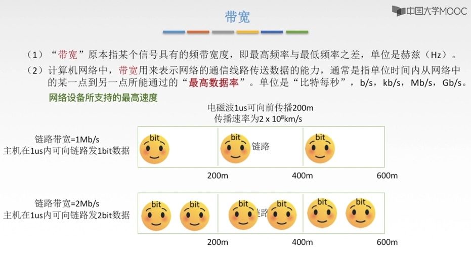

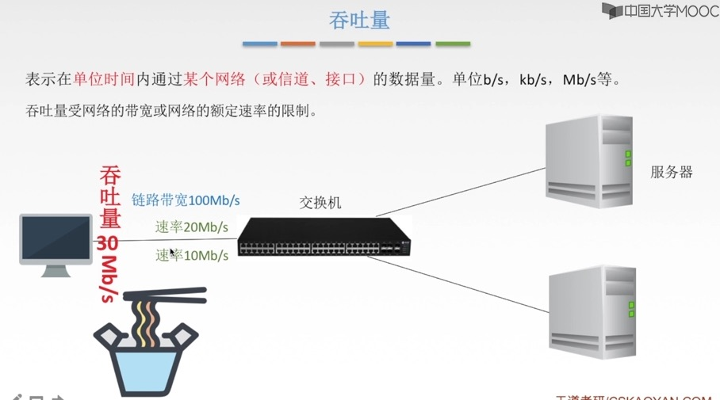


1.1、单位转换

>在计算机科学中，bit是表示信息的最小单位，叫做二进制位；一般用0和1表示。
>Byte叫做字节，由8个位（8bit）组成一个字节(1Byte)，用于表示计算机中的一个字符

```
1T  = 1024G 
1G  = 1024M 
1M  = 1024KB 
1KB = 1024B
1B  = 1Byte = 8 bit 
```

1.2、【疑问】电脑硬盘500G，打开却只有480G ？？

* G、M、K之间的进制是1024，这是由于2进制的原因而定义的。而在IT产品行业多数是按1000进制计算，即1GB＝1000MB，这就是我们常看到的硬盘格式化以后为什么缩水了的原因，且硬盘越大差别越大。因为厂家是按1GB＝1000MB计算的硬盘容量，而格式化时系统是按1GB＝1024MB计量的。

1.3、带宽与网速

[网速单位换算](https://zhidao.baidu.com/question/495451667151530524.html?qbl=relate_question_0&word=%CD%F8%C2%E7M%D7%AA%BB%BB)

>在计算机网络或者是网络运营商中，一般，宽带速率的单位用bps(或b/s)表示；bps表示比特每秒即表示每秒钟传输多少位信息，是bit per second的缩写。在实际所说的1M带宽的意思是1Mbps（是兆比特每秒Mbps不是兆字节每秒MBps）。


* 线路单位是bps，表示bit(比特)/second(秒)
* 用户在网上下载时显示的速率单位往往是Byte(字节)/s(秒)，注意是大写字母B

```
带宽16Mbps = 16/8MBps = 2MBps (理论下载速度)
```

```
1s = 1,000ms = 1,000,000us
```


#### b. 时延 时延带宽积 往返时延RTT

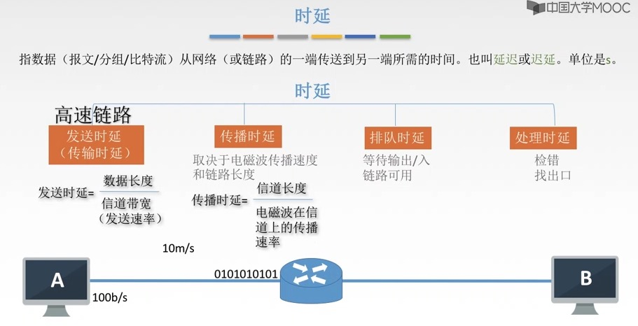

```
高速链路：提高了发送，不改变传播。
```


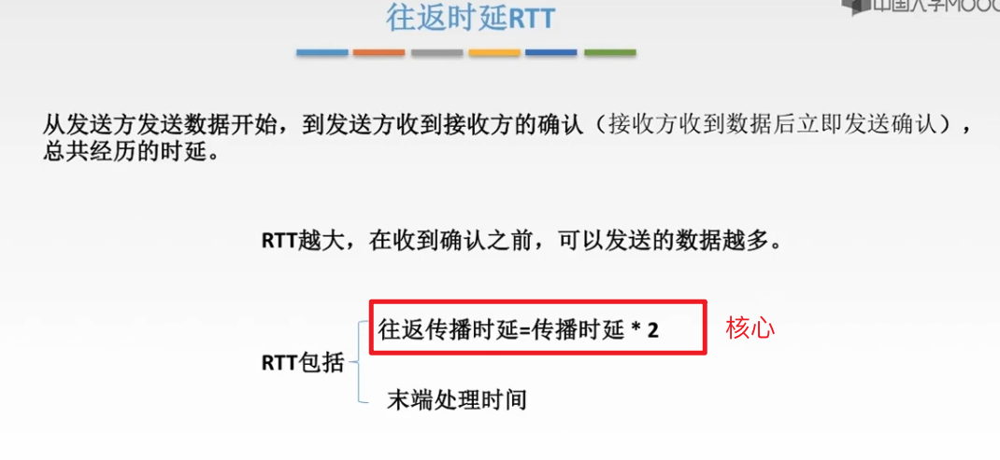

```
RTT不包括『发送时延』
```

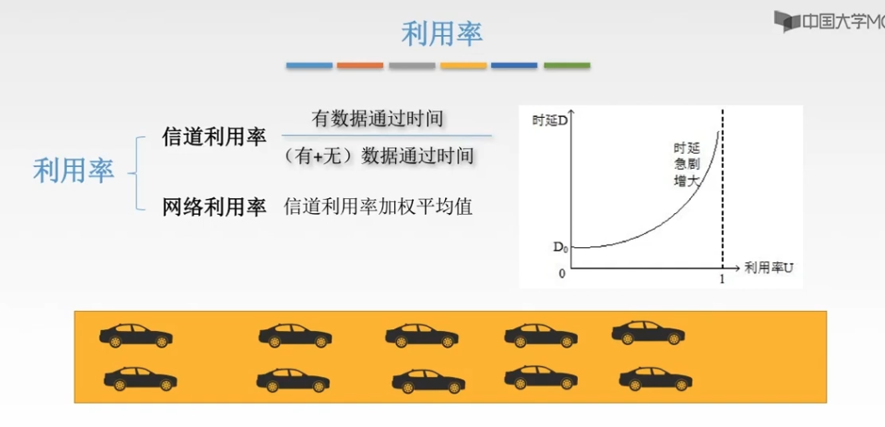


## 二、计算机网络的体系结构与参考模型

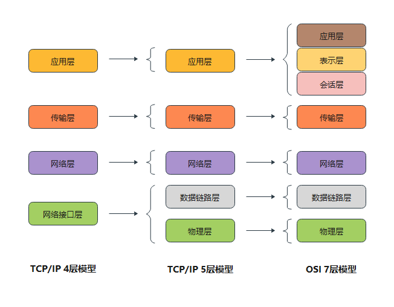

### 2.1 计算机网络协议、接口、服务的概念

* 协议
    * 规则的集合。在网络中要进行有条不紊的交换数据，就必须遵守一些事先约定的规则。
    * 协议 = 语法 + 语义 + 同步。
        * 语法：规定了传输数据的格式；
        * 语义：规定了所要完成的功能；
        * 同步：规定了各种操作的条件、时序关系。
* 接口
    * 接口就是同一结点内相邻的两层交换信息的连接点，是一个系统内部的规定。
* 服务
    * 服务是指下层为紧邻的上层提供的功能调用，它是垂直的。

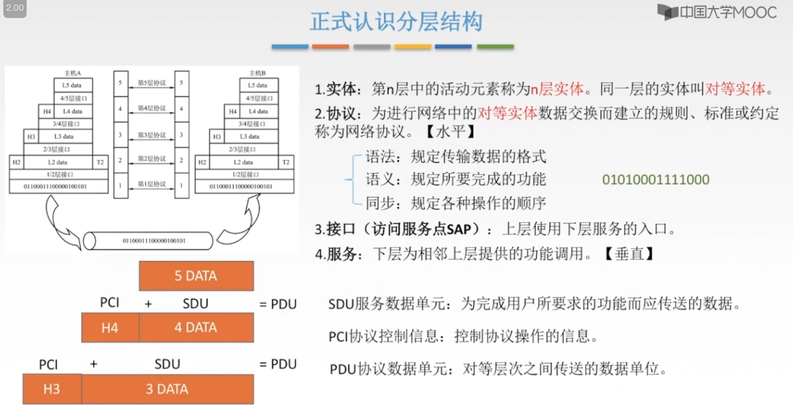


### 2.2 ISO/OSI参考模型

* 共7层：物 联 网 淑 慧 试 用
  * 应用层
  * 表示层
  * 会话层
  * 传输层
  * 网络层
  * 数据链路层
  * 物理层
  
* 低三层统称为**通信子网**，它是为了联网而附加的通信设备，完成数据传输的功能。

* 高三层统称为**资源子网**，它相当于计算机系统，完成数据的处理等功能。

* 传输层 - 承上启下

  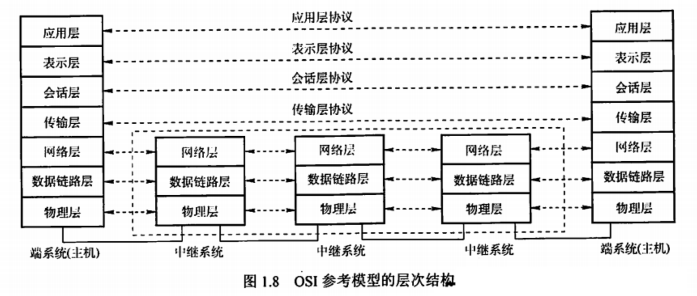

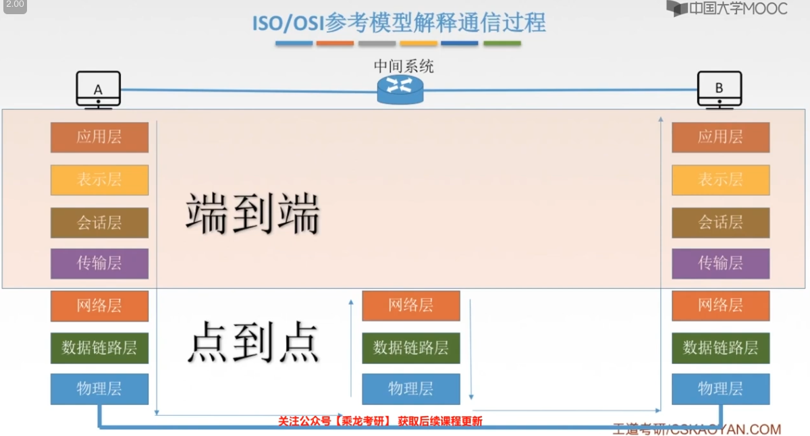


#### a. 物理层

* 传输单位：比特
* 任务：在 **物理媒体** 上实现比特流的 **透明传输**
* 功能：
    * 定义接口特性
    * 定义传输模式：单工、半双工、双工
    * 定义传输速率
    * 比特同步
    * 比特编码

* 物理层主要定义 数据终端设备DTE 与 数据通信设备DCE 的物理与逻辑连接方法，所以物理层协议也称 **物理层接口标准**。
    * 物理层接口标准：Rj45 、802.3

#### b. 数据链路层

* 传输单位：帧
* 任务：**将网络层传来的数据报组装成帧。**
* 功能：
    * 成帧：定义帧的开始与结束
    * 差错控制：**帧错 + 位错**
    * 流量控制
    * 访问（接入）控制：控制对信道的访问

* 协议：SDLC、HDLC、PPP、STP、帧中继

#### c. 网络层

* 传输单位：数据报 = 分组 + 分组 + 分组 + .....
* 任务：关心通信子网的运行控制，将网络层的协议数据单元（分组）传输到目的端，为分组交换网上的不同主机提供通信服务。
* 功能：关键问题是对**分组进行路由选择**，并实现：
    * 路由选择
    * 流量控制
    * 差错控制：奇偶检验码 
    * 拥塞控制

* 协议：IP、IPX、ICMP、IGMP、ARP、RARP、OSPF

#### d. 传输层

* 传输单位：报文段（TCP）或 用户数据报（UDP）
* 任务：负责主机中 **两个进程间** 的通信，即 **端到端** 的通信
* 功能：为 **端到端**连接提供可靠的传输服务，包括：***可 差 流 用***
    * 可靠传输、不可靠传输
    * 差错控制
    * 流量控制
    * 复用分用

* 协议：TCP、UDP

​		数据链路层提供的是点到点的通信，传输层提供的是端到端的通信，两者不同。通俗地说，点到点可以理解为主机到主机之问的通信，一个点是指一个硬件地址或IP地址，网络中参与通信的主机是通过硬件地址或IP地址标识的；端到端的通信是指运行在不同主机内的两个进程之间的通信，一个进程由一个端口来标识，所以称为端到端通信。

#### e. 会话层

功能：向表示层实体 / 用户进程提供 **建立连接** 并在连接上 **有序** 地 **传输数据**，这就是会话，也是建立同步SYN。

功能一：建立、管理、终止会话

功能二：使用校验点可使会话在通信失效时从 **校验点 / 同步点** 继续恢复通信，实现数据同步。

协议（了解）：ADSP、ASP

#### f. 表示层

功能一：数据格式变化

功能二：数据加密、解密

功能三：数据压缩和恢复

协议（了解）：JPEG、ASCII

#### g. 应用层

协议：FTP、SMTP、HTTP


### 2.3 TCP/IP参考模型

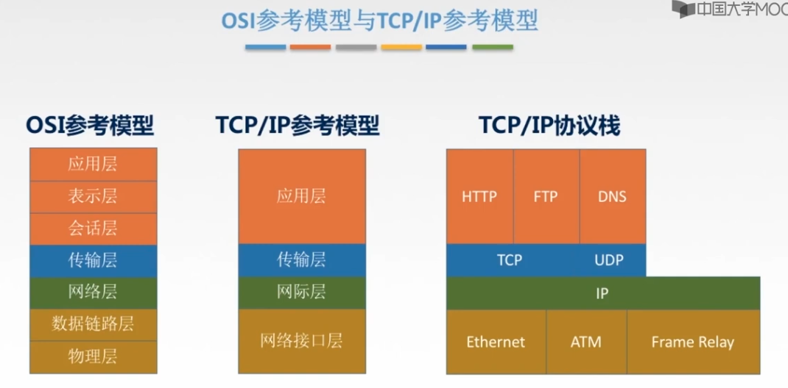


### 2.4 5层参考模型

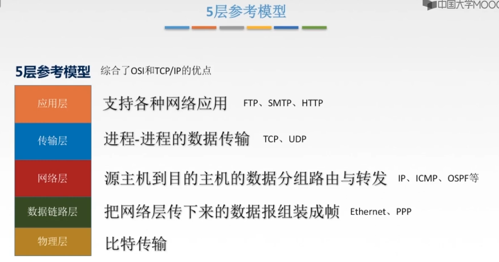

