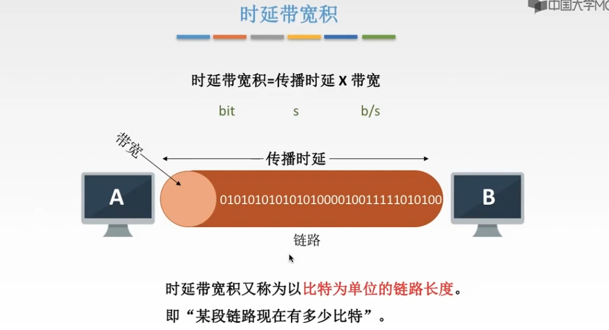
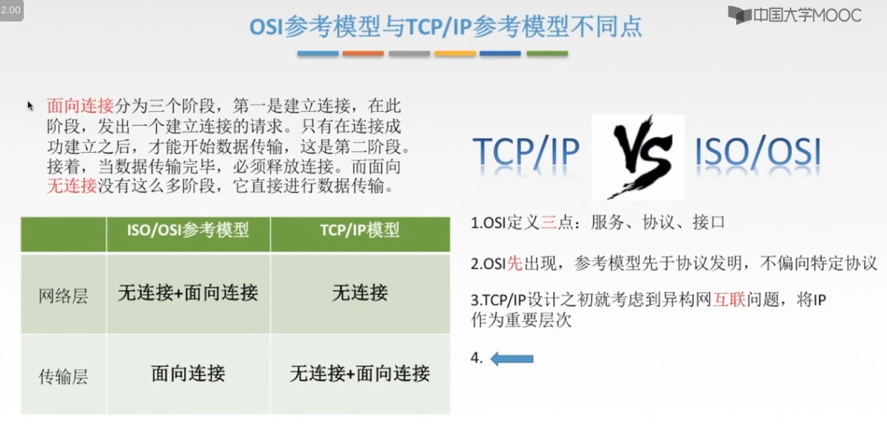

[学习视频](https://www.bilibili.com/video/BV12V4y1j7Hi/?spm_id_from=333.999.0.0&vd_source=dc55c355e9f5b6174832aacfb5d8b6aa)

大纲：

1. 掌握计算机网络的<font color=red>基本概念、基本原理和基本方法</font>；
2. 掌握计算机网络的<font color=green>体系结构、典型的网络协议</font>，了解典型的<font color=green>网络设备</font>的组成与特点，理解<font color=green>网络设备</font>的工作原理；
3. 能够运用计算机网络知识进行<font color=blue>网络系统的分析、设计与应用</font>。


# 第一章、计算机网络体系结构


## 一、计算机网络概述

### 1.1 计算机网络的组成

* 从 **组成部分** 来看

    * 计算机网络 = 硬件 + 软件 + 协议

* 从 **工作方式** 来看

    * 边缘部分：用户的主机
        * C/S 、B/S （Client/Server、Browser/Servier）
        * P2P（peer to peer）
    * 核心部分：网络 + 连接的网线与路由器

* 从 **功能组成** 来看

    * 通信子网：传输介质 + 通信设备 + 相应的网络协议，它使得网络具有**数据传输、交换、控制和存储**的能力，实现联网计算机之间的数据通信。

    * 资源子网：实现资源共享功能的设备和软件的集合，向网络用户提供共享其他计算机上的硬件资源、软件资源、数据资源的服务。

        


### 1.2 计算机网络的功能

* 数据通信：它是计算机网络**最基本、最重要**的功能。
* 资源共享
* 分布式处理
* 提高可靠性
* 负载均衡


### 1.3 计算机网络的分类


* 按 **分布范文** 分类
    * WAN、MAN、LAN、PAN

* 按 **传输技术** 分类

    * 广播式网络
        * 所有联网计算机共享一个公共信道。当一个计算机发送报文时，所有其他计算机都能『收听』到。接受到后计算机通过检查目的地址来决定是否接收。
        * 应用：局域网，广域网中的无线、卫星通信网络
    * 点对点网络
        * 每条物理线路连接一对计算机。若通讯的两台计算机直接没有直接连接的线路，则它们直接的分组传输就要通过中间结点进行**接收、存储和转发**，直至目的结点。
        * 应用：广域网
    * 区别：**是否采用分组存储转发与路由选择机制** 是点对点网络与广播式网络的重要区别。

* 按 **拓扑结构** 分类

    * 总线形：局域网

    * 星形：局域网

    * 环形：局域网

    * 网状网络：广域网

* 按 **使用者** 分类

    * 公用网
    * 专用网

* 按 **交换技术** 分类

    * 电路交换网络
        * 最典型：传统电话网络
    * 报文交换网络
        * 报文交换是将整个数据封装成一个报文进行 **存储-转发**；
    * 分组交换网络
        * 分组交换是将数据分成较短固定长度的数据块进行 **存储-转发**；
        * 主流网络
    * 区别：
        * 电路交换：占着专线，其他人插入不进来。
        * 报文交换、分组交换：存储-转发，一段一段的转发。

* 按 **传输介质** 分类

    * 有线
    * 无线

​	

### 1.4 计算机网络的标准化工作和相关组织

#### 1. 标准化工作


#### 2. 标准化组织


### 1.5 计算机网络的性能指标

* 速率
* 带宽
* 吞吐量
* 时延
* 时延带宽积
* 往返直接RTT
* 利用率

#### a. 速率 带宽 吞吐量


1.1、单位转换

>在计算机科学中，bit是表示信息的最小单位，叫做二进制位；一般用0和1表示。
>Byte叫做字节，由8个位（8bit）组成一个字节(1Byte)，用于表示计算机中的一个字符

```
1T  = 1024G 
1G  = 1024M 
1M  = 1024KB 
1KB = 1024B
1B  = 1Byte = 8 bit 
```

1.2、【疑问】电脑硬盘500G，打开却只有480G ？？

* G、M、K之间的进制是1024，这是由于2进制的原因而定义的。而在IT产品行业多数是按1000进制计算，即1GB＝1000MB，这就是我们常看到的硬盘格式化以后为什么缩水了的原因，且硬盘越大差别越大。因为厂家是按1GB＝1000MB计算的硬盘容量，而格式化时系统是按1GB＝1024MB计量的。

1.3、带宽与网速

[网速单位换算](https://zhidao.baidu.com/question/495451667151530524.html?qbl=relate_question_0&word=%CD%F8%C2%E7M%D7%AA%BB%BB)

>在计算机网络或者是网络运营商中，一般，宽带速率的单位用bps(或b/s)表示；bps表示比特每秒即表示每秒钟传输多少位信息，是bit per second的缩写。在实际所说的1M带宽的意思是1Mbps（是兆比特每秒Mbps不是兆字节每秒MBps）。


* 线路单位是bps，表示bit(比特)/second(秒)
* 用户在网上下载时显示的速率单位往往是Byte(字节)/s(秒)，注意是大写字母B

```
带宽16Mbps = 16/8MBps = 2MBps (理论下载速度)
```

```
1s = 1,000ms = 1,000,000us
```


#### b. 时延 时延带宽积 往返时延RTT


```
高速链路：提高了发送，不改变传播。
```




```
RTT不包括『发送时延』
```


## 二、计算机网络的体系结构与参考模型


### 2.1 计算机网络协议、接口、服务的概念

* 协议
    * 规则的集合。在网络中要进行有条不紊的交换数据，就必须遵守一些事先约定的规则。
    * 协议 = 语法 + 语义 + 同步。
        * 语法：规定了传输数据的格式；
        * 语义：规定了所要完成的功能；
        * 同步：规定了各种操作的条件、时序关系。
* 接口
    * 接口就是同一结点内相邻的两层交换信息的连接点，是一个系统内部的规定。
* 服务
    * 服务是指下层为紧邻的上层提供的功能调用，它是垂直的。


### 2.2 ISO/OSI参考模型

* 共7层：物 联 网 淑 慧 试 用
  * 应用层
  * 表示层
  * 会话层
  * 传输层
  * 网络层
  * 数据链路层
  * 物理层
  
* 低三层统称为**通信子网**，它是为了联网而附加的通信设备，完成数据传输的功能。

* 高三层统称为**资源子网**，它相当于计算机系统，完成数据的处理等功能。

* 传输层 - 承上启下

  

#### a. 物理层

* 传输单位：比特
* 任务：在 **物理媒体** 上实现比特流的 **透明传输**
* 功能：
    * 定义接口特性
    * 定义传输模式：单工、半双工、双工
    * 定义传输速率
    * 比特同步
    * 比特编码

* 物理层主要定义 数据终端设备DTE 与 数据通信设备DCE 的物理与逻辑连接方法，所以物理层协议也称 **物理层接口标准**。
    * 物理层接口标准：Rj45 、802.3

#### b. 数据链路层

* 传输单位：帧
* 任务：**将网络层传来的数据报组装成帧。**
* 功能：
    * 成帧：定义帧的开始与结束
    * 差错控制：**帧错 + 位错**
    * 流量控制
    * 访问（接入）控制：控制对信道的访问

* 协议：SDLC、HDLC、PPP、STP、帧中继

#### c. 网络层

* 传输单位：数据报 = 分组 + 分组 + 分组 + .....
* 任务：关心通信子网的运行控制，将网络层的协议数据单元（分组）传输到目的端，为分组交换网上的不同主机提供通信服务。
* 功能：关键问题是对**分组进行路由选择**，并实现：
    * 路由选择
    * 流量控制
    * 差错控制：奇偶检验码 
    * **拥塞控制**

* 协议：IP、IPX、ICMP、IGMP、ARP、RARP、OSPF

#### d. 传输层

* 传输单位：报文段（TCP）或 用户数据报（UDP）
* 任务：负责主机中 **两个进程间** 的通信，即 **端到端** 的通信
* 功能：为 **端到端**连接提供可靠的传输服务，包括：***可 差 流 用***
    * 可靠传输、不可靠传输
    * 差错控制
    * 流量控制
    * 复用分用

* 协议：TCP、UDP

​		数据链路层提供的是点到点的通信，传输层提供的是端到端的通信，两者不同。通俗地说，点到点可以理解为主机到主机之问的通信，一个点是指一个硬件地址或IP地址，网络中参与通信的主机是通过硬件地址或IP地址标识的；端到端的通信是指运行在不同主机内的两个进程之间的通信，一个进程由一个端口来标识，所以称为端到端通信。

#### e. 会话层

功能：向表示层实体 / 用户进程提供 **建立连接** 并在连接上 **有序** 地 **传输数据**，这就是会话，也是建立同步SYN。

功能一：建立、管理、终止会话

功能二：使用校验点可使会话在通信失效时从 **校验点 / 同步点** 继续恢复通信，实现数据同步。

协议（了解）：ADSP、ASP

#### f. 表示层

功能一：数据格式变化

功能二：数据加密、解密

功能三：数据压缩和恢复

协议（了解）：JPEG、ASCII

#### g. 应用层

协议：FTP、SMTP、HTTP


### 2.3 TCP/IP参考模型





### 2.4 5层参考模型


### 2.5 端到端 点到点

在计算机网络中，“端到端”和“点到点”是两个重要概念，它们描述了网络通信中不同层次的传输方式和通信模式。

1. **端到端（End-to-End）**：
   - 端到端通信是指数据从源端通过网络传输到目的端的过程。在端到端通信中，数据包从源主机传输到目的主机，经过网络中的各个路由器、交换机等设备，直到到达目的地。
   - 在端到端通信模式下，通信的双方直接交互，数据经过网络传输的过程中可能会经历多个中间节点，但最终的处理和决策是由通信的两个端点完成的。
   - 端到端通信强调了网络的端点之间的直接连接和交互，例如，Web浏览器和Web服务器之间的通信就是一种端到端通信。

2. **点到点（Point-to-Point）**：
   - 点到点通信是指网络中直接连接两个节点之间的通信方式。在点到点通信中，通信的两个端点之间通过专用线路或虚拟通道直接相连，而不需要经过其他中间节点。
   - 点到点通信可以在两个物理节点之间建立直接的通信链路，也可以通过虚拟链路在逻辑上连接两个节点。例如，拨号连接是一种点到点通信方式，它直接连接了用户计算机和互联网服务提供商的服务器。

总的来说，“端到端”强调了数据从源端到目的端的整个传输过程，而“点到点”则强调了网络中直接连接的两个节点之间的通信方式。在实际网络中，这两种通信模式可能会同时存在，并根据具体情况进行选择和应用。


## 三、GPT

### 1. 物理层

在计算机网络中，物理层是网络体系结构中的底层，负责传输原始比特流（0和1）以及物理连接的细节。物理层处理的是如何在物理介质上传输数据，它定义了传输媒介、接口标准、数据传输速率和信号传输方法等。

以下是物理层的主要功能和特点：

1. **传输介质**：
   物理层定义了在计算机网络中使用的传输介质，包括双绞线、光纤、无线电波等。不同的传输介质具有不同的特性，如带宽、传输距离、抗干扰能力等。

2. **数据编码**：
   物理层负责将数字数据转换为适合在传输介质上传输的模拟信号，以及将接收到的模拟信号转换回数字数据。这包括将比特流转换为电压、光信号等形式，并进行相应的解码。

3. **传输速率**：
   物理层定义了数据传输的速率，即比特率（bit rate），它表示在单位时间内传输的比特数。传输速率受到传输介质特性的限制，如带宽、传输距离、噪声等。

4. **数据传输方式**：
   物理层定义了数据在传输介质中的传输方式，包括串行传输和并行传输。串行传输是逐位传输，而并行传输是同时传输多个位。

5. **物理拓扑**：
   物理层定义了网络中设备之间的连接方式和布局，即物理拓扑，如总线、星型、环型等。

6. **接口标准**：
   物理层定义了设备之间的接口标准，包括电气特性、机械特性和功能特性，以确保不同厂商生产的设备能够互联互通。

物理层的主要目标是确保数据在传输介质上可靠地传输，同时最大限度地提高传输效率。物理层的功能对于整个网络的性能和稳定性至关重要，因为它直接处理了网络中最基本的数据传输过程。


### 2. 数据链路层

数据链路层是计算机网络体系结构中的第二层，位于物理层之上，负责在直接相连的节点之间传输数据帧。数据链路层通过物理层提供的物理连接，实现了节点之间的直接通信。

数据链路层的主要功能和特点包括：

1. **封装成帧**：
   数据链路层将网络层传递下来的数据包封装成数据帧（Frame），并在帧的首部和尾部添加了帧起始标志、地址、错误检测等控制信息，以便在接收端正确解析和处理数据。

2. **透明传输**：
   数据链路层负责在物理层提供的传输介质上进行透明的数据传输，屏蔽了底层物理细节对上层应用的影响，使上层协议可以将数据发送到相邻节点而不需要了解底层的具体传输细节。

3. **地址识别**：
   数据链路层使用硬件地址（MAC地址）来标识网络中的设备，每个网络接口都有一个唯一的MAC地址，用于在局域网内进行设备之间的唯一标识和寻址。

4. **流量控制**：
   数据链路层通过流量控制机制来协调发送端和接收端之间的数据传输速率，以避免数据包的丢失和网络拥塞。

5. **差错检测与纠正**：
   数据链路层使用差错检测技术（如循环冗余检测CRC）来检测数据在传输过程中是否发生了错误，并在必要时进行重传或纠正，以保证数据传输的可靠性和完整性。

6. **链路管理**：
   数据链路层负责管理与物理层的接口，处理与物理层的连接建立、维护和释放，以及处理链路的异常情况，如链路中断、重传等。

在OSI模型中，数据链路层通常被分为两个子层：逻辑链路控制子层（LLC，Logical Link Control）和介质访问控制子层（MAC，Media Access Control）。LLC子层负责数据帧的传输控制和流量管理，而MAC子层负责地址识别和媒体访问控制。


### 3. 网络层

网络层是计算机网络体系结构中的第三层，位于数据链路层之上，负责在网络中的不同节点之间提供数据传输和路由选择的功能。网络层的主要任务是实现逻辑上的端到端通信，通过选择合适的路径将数据从源主机传输到目的主机。

网络层的功能和特点包括：

1. **路由选择**：
   网络层根据目的地址选择合适的路径进行数据传输。路由选择算法负责根据网络拓扑、链路状态和其他因素选择最佳的传输路径，以实现数据的有效传输。

2. **转发**：
   网络层在每个路由器或网关上实现数据的转发功能，根据目的地址和路由表将数据包转发到下一跳或目标节点。路由器根据数据包的目的地址进行路由转发，将数据包从一个接口转发到另一个接口。

3. **分组封装**：
   网络层将传输层传递下来的数据进行分组封装，并添加了网络层的首部信息，如源地址、目的地址、TTL（Time-to-Live）等字段，以便在网络中进行路由选择和转发。

4. **拥塞控制**：
   网络层通过拥塞控制机制来管理网络中的拥塞情况，避免网络过载和数据包丢失。拥塞控制算法可以根据网络流量和拥塞状态调整传输速率，以保持网络的稳定性和性能。

5. **数据报和虚电路服务**：
   网络层提供两种主要的数据传输服务：数据报服务和虚电路服务。数据报服务是无连接的、面向数据报的服务，每个数据包都独立传输，不需要事先建立连接。虚电路服务是面向连接的服务，通过建立虚拟电路来传输数据，保证数据包的有序性和可靠性。

6. **地址分配和转换**：
   网络层负责为网络中的设备分配唯一的网络地址，以便进行寻址和路由选择。此外，网络层还可以实现地址转换功能，如NAT（Network Address Translation），将内部网络地址转换为外部网络地址，以实现内部网络和外部网络的互联。

网络层的主要目标是实现数据的端到端传输，并在不同的网络之间提供透明的通信服务。它是整个计算机网络体系结构中的核心层之一，承担了数据传输和路由选择的重要任务。


### 4. 传输层

传输层是计算机网络体系结构中的第四层，位于网络层之上，负责提供端到端的数据传输服务，确保数据在源主机和目的主机之间的可靠传输。传输层的主要任务是对数据进行分段、传输控制和错误恢复，以实现可靠的端到端通信。

以下是传输层的主要功能和特点：

1. **分段和重组**：
   传输层将从应用层接收到的数据进行分段，并在每个分段中添加序列号和检验和等控制信息。在接收端，传输层根据序列号对分段进行重组，以还原原始的数据。

2. **传输控制**：
   传输层负责控制数据的传输过程，包括数据流量控制和拥塞控制。数据流量控制用于协调发送端和接收端之间的数据传输速率，以避免接收端被过多的数据包淹没。拥塞控制用于监控网络中的拥塞情况，并根据网络的状态调整传输速率，以避免网络拥塞和数据包丢失。

3. **可靠性**：
   传输层通过序列号、确认和重传机制来确保数据的可靠传输。发送端发送数据包后，会等待接收端的确认，如果超时没有收到确认，则重新发送数据包。接收端在收到数据包后，会发送确认信号给发送端，以告知发送端数据已经接收成功。

4. **多路复用和分用**：
   传输层实现了多路复用和分用功能，允许在同一传输连接上同时传输多个应用程序的数据。多路复用将来自多个应用程序的数据合并到一个传输连接上进行传输，而分用则将传输连接上接收到的数据分发给不同的应用程序。

5. **端口标识**：
   传输层使用端口号来标识不同的应用程序或服务。每个传输层协议（如TCP和UDP）都有预留的端口号范围，用于标识常见的网络应用和服务，例如HTTP（端口80）、FTP（端口21）等。

传输层的主要目标是提供端到端的数据传输服务，并确保数据在源端和目的端之间的可靠传输和顺序交付。传输层的设计和实现对于整个计算机网络的性能和可靠性具有重要影响，因为它直接处理了端到端通信的核心问题。


### 5. 会话层

会话层是计算机网络体系结构中的第五层，位于传输层之上，负责建立、管理和终止两个节点之间的会话或连接。会话层的主要功能是在数据传输的过程中提供会话控制和管理功能，以确保数据的可靠传输和有效交流。

以下是会话层的主要功能和特点：

1. **会话管理**：
   会话层负责建立、管理和终止两个节点之间的会话或连接。它定义了会话的开始、结束、暂停和恢复等过程，并提供了会话标识和管理机制。

2. **会话复位和恢复**：
   会话层可以在会话过程中处理意外中断或故障，并支持会话的复位和恢复功能。这意味着如果会话中断或失败，会话层可以重新建立会话并恢复数据传输。

3. **对话同步**：
   会话层负责管理会话之间的同步和交互，确保不同会话之间的数据传输按照正确的顺序进行。它可以定义会话的开始、结束和阶段切换等事件，以控制会话的进行。

4. **会话标识和定位**：
   会话层提供了会话标识和定位机制，用于唯一标识和定位不同会话或连接。这些标识可以用于识别会话的参与者、状态和属性，以及进行会话的管理和控制。

5. **会话安全**：
   会话层可以实现会话的加密、认证和安全保护机制，以确保会话的安全性和隐私性。它可以通过加密算法和认证协议来保护会话中传输的数据，防止数据泄露和篡改。

6. **会话结束和释放**：
   会话层负责管理会话的结束和释放过程，包括正常结束、异常结束和超时释放等情况。它可以协调会话的参与者，确保会话在适当的时候结束和释放资源。

会话层的主要目标是实现两个节点之间的会话管理和控制，以确保数据的可靠传输和有效交流。它为上层应用提供了抽象和接口，使应用程序可以方便地建立和管理会话，而不需要关注底层的通信细节。


### 6. 表示层

表示层是计算机网络体系结构中的第六层，位于会话层之上、应用层之下，负责对数据进行格式化、编码、加密和压缩等处理，以确保不同设备和应用程序之间能够正确地解释和交换数据。

以下是表示层的主要功能和特点：

1. **数据格式化**：
   表示层负责将应用层传递下来的数据进行格式化，以适应不同设备和应用程序之间的数据格式要求。这包括数据的结构化、排列和编码等方面的处理。

2. **数据编码和解码**：
   表示层负责对数据进行编码和解码，以确保数据在传输过程中能够正确地被接收和解释。它可以使用不同的编码方案来表示数据，如ASCII、UTF-8等。

3. **数据加密和解密**：
   表示层可以对数据进行加密和解密，以确保数据在传输过程中的安全性和隐私性。它可以使用各种加密算法和密钥管理机制来对数据进行加密和解密操作。

4. **数据压缩和解压缩**：
   表示层负责对数据进行压缩和解压缩，以减少数据的传输时间和带宽消耗。它可以使用各种压缩算法和压缩技术来对数据进行压缩和解压缩操作。

5. **数据格式转换**：
   表示层可以对数据进行格式转换，以适应不同设备和应用程序之间的数据格式要求。它可以将数据从一种格式转换为另一种格式，使数据能够被正确地解释和处理。

6. **数据标识和注释**：
   表示层可以对数据进行标识和注释，以提供数据的元数据信息和附加说明。这些标识和注释可以帮助接收方正确地解释和处理数据。

表示层的主要目标是确保数据在不同设备和应用程序之间的正确解释和交换，通过对数据进行格式化、编码、加密和压缩等处理，使数据能够在网络中安全、高效地传输和共享。


### 7. 应用层

应用层是计算机网络体系结构中的最顶层，负责为用户提供各种网络应用和服务，包括电子邮件、文件传输、网页浏览、远程登录等。应用层的主要任务是通过网络实现用户与网络之间的交互和通信。

以下是应用层的主要功能和特点：

1. **网络应用和服务**：
   应用层提供了各种网络应用和服务，包括电子邮件、文件传输、网页浏览、即时通信、远程登录等。这些应用和服务允许用户通过网络进行信息交流、资源共享和远程访问等操作。

2. **协议支持**：
   应用层定义了一系列网络应用协议，如HTTP、SMTP、FTP、SSH等，用于实现不同网络应用和服务之间的通信和交互。这些协议规定了数据的格式、传输方式、交互过程等规范，以确保网络应用的正常运行。

3. **用户接口**：
   应用层提供了用户与网络之间的接口和交互界面，使用户可以方便地使用网络应用和服务。这包括图形用户界面（GUI）、命令行界面（CLI）、应用程序接口（API）等形式的用户界面。

4. **数据格式**：
   应用层定义了数据的格式和结构，以适应不同网络应用和服务的需求。这包括数据的组织、排列、编码等方面的规范，以确保数据能够被正确地解释和处理。

5. **错误处理**：
   应用层负责处理和报告各种错误和异常情况，包括连接错误、数据丢失、超时等。它可以提供错误提示、日志记录、重试机制等功能，以提高网络应用的可靠性和稳定性。

6. **安全性和隐私保护**：
   应用层可以实现安全性和隐私保护机制，包括用户身份验证、数据加密、访问控制等。这些机制可以保护用户的数据安全和隐私，防止数据泄露和非法访问。

应用层的主要目标是为用户提供各种网络应用和服务，通过网络实现用户与用户、用户与资源之间的交互和通信。它是用户与网络之间的接口和桥梁，承载了网络通信中的各种应用和服务需求。


