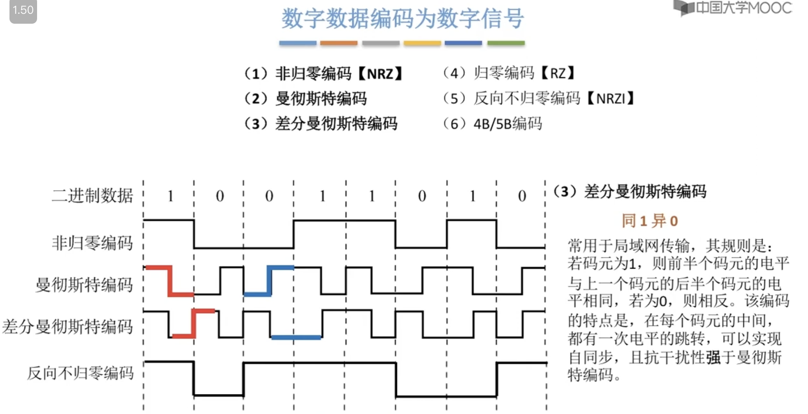
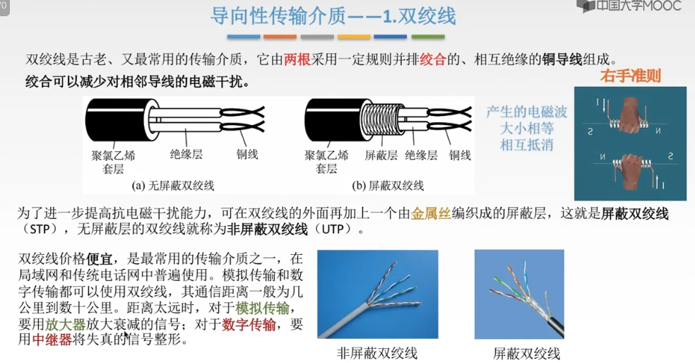
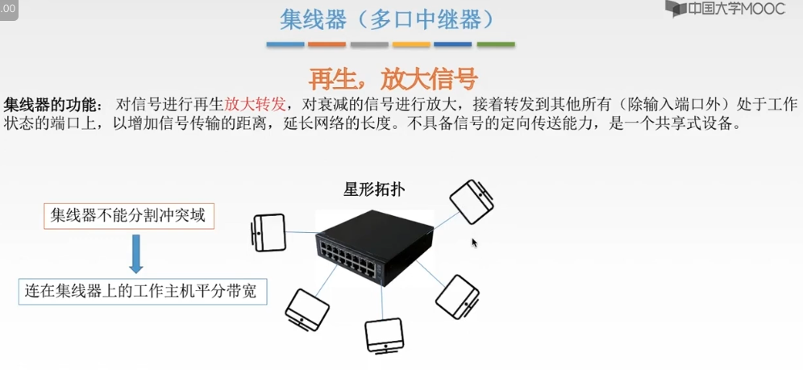

 https://www.cnblogs.com/ricklz/p/16470075.html

https://blog.csdn.net/weixin_40179091/article/details/105782593

# 导图

# 一、通信基础

物理层传输的是[比特流](https://www.eefocus.com/baike/1555807.html)（Bit Stream），也就是由0和1组成的二进制数字序列。

## 1.1 基本概念

### a. 物理层接口特性

> **如何区分？**
>
> * 电气特性：一般有数值范围
>
> * 功能特性：一般没有数值

### b. 数据通信模型

**数字信号** 需要调制成 **模拟信号**。

#### 思考：数字信号 VS 模拟信号

* 模拟信号：**时间连续，幅值连续。**

* 数字信号：**时间离散，幅值离散。**

举个例子：随着时间的流逝，太阳缓缓升起，在这里，时间是连续变化的，太阳的位置也是连续变化的，每一个时间点，对应于一个太阳的位置。这就是 **模拟信号**。

咱们要进行 **离散化** 的处理，比如早晨8点到10点，每隔5分钟，咱们记录一个太阳的位置。这样就变成了 **数字信号**。

### c. 数据通信相关术语

### d. 单工通信、半双工通信、全双工通信

* 单工：只有一个方向的通信，没有反方向的交互，仅需要 **一条** 信道。
    * eg：广播、电视
* 半双工：通信双方都可以发送或接收信息，但任何一方都 **不能同时发送或接收**，需要 **两天** 信道。
    * eg：对讲机
* 全双工：通信双方可以同时发送和接收信息，需要 **两条** 信道。
    * eg：打电话

### e. 串行传输 & 并行传输

* 串行：一串8位的二进制数，一个个依次发送
    * 特点：速度慢，费用低、适合远距离传输
* 并行：一串8位的二进制数，同时通过8条信道发送
    * 特点：速度快、费用高、适合近距离传输
    * eg：计算机内部的数据传输，主板到CPU多条信道

### f. 同步传输 & 异步传输

异步传输场景：敲键盘输入

### g. 码元⭐️ - 数字通信

* 码元：指用一个固定时长的信号波形（数字脉冲）表示一位k进制数字。代表不同离散数值的基本波形，是**数字通信中数字信号的计量单位。** 这个时长内的信号被称为 **k进制码元**，而该时长称为 **码元宽度**。
    * 1码元可以携带若干bit的信息量
    * 二进制码元，只有2种不同的状态，1个bit即可表示这2种状态，即0和1
    * 四进制码元，即需要表示4种状态，需要2bit才能表示4种状态，即00、01、10、11
    * 八进制码元，即需要表示8种状态，需要3bit才能表示8种状态，即000、001、011、010、100、101、110、111
    * 十六进制码元，即需要表示16种状态，需要4bit才能表示16种状态，即0000、0001、0011.........

### h. 速率、波特

数字通信系统数据传输速率的两种表示方式。

速率：指数据的传输速率，表示单位时间内传输的数据量。可以用 **码元传输速率** 和 **信息传输速率** 表示。

* 码元传输速率：表示单位时间内数字通信系统所能传输的码元个数，单位 **波特 Baud**
    * 1 Baud = 1 码元 / s ：表示数字通信系统每秒传输一个码元
    * 码元 可以是多进制的，也可以是二进制的，**码元速率 与 进制 无关。**
        * 举例：固定时长为2s，二进制码元表示，在2s内传输一个码元；八进制表示，在2s内传输一个码元。但是它们传输的bit数不一样。
* 信息传输速率：表示单位时间内数字通信系统传输的比特数，单位 **比特/秒  = b/s**

#### 计算题

1、某一数字通信系统传输的是四进制码元，4s传输了8000个码元，求系统的码元传输速率是多少？信息传输速率是多少？若另一通信系统传输的是十六进制码元，6s传输了7200个码元，求他的码元传输速率是多少？信息传输速率是多少？并指出哪个系统传输速率快？

> (1)答：
>
> 8000 / 4 = 2000 B
>
> 四进制 -> 4种状态 -> 需要log24 = 2 个bit
>
> 所以  2000 B * 2 = 4000 b/s
>
> (2)答：
>
> 7200 / 6 = 1200 B
>
> 十六进制 -> 16种状态 -> log216 = 4 个bit
>
> 1200 B * 4 = 4800 b/s
>
> (3)答：
>
> 综上：由于数字通信系统传输的是**比特流**，通常比较的是信息传输速率，所以十六进制的码元的通信系统传输速率快

2、己知八进制数字信号的传输速率为1600B。试问变换成二进制数字信号时的传输速率是多少？

> 答：
>
> 八进制 -> 8种状态 -> log28 = 3 个bit
>
> 二进制 -> 1个bit
>
> 1600 B * 3 = 4800 b/s
>
> 4800 / 1 = 4800 Baud

3、己知二进制数字信号的传输速率为2400b/s。试问变换成四进制数字信号时，传输速率为多少波特？

> 答：
>
> 二进制 -> 1bit
>
> 2400 / 1 = 2400 Baud
>
> 四进制 -> 2bit
>
> 2400 / 2 = 1200 Baud

### i. 带宽

* 模拟信号系统中：原指信号具有的频带宽度，单位 **赫兹 Hz**，也就是 **最高频率 - 最低频率 = 系统的通频带宽**
* 数字设备中：表示单位时间内从网络中的某一点到另一点所能通过的 **最高速度率**；单位是 **bit/s = b/s = bps**
    * 通常表示网络的通信线路所能传输数据的能力

### j. 带宽 VS 频率

* 频率指的是信号在单位时间内重复的周期数，通常以赫兹（Hz）为单位。它表示信号的周期性变化的快慢或震荡的速度。

* 带宽是指信号在频域上的频率范围，表示信号包含的频率范围宽度。带宽通常以赫兹（Hz）为单位，表示信号在频率轴上的宽度。

## 1.2 奈奎斯定理 & 香浓定理⭐️

### a. 失真

### b. 码间串扰

* 信道带宽：**就是能通过的最高频率与最低频率的差。** 如下图：3300Hz - 300Hz = 3000Hz，所以该条信道带宽为3000Hz
* 码间串扰：是因为发送的频率过大，导致接收端无法分别信号。

### c. 带宽单位区分

**之前通常所说的带宽的单位是 bit/s，但是在奈氏准则与香浓定理这，带宽单位是 Hz。**

### d. 奈氏准则 - 理想环境⭐️

* 理想：无电磁干扰、无噪声的理想状态下
* 低通：带宽受限
* 极限码元传输速率：2W Baud
* 奈氏准则：限制 **码元** 的传输速率，也就是 2W Baud
* 香浓定制：限制 **信息** 的传输速率，也就是bit的传输速率

#### 计算题

1、在无噪声的情况下，若某通信链路的带宽为3kHZ，采用4个相位，每个相位具有4种振幅的QAM调制技术，则该通信链

路的最大数据传输率是多少？

> 答：
>
> 码元状态：4 x 4 = 16 种状态，需要 log216 = 4 个bit位。
>
> 利用奈氏准则计算信道极限数据传输速率 = 2Wlog2V  = 2 * 3000Hz * 4 = 24,000 b/s = 24 kb/s

### e. 香农定理 - 现实环境⭐️

* 环境：有噪声
* 带宽受限
* 信噪比 = 信号的平均功率 / 噪声的平均功率 = S/N (dB)

***【二次回顾备注】：信噪比dB 还是 S/N 注意区分。***

#### 计算题

1、 例.电话系统的典型参数是信道带宽为3000Hz，信噪比为30dB，则该系统最大数据传输速率是多少？

> 答:
>
> 信噪比 = 10log10(S/N) = 30 ，所以 S/N = 1000 dB
>
> 利用香浓定理计算信道极限数据传输速率 = Wlog2(1+S/N) = 3000Hz * log21001 约等于 30 kb/s
>
> （210 = 1024 ，所以  log21001 约等于 10）
>
> 

### f. 对比

* 条件不明，都算一遍，取最小值。

## 1.3 编码与调制

### a. 基带信号 & 宽带信号

* 基带信号表示 **来自信源的信号**，根据原始电信号的特征，基带信号可分为『数字基带信号』和『模拟基带信号』（相应地，信源也分为『数字信源』和『模拟信源』。）其由信源决定。
* 基带传输：基带信号（数字信号） 在 **数字信道** 上传输。
* 基带信号既可以是『数字信号』，也可以是『模拟信号』
    * 计算机网络中是『数字信号』，因为网卡发送的就是『数字信号』
    * 人说话的声音就是『模拟信号』

* 宽带信号：将 **基带信号** 进行调制形成 **频分复用的模拟信号**，在 **模拟信道** 上传输（**宽带传输**）。
* 将人说话的声音（频率低）传播过程损耗高，所以调制成高频信号，便于远距离传输。

### b. 编码与调制

#### 1. 数字数据 -> 数据信号

##### (1) 非归零编码【NRZ】⭐️

* 特征：高 1 低 0
* 优点
    * 编码容易实现
* 缺点
    * 没有检错能力
    * 无法判断一个码元的开始与结束，以至于 **收发双方难以保持同步**
        * 场景描述：如果连续发送0或者1，也就是一条直线，无法判断发送了几个信号，所以需要额外建立一条通信，告诉接收端时钟周期。

##### (4) 归零编码【RZ】

* 特征：每个码元内都要恢复到0，
    * 1 = 1 0
    * 0 = 0 0
* 缺点：处于低电平的情况比较多，也会出现连续发送0时，无法判断的问题

##### (5) 反向不归零编码【NRZI】

* 特征：信号电平变化表示0，信号电平不变表示1
* 缺点：连续发送1，就会是一条直线，同样会出现无法区分，仍需要额外发送时钟周期的信号

##### (2 ) 曼彻斯特编码⭐️

* 特征：
    *  每一个码元被调成两个电平，所以数据传输速率只有调制速率的 1/2

##### (5) 差分曼彻斯特编码⭐️

* 特点：
    * 常用于 局域网
    * 同1 异 0

##### (6) 4B/5B编码

* 特点
    * 编码效率为 80%

#### 2. 数字数据 -> 模拟信号

##### 考点

> 结合计算信息传输速率

##### 计算题

1. 某通信链路的波特率是1200Baud，采用4个相位，每个相位有4种振幅的QAM调制技术，则该链路的信息传输速率是多少？

> 答：
>
> 共有 4 X 4 = 16 种状态，需要 log216 = 4 个bit位 = 1 码元
>
> 所以，信息传输速率为：1200B * 4 = 4800 bit/s

#### 3. 模拟数据 -> 数据信号

* 场景：音频数字化。对音频信号进行编码的脉冲调制PCM。
    * 抽样 -> 量化 -> 编码

* 采样频率 ≥ 2 * 信号最高频率
    * 频率指的是信号在单位时间内重复的周期数，通常以赫兹（Hz）为单位。它表示信号的周期性变化的快慢或震荡的速度。
    * 由于：y=Asin(ωx+φ) ，若此时一个频率为2Hz的信号，采样频率则需要最低4Hz。
    * 常见的采样频率44100Hz、48000Hz、88200Hz等。
        * 为什么呢？因为人可听声的频率为 **20Hz - 20000Hz**，所以采样频率 * 2 = 40000Hz。

#### 4. 模拟数据 -> 模拟信号

1. 由于我们的声波信号的频率比较低，难以在信道上长距离传播，容易失真；
2. 所以调制成一个高频信，传播时不容易失真；
3. 到达后经过 **解调器** 恢复成原始声波信号。

### c. 回顾

## 1.4 数据交换方式

问：为什么需要数据交换？？

总纲

### a. 电路交换

### b. 报文交换

* 报文：一个整体的数据，可能很大。

### c. 分组交换

三种方式如何选择？

#### 1) 分组交换 - 数据报

#### 2) 分组交换 - 虚电路

对比

# 二、传输介质

* 传输媒介  不是  物理层

## 2.1 导向性传输介质

### a. 双绞线

### b. 同轴电缆

### c. 光纤

## 2.2 非导向性传输介质

总结

# 三、物理层设备

## 3.1 中继器

* 核心：再生

### 1. 中继器由来

**信号的衰减 失真 :**

**① 信号衰减 :** 信号在 信道上传输 , 存在损耗 , 信号的功率会随着距离边长 , 而不断衰减 ;

**② 信号失真 :** 信号功率 衰减 到一定程度就会失真 , 导致接收端接收到错误的信号 ;

### 2.  “中继器” 概念

**中继器 :**

**① 再生信号功能 :** 对信号 进行 再生 和 还原 ; 注意不是放大数字信号 , 需要将数字信号接收 , 并识别出来 , 重新进行编码发送 ;

**② 放大信号功能 :** 对衰减的 信号 进行放大 , 与 原数据 保持一致 ;

**③ 中继器作用 :** 增加 信号 传输距离 , 延长 网络 长度 ;

### 3.  “中继器” 两端网络

**"中继器" 两端网络 :**

**① 中继器 两端连接内容 :** 中继器 两端 网络部分是 网段 , 不是子网 ;

**② 被连接网络完全相同 :** 中继器 可以 将 完全相同的 网络 互连 , 两个网段 速率 必须相同 ;

**③ 电气部分作用 :** 中继器 将 一条电缆段 的数据 , 发送到 另一条电缆段 , 其 仅作用于 信号的 电气部分 , 不会校验数据的正确性 ;

**④ 两端媒体 :** 中继器两端的媒体 , 可以是相同的 , 也可以是不同的 , 如传入的数据的媒体是光纤 , 传出数据的媒体是双绞线 ;

**⑤ 两端协议相同 :** 中继器 两端 网段 的协议 必须是同一个协议 ;

### 4. “中继器” 使用规则 ( 5-4-3 规则 )

一个[网段](https://baike.baidu.com/item/网段/0?fromModule=lemma_inlink)最多只能分5个[子网](https://baike.baidu.com/item/子网/0?fromModule=lemma_inlink)段；一个网段最多只能有4个[中继器](https://baike.baidu.com/item/中继器/0?fromModule=lemma_inlink)；一个网段最多只能有三个子网段含有PC

## 3.2 集线器

"集线器" 是 多端口 “中继器” , 这两种设备功能类似。

