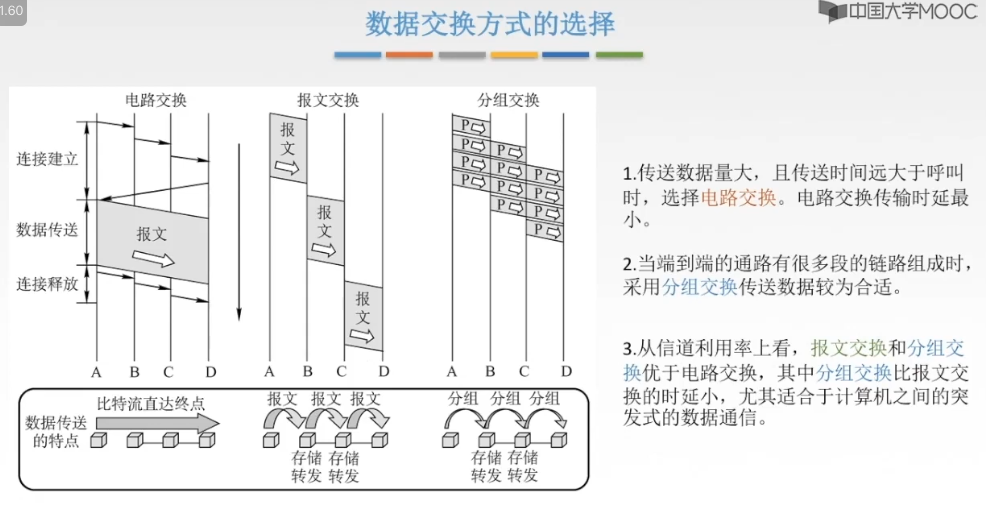

# 导图

# 一、通信基础

## 1.1 基本概念

### a. 物理层接口特性

> **如何区分？**
>
> * 电气特性：一般有数值范围
>
> * 功能特性：一般没有数值

### b. 数据通信模型

**数字信号** 需要调制成 **模拟信号**。

#### 思考：数字信号 VS 模拟信号

* 模拟信号：**时间连续，幅值连续。**

* 数字信号：**时间离散，幅值离散。**

举个例子：随着时间的流逝，太阳缓缓升起，在这里，时间是连续变化的，太阳的位置也是连续变化的，每一个时间点，对应于一个太阳的位置。这就是 **模拟信号**。

咱们要进行 **离散化** 的处理，比如早晨8点到10点，每隔5分钟，咱们记录一个太阳的位置。这样就变成了 **数字信号**。

### c. 数据通信相关术语

### d. 单工通信、半双工通信、全双工通信

* 单工：只有一个方向的通信，没有反方向的交互，仅需要 **一条** 信道。
    * eg：广播、电视
* 半双工：通信双方都可以发送或接收信息，但任何一方都 **不能同时发送或接收**，需要 **两天** 信道。
    * eg：对讲机
* 全双工：通信双方可以同时发送和接收信息，需要 **两条** 信道。
    * eg：打电话

### e. 串行传输 & 并行传输

* 串行：一串8位的二进制数，一个个依次发送
    * 特点：速度慢，费用低、适合远距离传输
* 并行：一串8位的二进制数，同时通过8条信道发送
    * 特点：速度快、费用高、适合近距离传输
    * eg：计算机内部的数据传输，主板到CPU多条信道

### f. 同步传输 & 异步传输

异步传输场景：敲键盘输入

### g. 码元⭐️

* 码元：指用一个固定时长的信号波形（数字脉冲）表示一位k进制数字。代表不同离散数值的基本波形，是**数字通信中数字信号的计量单位。** 这个时长内的信号被称为 **k进制码元**，而该时长称为 **码元宽度**。
    * 1码元可以携带若干bit的信息量
    * 二进制码元，只有2种不同的状态，1个bit即可表示这2种状态，即0和1
    * 四进制码元，即需要表示4种状态，需要2bit才能表示4种状态，即00、01、10、11
    * 八进制码元，即需要表示8种状态，需要3bit才能表示8种状态，即000、001、011、010、100、101、110、111
    * 十六进制码元，即需要表示16种状态，需要4bit才能表示16种状态，即0000、0001、0011.........

### h. 速率、波特

数字通信系统数据传输速率的两种表示方式。

速率：指数据的传输速率，表示单位时间内传输的数据量。可以用 **码元传输速率** 和 **信息传输速率** 表示。

* 码元传输速率：表示单位时间内数字通信系统所能传输的码元个数，单位 **波特 Baud**
    * 1 Baud = 1 码元 / s ：表示数字通信系统每秒传输一个码元
    * 码元 可以是多进制的，也可以是二进制的，**码元速率 与 进制 无关。**
        * 举例：固定时长为2s，二进制码元表示，在2s内传输一个码元；八进制表示，在2s内传输一个码元。但是它们传输的bit数不一样。
* 信息传输速率：表示单位时间内数字通信系统传输的比特数，单位 **比特/秒  = b/s**

#### 练习题

1、某一数字通信系统传输的是四进制码元，4s传输了8000个码元，求系统的码元传输速率是多少？信息传输速率是多少？若另一通信系统传输的是十六进制码元，6s传输了7200个码元，求他的码元传输速率是多少？信息传输速率是多少？并指出哪个系统传输速率快？

> (1)答：
>
> 8000 / 4 = 2000 B
>
> 四进制 -> 4种状态 -> 需要log24 = 2 个bit
>
> 所以  2000 B * 2 = 4000 b/s
>
> (2)答：
>
> 7200 / 6 = 1200 B
>
> 十六进制 -> 16种状态 -> log216 = 4 个bit
>
> 1200 B * 4 = 4800 b/s
>
> (3)答：
>
> 综上：由于数字通信系统传输的是**比特流**，通常比较的是信息传输速率，所以十六进制的码元的通信系统传输速率快

2、己知八进制数字信号的传输速率为1600B。试问变换成二进制数字信号时的传输速率是多少？

> 答：
>
> 八进制 -> 8种状态 -> log28 = 3 个bit
>
> 二进制 -> 1个bit
>
> 1600 B * 3 = 4800 b/s
>
> 4800 / 1 = 4800 Baud

3、己知二进制数字信号的传输速率为2400b/s。试问变换成四进制数字信号时，传输速率为多少波特？

> 答：
>
> 二进制 -> 1bit
>
> 2400 / 1 = 2400 Baud
>
> 四进制 -> 2bit
>
> 2400 / 2 = 1200 Baud

### h. 带宽

* 模拟信号系统中：原指信号具有的频带宽度，单位 **赫兹 Hz**，也就是 **最高频率 - 最低频率 = 系统的通频带宽**
* 数字设备中：表示单位时间内从网络中的某一点到另一点所能通过的 **最高速度率**；单位是 **bit/s = b/s = bps**
    * 通常表示网络的通信线路所能传输数据的能力

## 1.2 奈奎斯定理 & 香浓定理⭐️

## 奈氏准则

## 香农定理

## 对比

> 条件不明，都算一遍，取最小值。

# 编码与调制

> 基带信号表示来自信源的信号，根据原始电信号的特征，基带信号可分为『数字基带信号』和『模拟基带信号』（相应地，信源也分为『数字信源』和『模拟信源』。）其由信源决定。
>
> 但在计算机网络中是『数字信号』，因为网卡发送的就是『数字信号』。

## 数字数据 -> 数据信号

> 差分曼彻斯特编码：局域网

## 数字数据 -> 模拟信号

## 模拟数据 -> 数据信号

## 模拟数据 -> 模拟信号

## 回顾

# 数据交换方式

## 问：为什么需要数据交换？？

## 总纲

## 电路交换

## 报文交换

## 分组交换

### — 数据报

### — 虚电路

### — 对比

## 如何选择？

# 传输介质

## 导向性传输介质

## 非导向性传输介质

# 物理层设备

## 中继器

> 信号的再生与还原。

## 集线器

