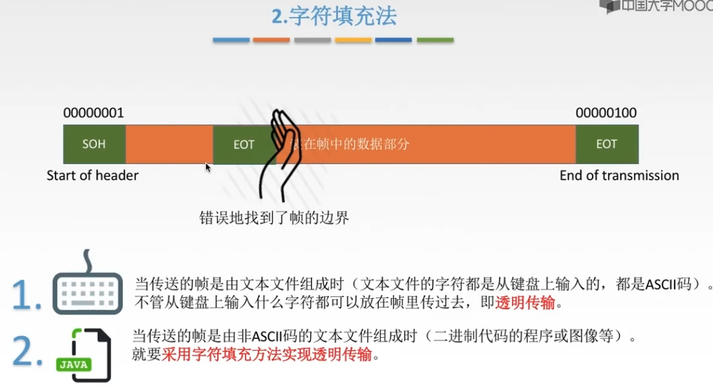
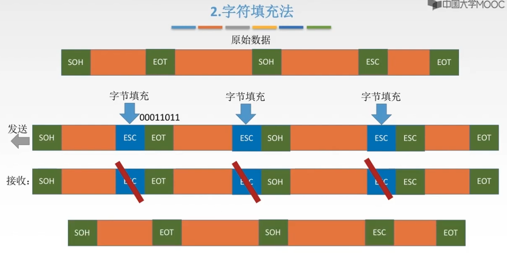
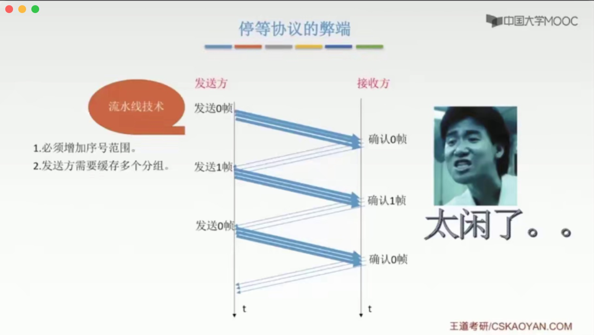
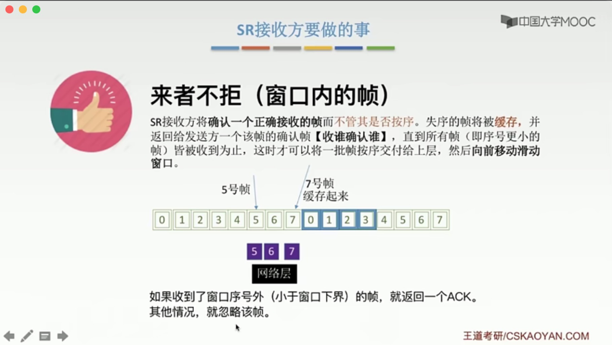
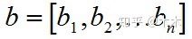

* 核心章节

# 一、数据链路层功能概述

* 链路：物理通道
* 数据链路：逻辑通道

* 数据链路层核心：将网络层的数据**可靠**的传输到相邻结点的网络层。
* 如 Boos -> 秘书 -> 快递小哥
    * Boos = 网络层，提供数据
    * 秘书 = 数据链路层，整理数据，并使数据在传递过程中可能遇到的问题进行处理，最后再给相邻节点的网络层
    * 快递小哥 = 物理层，只传输数据

## 1.1 核心概念

**数据链路层** 在 **<u>物理层</u>** 提供服务的基础上，向 <u>**网络层**</u> 提供服务。

* 最基本的服务：**将源自网络层的数据<u>可靠</u>的传输到目标机器的网络层**
* 主要作用：**加强物理层传输原始比特流的功能，将物理层提供的可能出错的物理连接改造成为逻辑上无差错的数据链路，使之对网络层表现为一条无差错的链路。**

1. 为网络层提供服务
    * 对**网络层**而言，数据链路层的基本任务是 **将源机器中来自网络层的数据传输到目标机器的网络层。**
    * 数据链路层通常为网络层提供的服务：
        * 无确认的无连接服务
        * 有确认的无连接服务
        * 有确认的面向连接服务
        * 注意：<u>**不存在**</u> 无确认的面向连接服务
2. 链路管理
    * 数据链路层连接的建立、维持、释放，主要用于面向连接服务
3. 组帧：帧定界、帧同步与透明传输
4. 流量控制
    * 限制发送方
5. 差错控制
    * 帧错
    * 位错

# 二、组帧

## 2.1 封装成帧

* 成帧：在数据前后加上首部和尾部，构成一个帧。
* 帧定界：首部和尾部包含很多控制信息，它们的一个重要作用就是 **确定帧的界限**，即帧定界。 
* 帧同步：接收方应能从接收到的二进制比特流中区分出帧的起始与终止。

## 2.2 透明传输

1. 透明传输的概念

    透明传输：不管所传递的数据是什么样的比特组合，都应能在链路上传送。

2. 如何保证透明传输

    当传输数据中的比特组合恰巧与某个控制信息完全一样，此时，就必须采取适当的措施，使得接收方不会将这样的数据错误当作是某种控制信息。这样才能保证数据链路层的传输是透明的。

## 2.3 四种方法实现组帧

### a. 字符计数法

* 优点：简单
* 缺点：如果一个错误，会导致后面所有的帧都读取错位。

### b. 字符填充法

* 如果数据是普通的文本，可以直接放在帧里，因为键盘输入的都是ASCII码，不可能与首部尾部冲突。
* 如果是二进制代码或图像，需要采用方法来规避，这里介绍 字符填充法。
* 字符填充法：遇到数据中与首部尾部相同的比特，则在前面加上特殊转义字符，接收端收到后，移除特殊的转移字符即可。

### c. 零比特填充法⭐️

* 固定首尾：01111110   中间六个1
* 数据组若遇到连续5个1，后面补充一个0，就不会存在与首尾相同的数据了。

### d. 违规编码法⭐️

* 利用与曼彻斯特编码不同的编码进行区分。
* 因为曼彻斯特编码不可能出现『高-高』『低-低』的电平。

### e. 总结

由于<u>字节计数法</u>中Count字段的脆弱性（其值若有差错将导致灾难性后果）及 <u>字符填充法</u>实现上的复杂性和不兼容性，

目前较普遍使用的 **帧同步法** 是 **比特填充法** 和 **违规编码法**。

# 三、差错控制

## 1. 检错编码

#### 奇偶校验码

> 特点：
>
> 1. 只能检测奇位错；
> 2. 不具备纠错能力。

#### CRC循环冗余码

> 需要学会做题。
>
> CRC有纠错能力，但链路层只用到了检错能力。

> CRC只是对帧进行丢弃，所以接收端丢失了一个帧，还不是可靠传输，后续还需要进行帧处理。

## 2. 纠错编码

#### 海明码

> 发现错误 -> 找到位置 -> 纠正错误

**与上面两个码区别？**

> 都需要加上校验码
>
> 上面两个码的校验码添加在最低位，而海明码需要计算位置。

**海明距离**

> 为了检测 N 位错，则码距为 N+1；（码距为N，可检测出N-1位的bit错）
>
> 为了纠正 N 位错，则码距位 2N+1。

**1.确定校验码位数r**

**2.确定校验码与数据的位置**

**3.求出校验码的值**

> 使用偶校验
>
> eg：4、5、6、7位置 『1』的个数为偶数个，所以 X4 = 0

**4.检错并纠错**

> 纠错方法一：画图
>
> 纠错方法二：异或（同0异1）

# 四、流量控制与可靠传输机制⭐

**流量控制在『链路层』与『传输层』都有，他们的区别？**

> 区别一：对象不同
>
> 链路层的流量控制是 点对点的（两个相邻节点之间）；传输层的流量控制是端到端的。
>
> 这里的点是指中间系统（网络层、数据链路层、物理层）；端是指发送端、接收端，有七层。
>
> 区别二：手段不同
>
> 链路层流量控制的手段：接收方接收不下就不回复确认；
>
> 传输层流量控制的手段：接收端给发送端一个窗口公告。

## 链路层流量控制方法

* 停止-等待协议

  > 停止-等待协议 也算特殊的 滑动窗口协议，窗口为1 

* 滑动窗口协议

  * 后退N帧协议（GBN）
  * 选择重传协议（SR）

* 三个协议区别

## 可靠传输、流量控制、滑动窗口三者关系

### 停止-等待协议

**停止-等待协议属于哪一层？**

> 前期链路通讯质量不好，链路层担起可靠传输的职责；
>
> 随着通讯质量的提高，出错少，所以链路层可暂时抛弃"可靠传输"的职责，将"可靠传输"这个职责交给『传输层』，而链路层主要负责"差错控制"，从而提升数据在链路上传输的速度。
>
> 所以不必纠结属于哪一层， 因为最终影响的只是传输数据的对象，在传输层叫分组，在链路层叫帧。本质上都是一样的，都是传送的数据。 

**为什么要有停止-等待协议？**

> 除了 **比特出错**，底层信道还会出现丢包问题。

#### 无差错情况

#### 有差错情况

#### 性能分析

> 优点：简单
>
> 缺点：信道利用率低

#### 信道利用率&信道吞吐率

#### 脑图时刻

### 后退N帧协议（GBN）

**出现的原因？**

> 停止-等待协议太闲了，利用率太低。

#### 流程介绍

**发送**

> ⭐累计确认：表示n之前的帧全部正确！！
>
> 后退N帧：超时后，未确认的帧都需要重传一遍！！

**接收方**

> 严格按顺序接收，若未收到特定的帧，后续帧都丢弃，接收方无需缓存任何失序帧。

**整体流程**

> 接收方就像吃汉堡，必须一层一层吃，丢了一层就不吃，必须等到那一层再继续往下吃。

#### 滑动窗口长度

> 区分 "帧编号" 与 "窗口编号"

#### GBN考研重点⭐

#### 性能分析

#### 考题

#### 脑图时刻

### 选择重传协议（SR）

> SR: Selective Repeat

**出现的原因？**

> GBN的缺点：需要批量重传

#### 流程介绍

#### 滑动窗口长度

#### SR考研重点⭐

#### 习题

#### 脑图时刻

# 传输数据使用的两种链路

## 介质访问控制（广播）

> 介质访问控制：为了解决 **广播** 模式下 **通信干扰** 的问题。

### 静态划分信道 - 信道划分介质访问控制

**什么是多路复用技术？（答案见下图）**

#### 频分多路复用 FDM

> **Frequency Division Multiplexing**

#### 时分多路复用 TDM

> **Time Division Multiplexing**

缺点：等待时间固定，利用率比较低。

##### 统计时分复用 STDM（改进）

> **Statistical Time Division Multiplexing**
>
> 
>
> TDM VS STDM:
>
> ​	若最高速率为8000 bit/s
>
> ​	时分多路复用：平均2000 bit/s
>
> ​	统计时分复用：最高8000 bit/s 

#### 波分多路复用 WDM

> **Wavelength Division Multiplexing**
>
> 只要记住：**光的频分多路复用**， 不常考。

#### 码分多路复用 CDM

> CDM: Code Division Multiplexing
>
> 码分多路复用：将数据扭在一起，到了目的端，再拆分开。

**码分多址 CDMA （Code Division Multiple Access）**

**内积**

> 内积：向量内积
>
> 规格化内积：内积后，除以向量维数。

**CDMA与CSMA混淆？**

> CS游戏是动态的，所以CSMA是 `动态分配信道` 中的 `随机访问介质控制`。

### 动态分配信道

> 也叫：**动态媒体接入控制 、 多点接入**
>
> 特点：信道并非在用户通信时固定分配给用户。

### 动态分配信道 - 轮询访问介质访问控制

### 动态分配信道 - 随机访问介质访问控制

> 特点：所有用户可以随机发送信息。**发送信息时占用全部带宽。**
>
> 又因为所有用户可以随机发送信息，导致可能在同一时间都发送信息，从而发生冲突，所以才有了以下解决冲突的几种协议。

#### ALOHA协议

##### 纯ALOHA协议 

> 

