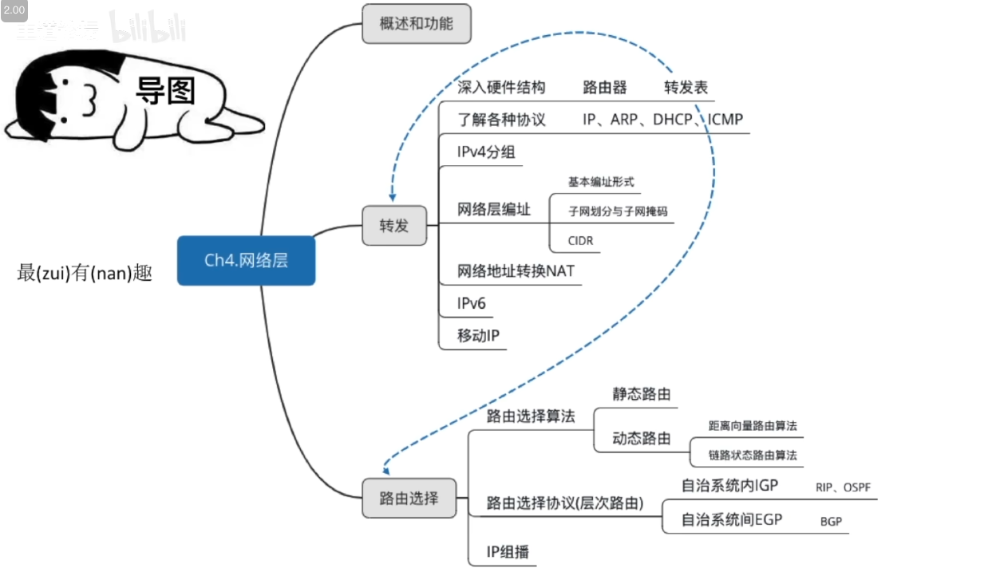

# 一、网络层的功能

## 1. 网络层概述

### a. 网络层的特点

- **面向逻辑:** 网络层不关心数据的物理传输方式，只关心数据的逻辑传输路径。它将数据链路层封装的帧分解为更小的数据包，并根据路由选择算法确定数据包的传输路径。
- **无连接:** 网络层通常采用无连接的方式进行数据传输，即每个数据包都是独立传输的，彼此之间没有建立任何联系。如果需要可靠的数据传输，则需要在更高的传输层实现。
- **路由选择:** 网络层的主要功能之一是路由选择，即根据路由表确定数据包的传输路径。路由表通常由路由器维护，其中记录了各个网络之间的连接关系。

### b. 网络层的功能

- **寻址:** 网络层为网络中的每个设备分配一个唯一的网络地址，如IP地址。
- **路由:** 网络层根据路由表确定数据包的传输路径。
- **转发:** 网络层将数据包从一个网络设备转发到另一个网络设备。
- **拥塞控制:** 网络层可以采取措施控制网络中的数据流量，防止网络拥塞。
- **差错控制:** 网络层可以采取措施检测和纠正数据传输过程中的差错。

### c. 网络层的协议

- **IP协议:** IP协议是网络层最重要的协议，它负责在网络中传输数据包。
- **ICMP协议:** ICMP协议用于在网络设备之间传输控制信息，如错误信息和路由信息。
- **IGMP协议:** IGMP协议用于多播组成员的管理。

### d. 网络层的设备

- **路由器:** 路由器是网络层最重要的设备，它负责在网络之间转发数据包。
- **网关:** 网关是连接不同类型的网络的设备，如局域网和广域网。

## 2. SDN基本概念（选择题）

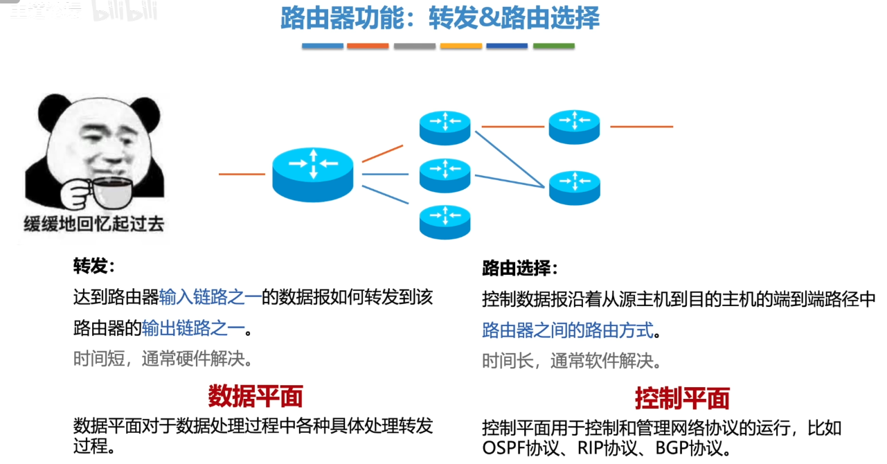

### a. 数据平面

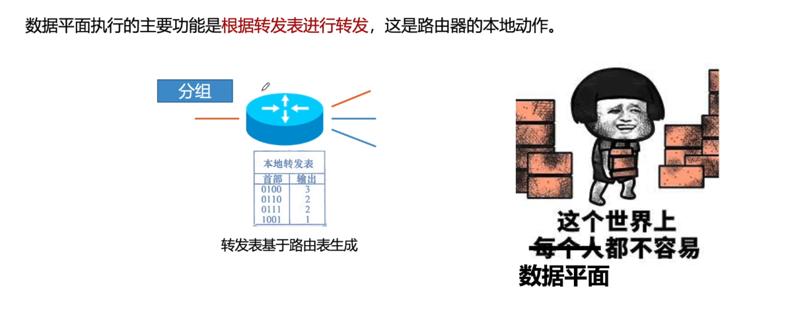

### b. 控制平面 - 传统方法

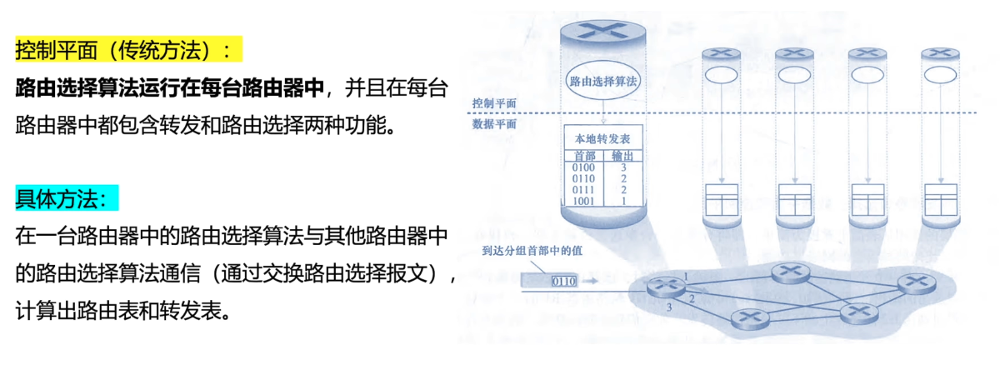

### c. 控制平面 - SDN方法

SDN: Software-Defined Networking

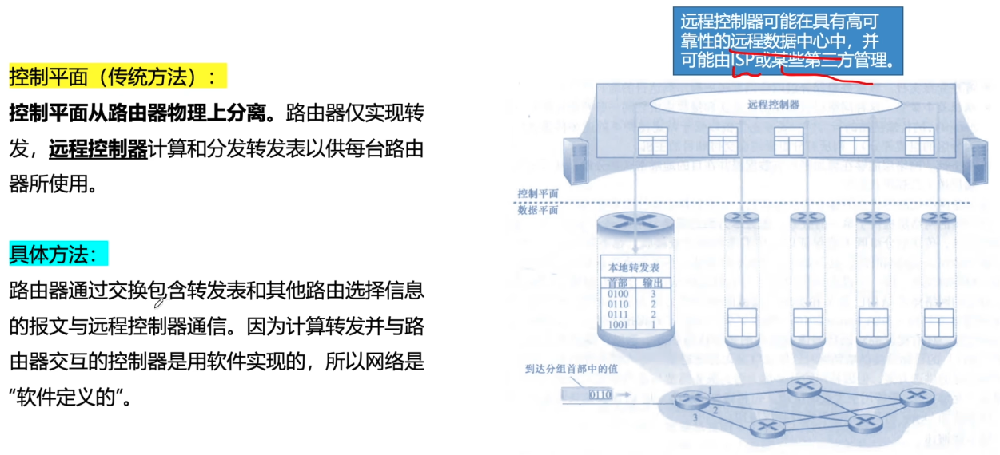

#### Ⅰ. SDN中路由选择处理器

功能降低了，从主要执行，变成了通信工具。

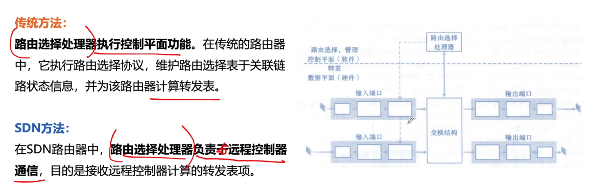

#### Ⅱ. SDN控制平面

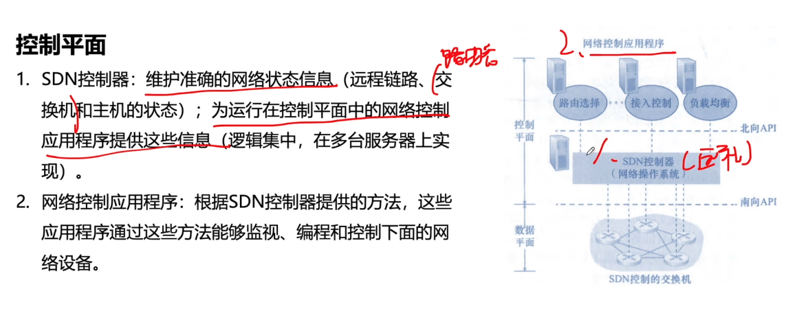

#### Ⅲ. SDN控制器的三个层次

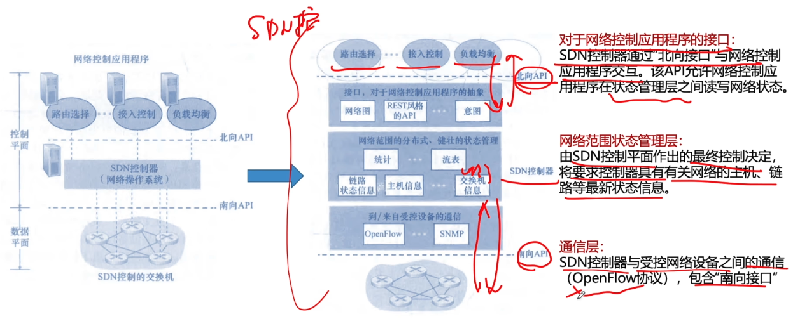

### d. 题目

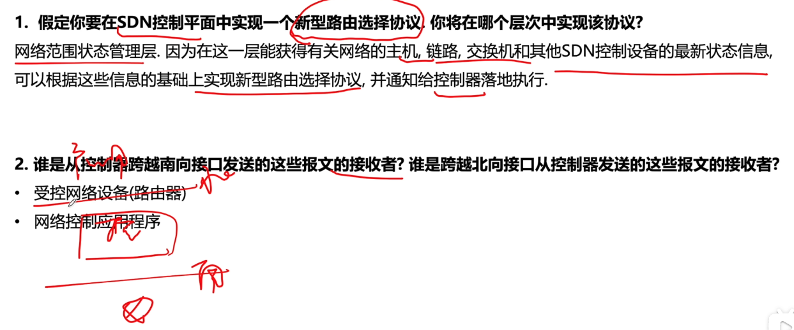

### e. 总结

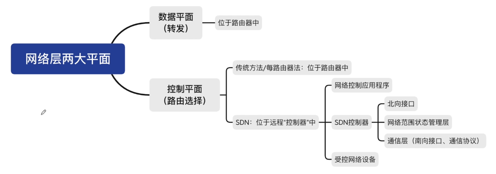

# 二、路由算法

## 1. 路由算法的分类

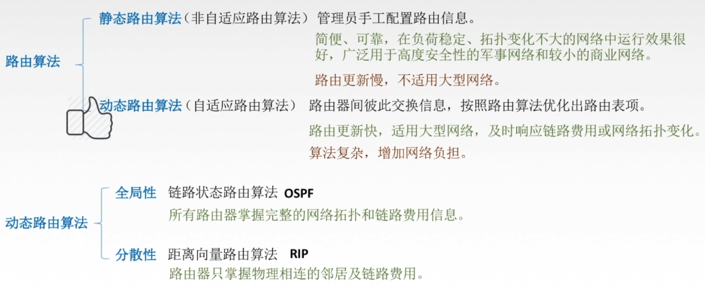

## 2. 分层次的路由选择协议

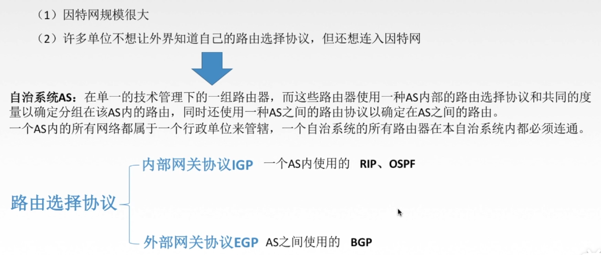

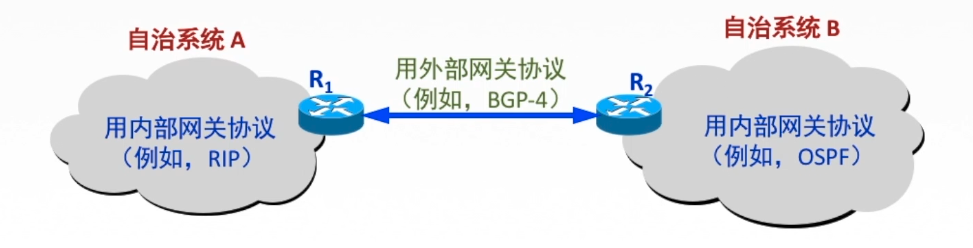

# 三、IPv4

## 1. TCP/IP协议

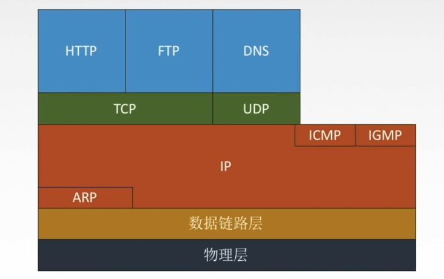

## 2. IP数据报格式

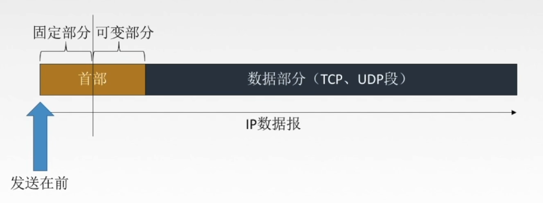

### a. 首部

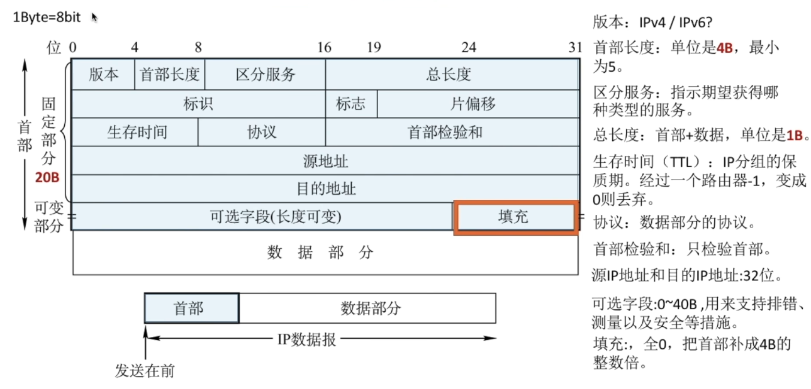

说明：

1. 首部中，固定部分固定为20Byte。

2. 首部长度：占4bit，也就是 0000 - 1111，最小为5 即 0101，

    单位为4Byte，因为一行为32bit也就是4Byte，所以 **固定部分 + 可变部分** 一定是把一行铺满的，必须为4B的整数倍。

    **填充**：就是为了补足成4B的整数倍。

3. 协议：TCP：6         UDP：17

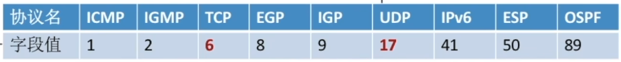

### b. IP数据报分片

#### Ⅰ、为什么要分片

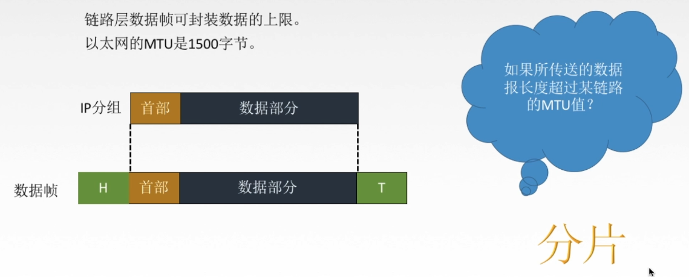

#### Ⅱ、分片用到的头部信息

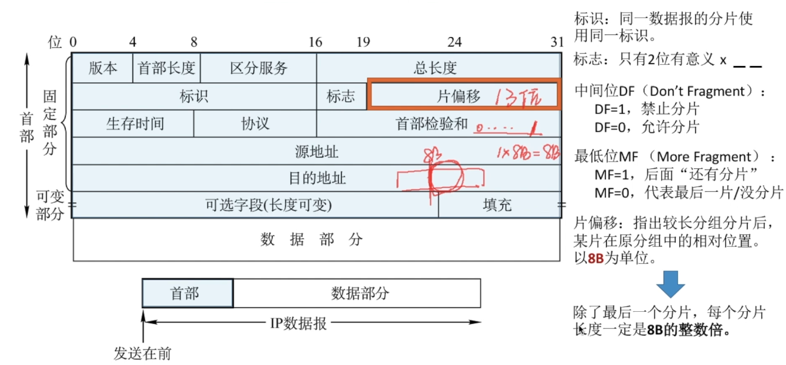

说明：

1. 标识：16bit，一个数据包拆分的分片，使用同一个标识，才知道你们是一个数据分出来的。

2. 标志：3bit，判断是否有分片。

3. 片偏移：各个分片在原数据的位置，方便重新组合成原数据。8B为单位。

    片偏移总共有 13bit，若片偏移为00.....0001，则表示该片的位置：1 * 8B = 8B，在原数据的第八个字节开始的位置。

#### Ⅲ. 分片举例

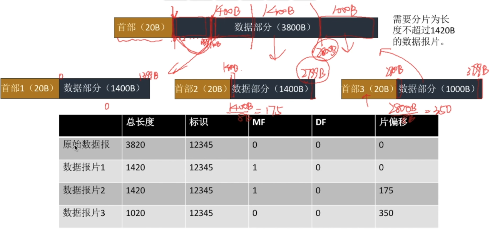

说明：

片偏移 = 数据开始的位置 / 8B     （8B是固定单位）

### c. 数据报中三个固定单位

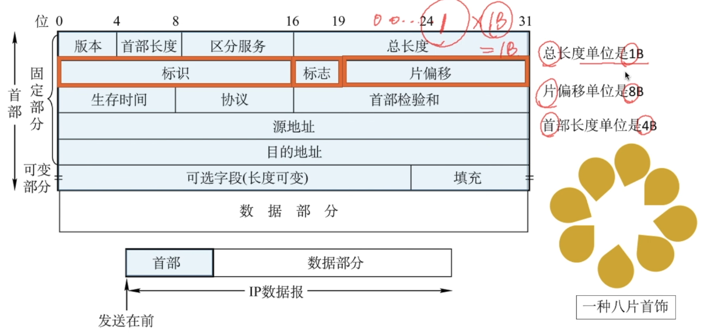

## 3. IPv4地址

### a. IP地址的历史阶段

* 分类的IP地址：每个设备都分配一个，但是后来不够用了；（也就是本节的内容）
* 子网的划分：设备太多，32bit的IP地址不够分了，从而推出的新方案；（后面章节的内容）
* 构成超网（无分类编址方案）：CIDR（后面章节的内容）

### b. IP地址的简介

连接到互联网上的每台主机或路由器都分配了一个32bit的全球唯一的标识符，即IP地址。

* IP地址：全球唯一，
* IP地址并不是标识一个主机，而是标识 **主机/路由器 的一个接口**，如果一个**主机/路由器** 有多个接口，则需要分配多个IP地址。
* IP地址：{<网络号>,  <主机号>}
    * 网络号：标志主机 / 路由器所链接到的网络；**一个网络号在整个因特网范围内必须是唯一的。**
    * 主机号：标志该主机 / 该路由器

**互联网中的IP地址**

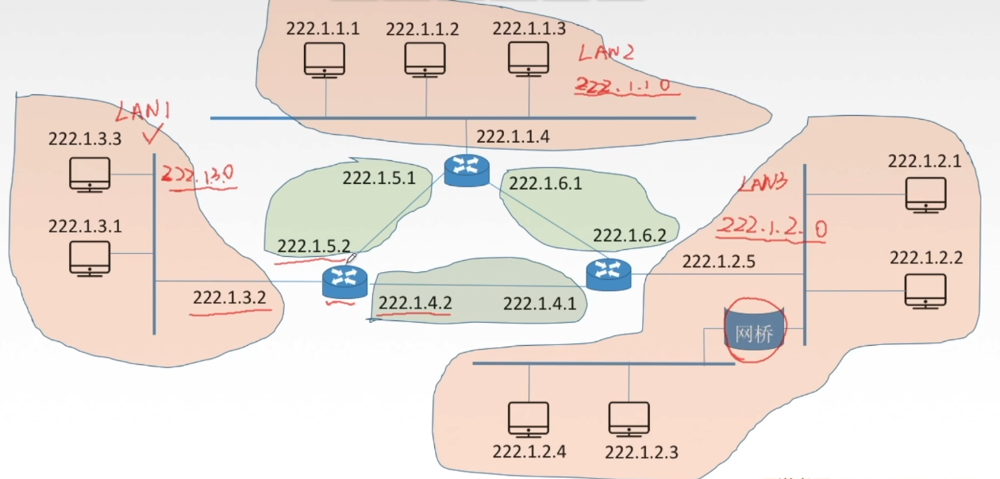

说明：

网桥：能隔离冲突域，并不能隔离广播域，所以右下角整体还是一个局域网，所以只能一个网络号。

### c. IP地址的分类

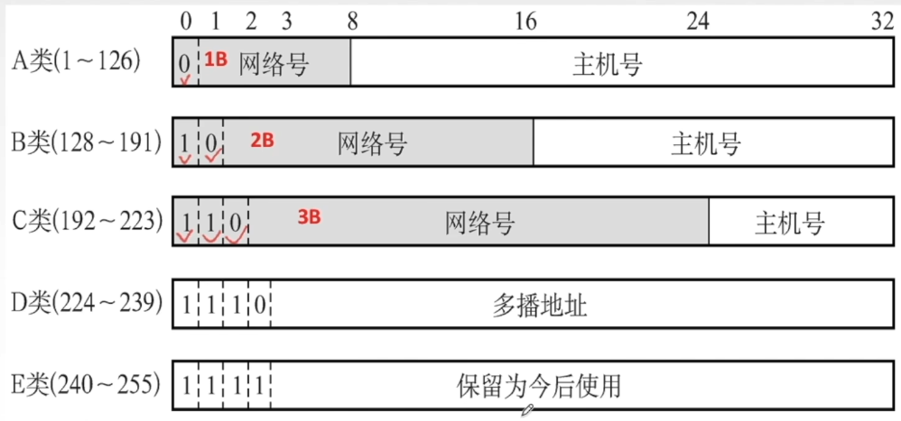

#### Ⅰ. 特殊的IP地址

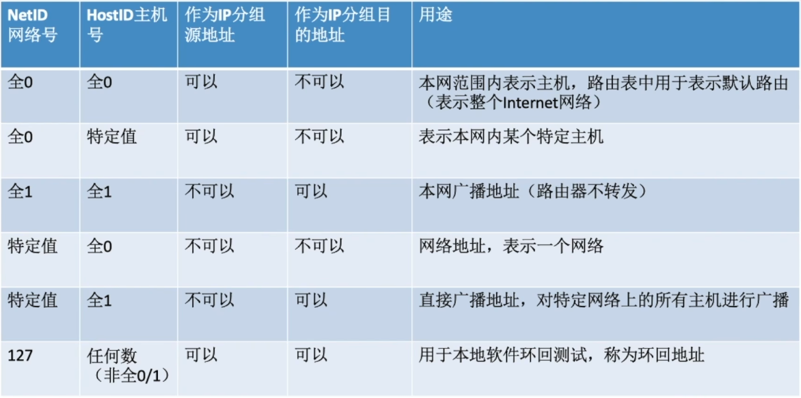

说明：

* 32位全0：表示本网络上的本主机
* 32位全1：即255.255.255.255表示整个TCP/IP 网络的广播地址，又称为**受限广播地址**。实际使用中，由于路由器对广播域的隔离，255.255.255.255等效于本网络的广播地址。

* 主机号全0：本网络本身，如 202.98.174.0
* 主机号全1：本网络的广播地址，又称为**直接广播地址**，如 202.98.174.255
* 127.0.0.0：保留为 环回地址，地址表示任意主机本身，目的地址为环回地址的IP数据报不会出现在任何网络上。

#### Ⅱ. 私有IP地址

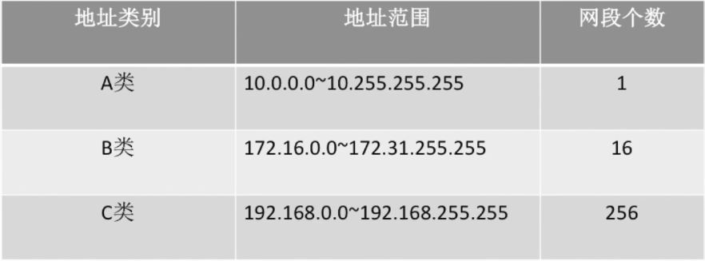

* 为了网络安全，划分部分IP地址为私有IP地址。**私有IP地址只能用于LAN。**

* 私有IP地址需要使用NAT技术，才能对外通信。
* 私有IP地址的好处：
    * 使得整个专用网络只需要一个全球IP地址就可以与因特网连接。
    * 由于专用网络内部的IP地址是可以重用的，大大降低了IP的消耗。

#### Ⅲ. 可用数量

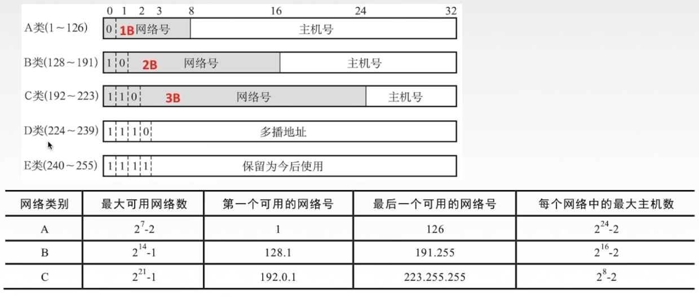

说明：

A类：网络号 0000 0000 (0) 与 0111 1111 (127环回地址) 不可用；

B类：网络号 128.0 不可用；

C类：网络号：192.0.0 不可用；

## 4. 网络地址转换 NAT

# 四、IPv6

# 五、路由协议

# 六、IP组播

# 七、移动IP

# 八、网络层设备

