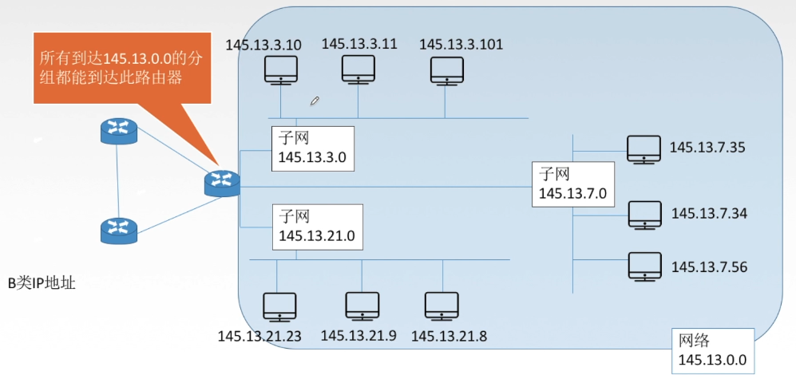
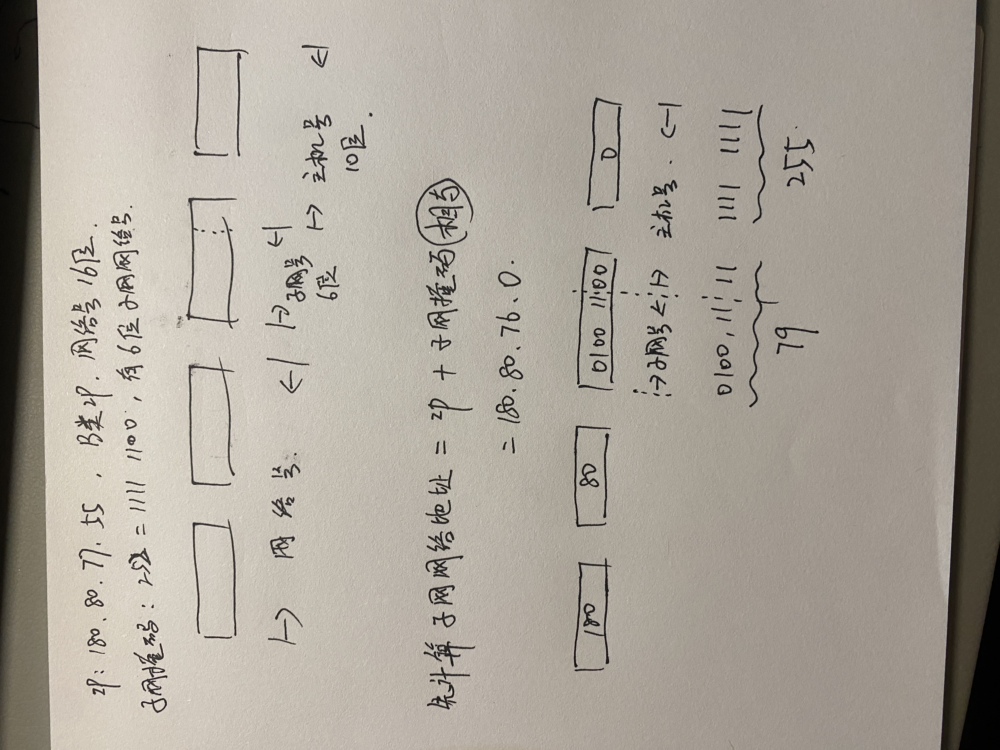

# 一、网络层的功能

## 1. 网络层概述

### a. 网络层的特点

- **面向逻辑:** 网络层不关心数据的物理传输方式，只关心数据的逻辑传输路径。它将数据链路层封装的帧分解为更小的数据包，并根据路由选择算法确定数据包的传输路径。
- **无连接:** 网络层通常采用 **无连接** 的方式进行数据传输，即每个数据包都是独立传输的，彼此之间没有建立任何联系。如果需要可靠的数据传输，则需要在更高的传输层实现。
- **路由选择:** 网络层的主要功能之一是路由选择，即根据路由表确定数据包的传输路径。路由表通常由路由器维护，其中记录了各个网络之间的连接关系。

### b. 网络层的功能

- **寻址:** 网络层为网络中的每个设备分配一个唯一的网络地址，如IP地址。
- **路由:** 网络层根据路由表确定数据包的传输路径。
- **转发:** 网络层将数据包从一个网络设备转发到另一个网络设备。
- **拥塞控制:** 网络层可以采取措施控制网络中的数据流量，防止网络拥塞。
- **差错控制:** 网络层可以采取措施检测和纠正数据传输过程中的差错。

### c. 网络层的协议

- **IP协议:** IP协议是网络层最重要的协议，它负责在网络中传输数据包。
- **ICMP协议:** ICMP协议用于在网络设备之间传输控制信息，如错误信息和路由信息。
- **IGMP协议:** IGMP协议用于多播组成员的管理。

### d. 网络层的设备

- **路由器:** 路由器是网络层最重要的设备，它负责在网络之间转发数据包。
- **网关:** 网关是连接不同类型的网络的设备，如局域网和广域网。


## 2. SDN基本概念（选择题）


### a. 数据平面


### b. 控制平面 - 传统方法


### c. 控制平面 - SDN方法

SDN: Software-Defined Networking


#### Ⅰ. SDN中路由选择处理器

功能降低了，从主要执行，变成了通信工具。


#### Ⅱ. SDN控制平面


#### Ⅲ. SDN控制器的三个层次


### d. 题目


### e. 总结


# 二、路由算法

## 1. 路由算法的分类


## 2. 分层次的路由选择协议


# 三、IPv4

## 1. TCP/IP协议


## 2. IP数据报格式


### a. 首部


说明：

1. 首部中，固定部分固定为20Byte。

2. 首部长度：占4bit，也就是 0000 - 1111，最小为5 即 0101，

    **单位为4Byte**，因为一行为32bit也就是4Byte，所以 **固定部分 + 可变部分** 一定是把一行铺满的，必须为4B的整数倍。

3. **填充**：就是为了补足成4B的整数倍。

4. 协议：TCP：6         UDP：17


### b. IP数据报分片

#### Ⅰ、为什么要分片


#### Ⅱ、分片用到的头部信息


说明：

1. 标识：16bit，一个数据包拆分的分片，使用同一个标识，才知道你们是一个数据分出来的。

2. 标志：3bit，判断是否有分片。

3. 片偏移：各个分片在原数据的位置，方便重新组合成原数据。8B为单位。

    片偏移总共有 13bit，若片偏移为00.....0001，则表示该片的位置：1 * 8B = 8B，在原数据的第八个字节开始的位置。


#### Ⅲ. 分片举例


说明：

片偏移 = 数据开始的位置 / 8B     （8B是固定单位）


### c. 数据报中三个固定单位


## 3. IPv4地址

### a. IP地址的历史阶段

* 分类的IP地址：每个设备都分配一个，但是后来不够用了；（也就是本节的内容）
* 子网的划分：设备太多，32bit的IP地址不够分了，从而推出的新方案；（后面章节的内容）
* 构成超网（无分类编址方案）：CIDR（后面章节的内容）


### b. IP地址的简介

连接到互联网上的每台主机或路由器都分配了一个32bit的全球唯一的标识符，即IP地址。

* IP地址：全球唯一，
* IP地址并不是标识一个主机，而是标识 **主机/路由器 的一个接口**，如果一个**主机/路由器** 有多个接口，则需要分配多个IP地址。
* IP地址：{<网络号>,  <主机号>}
    * 网络号：标志主机 / 路由器所链接到的网络；**一个网络号在整个因特网范围内必须是唯一的。**
    * 主机号：标志该主机 / 该路由器


**互联网中的IP地址**


说明：

网桥：能隔离冲突域，并不能隔离广播域，所以右下角整体还是一个局域网，所以只能一个网络号。


### c. IP地址的分类


#### Ⅰ. 特殊的IP地址


说明：

* 32位全0：表示本网络上的本主机
* 32位全1：即255.255.255.255表示整个TCP/IP 网络的广播地址，又称为**受限广播地址**。实际使用中，由于路由器对广播域的隔离，255.255.255.255等效于本网络的广播地址。

* 主机号全0：本网络本身，如 202.98.174.0
* 主机号全1：本网络的广播地址，又称为**直接广播地址**，如 202.98.174.255
* 127.0.0.0：保留为 环回地址，地址表示任意主机本身，目的地址为环回地址的IP数据报不会出现在任何网络上。


#### Ⅱ. 私有IP地址


* 为了网络安全，划分部分IP地址为私有IP地址。**私有IP地址只能用于LAN。**

* 私有IP地址需要使用NAT技术，才能对外通信。
* 私有IP地址的好处：
    * 使得整个专用网络只需要一个全球IP地址就可以与因特网连接。
    * 由于专用网络内部的IP地址是可以重用的，大大降低了IP的消耗。


#### Ⅲ. 可用数量


说明：

**网络号：**

A类：网络号 0000 0000 (**保留地址，意思是“本网络”**) 与 0111 1111 (**保留地址，环回地址，保留作为本地软件环回测试，本主机的进程之间的通信之用**) 不可用；

B类：网络号 128.0 不可用；

C类：网络号：192.0.0 不可用；


**主机号：**

A、B、C类：**x.x.x.0：本网络本身** 和 **x.x.x.255：本网络广播地址**，所以不可用。

> ​		不管是A类还是B类还是C类网络，在不划分子网的情况下，有两个IP地址不可用： 网络号和广播地址。比如在一个没有划分子网的C类大网中用**202.203.34.0来表示本网络本身，用202.203.34.255来表示本网络广播地址**，因为C类大网的IP地址有256个，现在减去这两个IP地址，那么可用的IP地址就只剩下256-2=254个了。如果题目问：把一个C类大网划分为4个子网，有多少个不可用的IP地址？可以这样想：在C类大网不划分子网时，有两个IP地址不可用；现在将C类大网划分为4个子网，那么每个子网中都有2个IP地址不可用，所以4个子网中就有8个IP地址不可用。


## 4. 网络地址转换 NAT

### a. 私有IP如何与外部网络通信？


方案：专用网中，必须有一个**NAT路由器**，NAT必须有一个**全球IP**（也可以有多个全球IP）。


### b. 私有IP与外部通信过程

#### Ⅰ.自总结⭐️

1. A主机发送消息给B主机，

    `A信息：源地址（A主机：192.168.0.3）+ 目的地址（B主机：213.18.2.4）+ 端口号（进程号：30000）`

2. 到了NAT路由器，根据NAT转换表，将 **原地址 与 端口号** 进行替换

    `NAT信息：源地址（NAT的外网IP地址：173.38.1.5） + 目的地址（不变） + 端口号（NAT的端口号：40001）`

3. 新数据可以在因特网上转发，到了B主机，B主机可以整理信息返回给A

    `B信息：源地址（B主机的IP）+ 目的地址（接受到的NAT的IP：173.38.1.5）+ 端口号（接受到的NAT的端口号40001）`

4. NAT路由器接受到B的信息后，根据NAT转发表，再将信息替换为内部IP信息。


#### Ⅱ. GPT答案

```
私有IP地址是指在本地网络中使用的IP地址，无法在互联网中直接路由。为了使使用私有IP地址的设备能够与互联网通信，需要进行网络地址转换（NAT，Network Address Translation）。以下是详细过程：

### 1. 私有IP地址与NAT的概念
- **私有IP地址**：常见的私有IP地址范围包括：
  - 10.0.0.0 到 10.255.255.255
  - 172.16.0.0 到 172.31.255.255
  - 192.168.0.0 到 192.168.255.255
- **NAT**：NAT是一种在路由器或防火墙上实现的功能，用于在私有IP地址和公共IP地址之间进行转换。

### 2. 设备发送数据包到互联网
- 设备在本地网络中使用私有IP地址发送数据包，数据包的源IP地址是该设备的私有IP。
- 数据包到达网络边界的NAT设备（如路由器）。

### 3. NAT设备处理数据包
- NAT设备记录原始源IP地址和端口号。
- NAT设备将私有IP地址转换为公共IP地址，并更改数据包的源IP地址为路由器的公共IP地址，同时也可能修改源端口号。
- 修改后的数据包被发送到互联网。

### 4. 互联网目的地处理数据包
- 互联网服务器接收到数据包后，会看到请求来自路由器的公共IP地址和相应的端口号。
- 服务器根据请求进行响应，并将响应数据包发送到NAT设备的公共IP地址。

### 5. NAT设备将数据包发送回私有网络中的设备
- NAT设备接收到服务器响应的数据包。
- 根据之前记录的NAT映射表，NAT设备将数据包的目标IP地址和端口号转换回原始的私有IP地址和端口号。
- 数据包被发送回最初发送请求的设备。

### 6. 设备接收数据包
- 私有网络中的设备接收到来自互联网的响应数据包，完成一次完整的通信过程。

### 示例
假设有一台在私有网络中的计算机，其IP地址为192.168.1.2，需要访问位于互联网的服务器，其IP地址为8.8.8.8，过程如下：

1. 计算机192.168.1.2发送数据包到8.8.8.8，数据包源IP为192.168.1.2，目的IP为8.8.8.8。
2. 路由器接收数据包，将源IP从192.168.1.2转换为路由器的公共IP（例如203.0.113.5），并记录NAT映射关系。
3. 路由器将修改后的数据包发送到互联网。
4. 服务器8.8.8.8接收到数据包，处理请求后，将响应数据包发送到203.0.113.5。
5. 路由器接收响应数据包，查询NAT映射表，将目标IP从203.0.113.5转换回192.168.1.2，并发送数据包回计算机。
6. 计算机192.168.1.2接收到响应数据包。

通过NAT机制，私有IP地址的设备可以安全地与互联网进行通信，同时保持本地网络的私密性和安全性。
```


## 5. 子网划分

### a. 为什么推出子网划分

子网的划分：设备太多，32bit的IP地址不够分了，从而推出的新方案；（后面章节的内容）


### b. 如何子网划分？

注意点

* 划分子网后，对外仍表现为一个网络，外网看不到内网的子网划分；
* 子网号能否全0全1：
    * 最开始不可以；
    * 后面出现了CIDR，就可以了；
* 主机号最少几位：2位
    * 若为1位，也就是0 / 1，此时0表示本网络，1表示广播分组，划分子网无意义！！


### c. 子网掩码

如下图：

此时外网向 **145.13.3.10** 发送消息，消息到NAT（145.13.0.0），NAT如何知道消息发送给哪个子网？？？

此时就需要 **子网掩码** 来确定 **网络号** 或 **子网号**。



#### Ⅰ. 二级IP的子网掩码

可以得到：网络号 + 主机号

* 网络号：IP地址 + 子网掩码    （按位与）
* 主机号：IP地址 + 子网掩码补码 （按位与）


#### Ⅱ. 三级IP的子网掩码

可以得到，子网的网络地址。

先将IP地址转为二进制，子网掩码也要是二进制形式。

按位与，两个都是1才是1，否则都为0。如：00101010 & 111111111 = 00101010


#### Ⅲ. 子网掩码 题目

`已知IP地址是141.14.72.24，子网掩码是255.255.192.0，求网络地址。若子网掩码为255.255.224.0，求子网掩码。`

解：都转为二进制

（1）IP中72 = 0100 1000，子网掩码中192 = 1100 0000

相与 = 0100 0000 = 64

所以第一个子网网络地址：141.14.64.0

（2）IP中72 = 0100 1000，子网掩码中224 = 1110 0000

相与 = 0100 0000 = 64

> 发现：
>
> 不同的掩网子码，可以得到相同的子网地址；
>
> 但是，它们的主机号的数量是不同的！！！！
>
> 如：子网掩码255.255.192.0 = 1111 1111.  1111 1111.  1100 0000.  0000 0000，他的子网网络号共18位，主机号共14位；
>
> 子网掩码225.225.224.0 = 1111 1111.  1111 1111.  1110 0000.  0000 0000，他的子网网络号共19位，主机号共13位；


【常见】


#### Ⅳ. 子网掩码 真题

> 某主机的IP地址为180.80.77.55，子网掩码255.255.252.0。若该主机向其所在子网发送广播分组，则目的地址可以是（）
>
> A. 180.80.76.0    B. 180.80.76.255   C. 180.80.77.255     D. 180.80.79.255

我选B，❎

```
我的思路：先计算子网号
都转二进制
77 = 0100 1101 
252 = 1111 1100
相与 = 0100 1100 = 76
广播：1111 1111 = 255
所以目的地址：180.80.76.255   ❎

正确思路：
1.子网掩码252 = 1111 1100，表示子网网络号有6位 ✔️
2.IP与子网掩码相与，得到子网网络号：180.80.76.0，这一步是没问题的 ✔️
3.（180表示是B类IP（128-192），所以网络号是前16位，也就是 180.80.0.0）
4.此刻广播，需要主机号都是1
5.子网网络号（16位 + 6位） + 子网主机号（10位，全1） = 180.80.（子网号：0100 11）+ (主机号：11) .1111 1111
```




# 四、IPv6


# 五、路由协议


# 六、IP组播


# 七、移动IP


# 八、网络层设备


