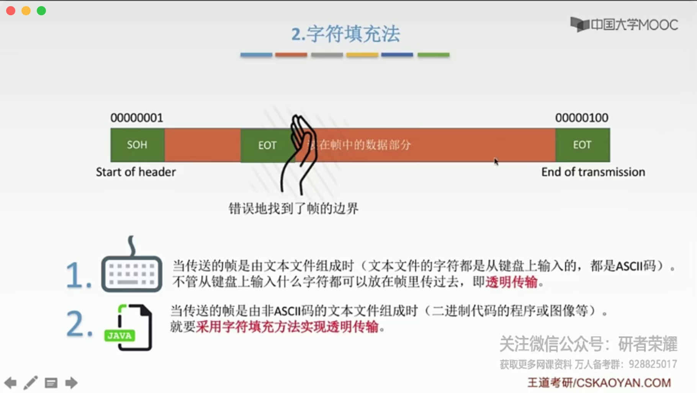
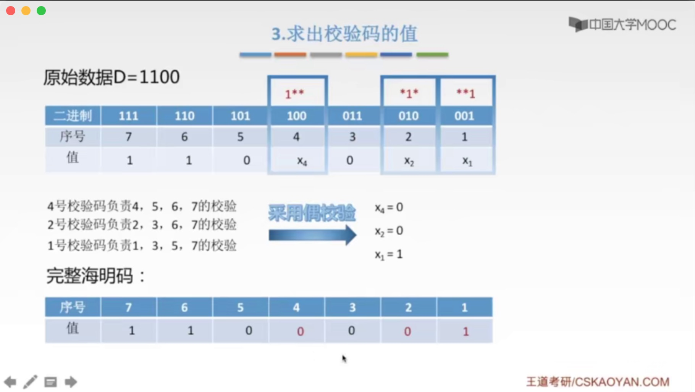
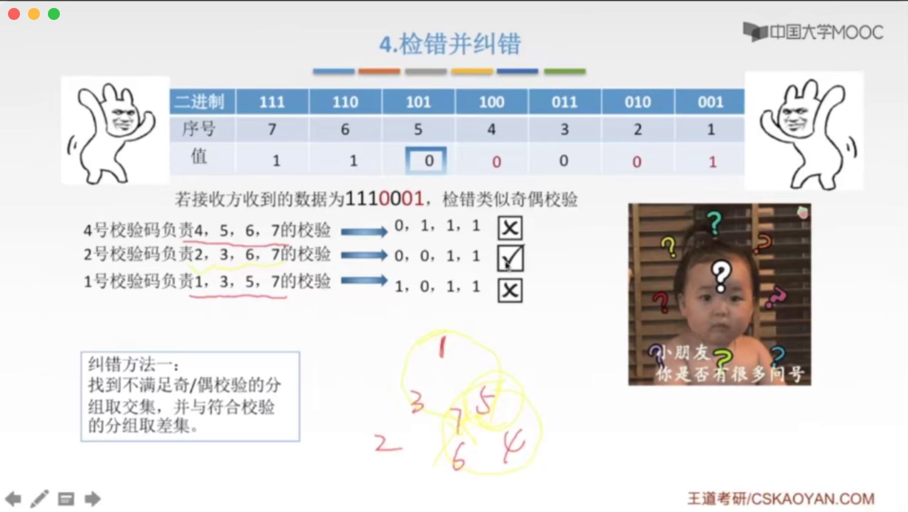
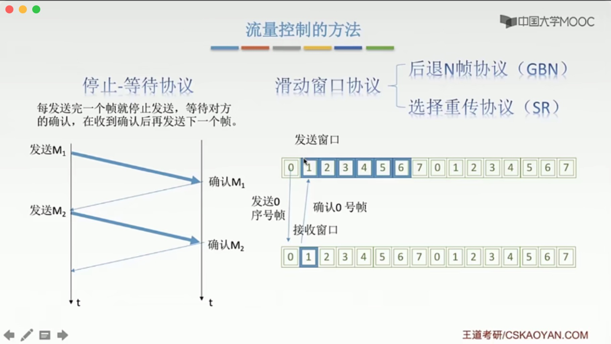
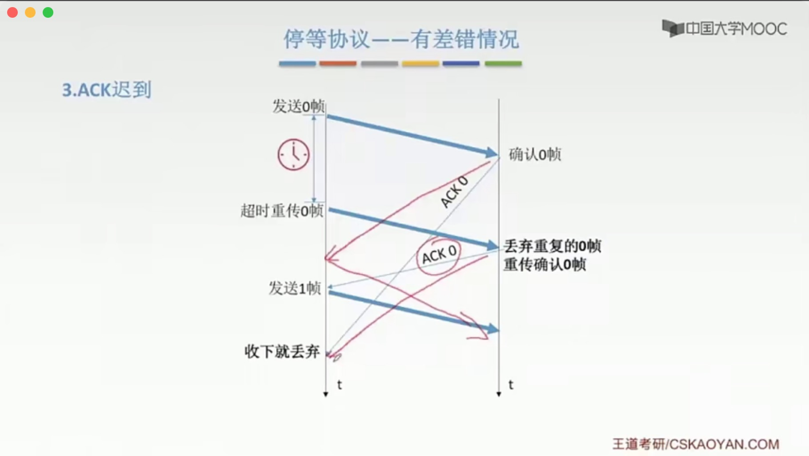
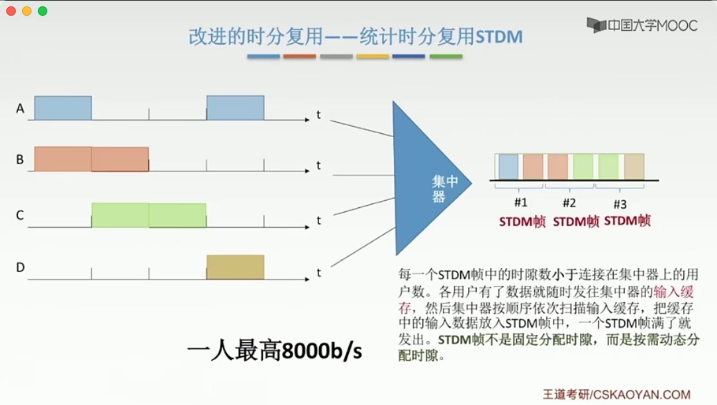
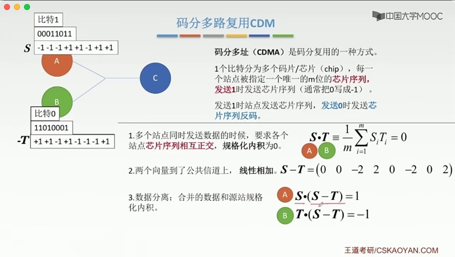

# 导图

# 数据链路层概述

# 封装成帧

## 透明传输

> 1. 透明传输的概念；
> 2. 如何保证透明传输。

## 透明传输在组帧上的应用

### 1.字符计数法

### 2.字符填充法

### 3.*零比特填充法

> 固定首尾：0111 1110
>
> 数据组若遇到连续5个1，后面补充一个0，就不会存在与首尾相同的数据了。

### 4.*违规编码法

> 利用与曼彻斯特编码不同的编码进行区分。

# 差错控制 与 检错编码

## 比特出错

### 检错编码

#### 奇偶校验码

> 特点：
>
> 1. 只能检测奇位错；
> 2. 不具备纠错能力。

#### CRC循环冗余码

> 需要学会做题。
>
> CRC有纠错能力，但链路层只用到了检错能力。

> CRC只是对帧进行丢弃，所以接收端丢失了一个帧，还不是可靠传输，后续还需要进行帧处理。

### 纠错编码

#### 海明码

> 发现错误 -> 找到位置 -> 纠正错误

**与上面两个码区别？**

> 都需要加上校验码
>
> 上面两个码的校验码添加在最低位，而海明码需要计算位置。

**海明距离**

> 为了检测 N 位错，则码距为 N+1；（码距为N，可检测出N-1位的bit错）
>
> 为了纠正 N 位错，则码距位 2N+1。

**1.确定校验码位数r**

**2.确定校验码与数据的位置**

**3.求出校验码的值**

> 使用偶校验
>
> eg：4、5、6、7位置 『1』的个数为偶数个，所以 X4 = 0

**4.检错并纠错**

> 纠错方法一：画图
>
> 纠错方法二：异或（同0异1）

# 流量控制与可靠传输机制⭐

**流量控制在『链路层』与『传输层』都有，他们的区别？**

> 区别一：对象不同
>
> 链路层的流量控制是 点对点的（两个相邻节点之间）；传输层的流量控制是端到端的。
>
> 这里的点是指中间系统（网络层、数据链路层、物理层）；端是指发送端、接收端，有七层。
>
> 区别二：手段不同
>
> 链路层流量控制的手段：接收方接收不下就不回复确认；
>
> 传输层流量控制的手段：接收端给发送端一个窗口公告。

## 链路层流量控制方法

* 停止-等待协议

  > 停止-等待协议 也算特殊的 滑动窗口协议，窗口为1 

* 滑动窗口协议

  * 后退N帧协议（GBN）
  * 选择重传协议（SR）

* 三个协议区别

## 可靠传输、流量控制、滑动窗口三者关系

### 停止-等待协议

**停止-等待协议属于哪一层？**

> 前期链路通讯质量不好，链路层担起可靠传输的职责；
>
> 随着通讯质量的提高，出错少，所以链路层可暂时抛弃"可靠传输"的职责，将"可靠传输"这个职责交给『传输层』，而链路层主要负责"差错控制"，从而提升数据在链路上传输的速度。
>
> 所以不必纠结属于哪一层， 因为最终影响的只是传输数据的对象，在传输层叫分组，在链路层叫帧。本质上都是一样的，都是传送的数据。 

**为什么要有停止-等待协议？**

> 除了 **比特出错**，底层信道还会出现丢包问题。

#### 无差错情况

#### 有差错情况

#### 性能分析

> 优点：简单
>
> 缺点：信道利用率低

#### 信道利用率&信道吞吐率

#### 脑图时刻

### 后退N帧协议（GBN）

**出现的原因？**

> 停止-等待协议太闲了，利用率太低。

#### 流程介绍

**发送**

> ⭐累计确认：表示n之前的帧全部正确！！
>
> 后退N帧：超时后，未确认的帧都需要重传一遍！！

**接收方**

> 严格按顺序接收，若未收到特定的帧，后续帧都丢弃，接收方无需缓存任何失序帧。

**整体流程**

> 接收方就像吃汉堡，必须一层一层吃，丢了一层就不吃，必须等到那一层再继续往下吃。

#### 滑动窗口长度

> 区分 "帧编号" 与 "窗口编号"

#### GBN考研重点⭐

#### 性能分析

#### 考题

#### 脑图时刻

### 选择重传协议（SR）

> SR: Selective Repeat

**出现的原因？**

> GBN的缺点：需要批量重传

#### 流程介绍

#### 滑动窗口长度

#### SR考研重点⭐

#### 习题

#### 脑图时刻

# 传输数据使用的两种链路

## 介质访问控制（广播）

> 介质访问控制：为了解决 **广播** 模式下 **通信干扰** 的问题。

### 静态划分信道 - 信道划分介质访问控制

**什么是多路复用技术？（答案见下图）**

#### 频分多路复用 FDM

> **Frequency Division Multiplexing**

#### 时分多路复用 TDM

> **Time Division Multiplexing**

缺点：等待时间固定，利用率比较低。

##### 统计时分复用 STDM（改进）

> **Statistical Time Division Multiplexing**
>
> 
>
> TDM VS STDM:
>
> ​	若最高速率为8000 bit/s
>
> ​	时分多路复用：平均2000 bit/s
>
> ​	统计时分复用：最高8000 bit/s 

#### 波分多路复用 WDM

> **Wavelength Division Multiplexing**
>
> 只要记住：**光的频分多路复用**， 不常考。

#### 码分多路复用 CDM

> CDM: Code Division Multiplexing
>
> 码分多路复用：将数据扭在一起，到了目的端，再拆分开。

**码分多址 CDMA （Code Division Multiple Access）**

**内积**

> 内积：向量内积
>
> 规格化内积：内积后，除以向量维数。

**CDMA与CSMA混淆？**

> CS游戏是动态的，所以CSMA是 `动态分配信道` 中的 `随机访问介质控制`。

### 动态分配信道

> 也叫：**动态媒体接入控制 、 多点接入**
>
> 特点：信道并非在用户通信时固定分配给用户。

### 动态分配信道 - 轮询访问介质访问控制

### 动态分配信道 - 随机访问介质访问控制

> 特点：所有用户可以随机发送信息。**发送信息时占用全部带宽。**
>
> 又因为所有用户可以随机发送信息，导致可能在同一时间都发送信息，从而发生冲突，所以才有了以下解决冲突的几种协议。

#### ALOHA协议

##### 纯ALOHA协议 

> 

