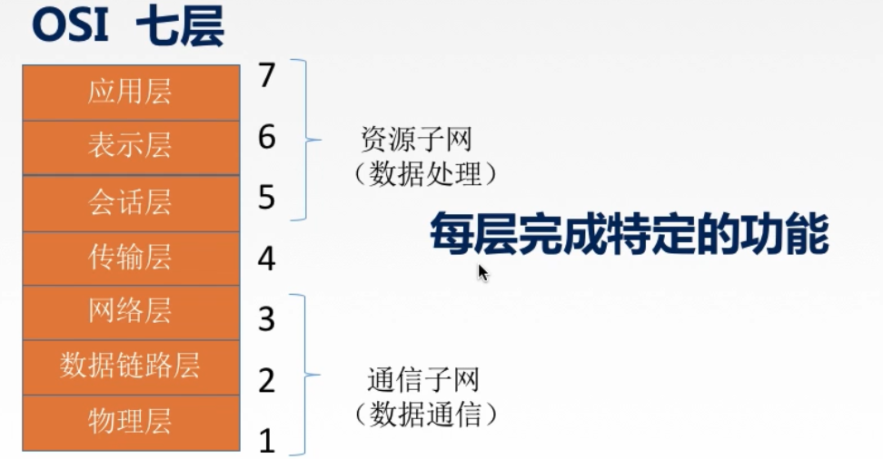

[TOC]

# 1.计算机网络概览

## 1.1 网络与计算机网络

**`计算机网络`**：是一个将分散的、具有独立功能的`计算机系统`，通过`通信设备`与`线路`连接起来，由功能完善的`软件`实现`资源共享`和`信息传递`的系统。

## 1.2 计算机网络的功能

**`数据通信`**：连通性

**`资源共享`**：硬件、软件、数据

**`分布式处理`**：多台计算机各自承担同一工作任务的不同部分（如 `Hadoop`平台）

**`提供可靠性`**：一台计算机宕机，可由其他替代机顶替等

**`负载均衡`**：多台计算机共同提供服务，分担压力

。。。。。。

## 1.3 计算机网络的组成

### 1.3.1 组成部分

`硬件`：主机、链路、路由器、交换机、集线器等

`软件`：运行在主机上的各种应用软件

`协议`：

### 1.3.2 工作方式

`边缘部分`：直接面向用户使用的各种主机

* C/S 方式
* P2P方式

`核心部分`：为边缘部分服务

### 1.3.3 功能组成

`通信子网`：实现数据通信，包含网络层、数据链路层、物理层。由各种传输介质、通信设备、相应的网络协议组成。

`资源子网`：实现资源共享/数据处理，包含应用层、表示层、会话层。是实现资源共享功能的设备和软件的集合。

## 1.4 计算机网络的分类

* `按分布范围`：可分为 广域网【WAN 使用交换技术】、城域网【MAN】、局域网【WAN 使用广播技术】、个人区域网【PAN】

* `按使用者`：可分为 公用网【如中国电信，普通用户只需要缴纳一定费用即可获得使用权限】、专用网【如军队、铁路等的专用网，只有特殊用户方可使用】

* `按交换技术`：电路交换、报文交换、分组交换
* `按拓扑结构`：总线型、星型、环型、网状型【常用于广域网】

* `按传输技术`：
  * 广播式网络：共享公共通信信道
  * 点对点网络：使用分组存储转发和路由选择机制

## 1.5 小结

# 2.计算机网络的标准化工作

​	要实现不同厂商的硬、软件之间相互连通，必须遵从统一的标准

## 2.1 标准的分类

`法定标准`：由权威机构制定的正式的、合法的标准【OSI】

`事实标准`：某些公司的产品在竞争中占据了主流，时间长了，这些产品中的协议和技术就成了标准【TCP/IP】

## 2.2 RFC

## 2.3 标准化工作的相关组织

## 2.4 小结

# 3.计算机网络性能指标

## 3.1 速率

速率即`数据率`或称`数据传输率`或`比特率`，指的是连接在计算机网上的主机在数字信道上传送数据位数的速率。

单位：b/s  kb/s  Mb/s  Gb/s  Tb/s

汉语表示：

* 千	1 kb/s = 10^3 b/s
* 兆    1 Mb/s = 10^6 b/s
* 吉    1 Gb/s = 10^9 b/s
* 太    1 Tb/s = 10^12 b/s

> **`区分`**：存储容量的表示法
>
> 1 KB = 2^10 B = 1024 B = 1024 * 8b
>
> 1 MB = 2^10 KB = 1024 KB
>
> 1 GB = 2^10 MB = 1024 MB
>
> 1 TB = 2^10 GB = 1024 GB

## 3.2 带宽

* `带宽`：原本是指某个信号具有的频带宽度，即最高频率与最低频率之差，单位是赫兹【Hz】

* 在计算机网络中，`带宽`用来表示网络的通信线路传送数据的能力，通常是指单位时间内从网络中的某一点到另一点所能通过的`最高数据率`。单位是`比特每秒`。

## 3.3 吞吐量

【定义】

单位时间内通过某个网络（或信道、接口）的数据量。单位：b/s

【注意】

吞吐量受网络带宽或网络的额定速率的影响

## 3.4 带宽、速率、吞吐量区别

## 3.5 时延

### 3.5.1 定义

数据（报文/分组/比特流）从网络（或链路）的一端传送到另一端所需要的的时间。也叫`延迟`、`迟延`，单位：s

### 3.5.2 分类

**`发送时延(传输时延)`**：从发送分组的第一个比特算起，到该分组的最后一个比特发送完毕需要的时间

`传播时延`：数据在信道上传送数据耗时。取决于电磁波传播速度与链路长度。

`排队时延`：分组在进入路由器后需要在输入队列中排队，确认转发接口后，也需要在输出队列中排队，由此产生排队时延。

`处理时延`：主机或路由器在收到分组时需要花费一定时间进行处理，由此产生处理时延。

## 3.6时延带宽积

**时延带宽积又称为以`比特为单位的链路长度`**，即某段链路现在有多少比特。

## 3.7 往返时延RTT

* 从发送方发送数据开始，到发送方收到接收方的确认，总共经历的时延。

* RTT[Round-Trip Time]主要包含：
  * 往返传播时延 = 传播时延 * 2
  * 末端处理时延

## 3.8 利用率

# 4. 计算机网络分层结构

## 4.1 分层缘由

举个栗子：一台计算机需要向另外一台计算机发送文件

> 发送文件前需要完成的工作：
>
> 1. 发起通信的计算机必须将数据通信的通路进行`激活`
>
> 2. 要告诉网络如何识别目的主机
>
> 3. 发送方要查明接收方是否开机，网络连接是否正常
>
> 4. 发送方需查明，对方计算机中文件管理程序是否已经做好准备
>
> 5. 确保差错和意外可以解决
>
>    。。。

## 4.2 分层原则

> 分层的基本原则：
>
> 1. 各层之间`相互独立`，每层只实现一种相对独立的功能
> 2. 每层之间`界限自然清晰`，易于理解，相互交流尽可能少
> 3. 结构上可分割。每层都采用`最适合的技术`来实现
> 4. 保持下层对上层的独立，`上层单向使用下层提供的服务`
> 5. 整个分层结构应该促进标准化工作

举个栗子：`82年拉菲的快递之旅`

## 4.3 术语解析

> 1. `实体`：第n层的活动元素称为`n层实体`。同一层的实体叫`对等实体`
> 2. `协议`：为进行网络中的`对等实体`数据交换而建立的规则、标准或约定，称为网络协议。【水平意义】
>    * 语法：规定传输数据的格式
>    * 语义：规定所要完成的功能
>    * 同步：规定各种操作的顺序
>
> 3. `接口`（访问服务点SAP）：上层使用下层服务的入口
> 4. `服务`：下层为相邻上层提供的功能调用。【垂直意义】

> 1. `SDU服务数据单元`：为完成用户所要求的功能而应传送的数据
> 2. `PCI协议控制信息`：控制协议操作的信息
> 3. `PDU协议数据单元`：对等层次之间传送的数据单元

## 4.4 小结

1. 网络体系结构是从`功能`上描述计算机网络结构的
2. 计算机网络体系结构（简称网络体系结构）是`分层结构`
3. 每层遵循某个/些`网络协议`以完成本层的功能
4. `计算机网络体系结构`是计算机网络的`各层及其包含的协议`的集合
5. 第n层向第n+1层提供服务时，此服务不仅包含第n层本身的功能，还包含由下层服务提供的功能
6. 仅仅在`相邻之间有接口`，且所提供服务的具体实现细节对上层完全屏蔽

7. 体系结构是`抽象`的，而具体实现是指硬件以及能运行的一些软件

## 4.5 分层结构

### 4.5.1 OSI七层结构

### 4.5.2 OSI参考模型解释通信过程

#### 4.5.2.1 概览

【端到端、点到点】

【数据封装与解封过程】

#### 4.5.2.2 各层介绍

##### 4.5.2.2.1 应用层

* 所有能和用户交互产生网络流量的程序，如 QQ、浏览器等。而无法联网的如记事本，则不属于计算机网络的应用层范畴
* 典型应用层服务：
  * 文件传输【FTP】
  * 电子邮件【SMTP】
  * 万维网【HTTP】

##### 4.5.2.2.2 表示层

> 用于处理在`两个通信系统`中交换的`信息`的表示方式（语法、语义）
>
> `功能一`：数据格式变换
>
> `功能二`：数据加密解密
>
> `功能三`：数据压缩和恢复
>
> 主要协议：JPEG、ASCII

##### 4.5.2.2.3 会话层

> 向表示层`实体/用户进程`提供`连接的建立`、在连接上`有序地传输数据`。这是会话，也是`同步建立`【SYN】
>
> `功能一`：建立、管理、终止会话
>
> `功能二`：使用校验点可以使会话在通信失效时，从`校验想·点/同步点`继续恢复通信，实现`数据同步`。适用于传输大文件
>
> 主要协议：ADSP、ASP

##### 4.5.2.2.4 传输层

> 负责主机中两个进程的通信，即`端到端`的通信。传输单位是报文段或用户数据报
>
> `功能一`：可靠传输【确认重传】、不可靠传输【最大努力交付】
>
> `功能二`：差错控制
>
> `功能三`：流量控制【控制发送速率】
>
> `功能四`：复用分用
>
> * 复用：多个应用层进程可同时使用下面运输层的服务
> * 分用：运输层把收到的信息分别交付给上面应用层中相应的进程
>
> 
>
> 主要协议：TCP、UDP

##### 4.5.2.2.5 网络层

> 主要任务是，把`分组`从源端传到目的端，为分组交换网上的`不同主机`提供`通信服务`。网络层传输单位是`数据报`。
>
> `功能一`：路由选择【选择最佳路径】
>
> `功能二`：流量控制
>
> `功能三`：差错控制
>
> `功能四`：拥塞控制
>
> ​	拥塞控制：若所有节点都来不及接受分组，而要丢弃大量分组的话，网络就处于拥塞状态。因此要采取一定措施缓解这种拥塞。
>
> 
>
> 主要协议：IP、IPX、ICMP、IGMP、ARP、RARP、OSPF

##### 4.5.2.2.6 数据链路层

> 主要任务是把`网络层传下来的数据报`组装成`帧`。数据链路层的传输单位是`帧`。
>
> `功能一`：成帧【定义帧的开始和结束】
>
> `功能二`：差错控制：`帧错 + 位错`
>
> `功能三`：流量控制
>
> `功能四`：访问（接入）控制【控制对信道的访问】
>
> 
>
> 主要协议：SDLC、HDLC、PPP、STP

##### 4.5.2.2.7 物理层

> 主要任务是在`物理媒体`上实现比特流的`透明传输`。物理层传输的单位是`比特`。
>
> `透明传输`：不管所传数据是什么样的比特组合，都应当能够在链路上传送
>
> 
>
> `功能一`：定义接口特性
>
> `功能一`：定义传输模式【单工、半双工、双工】
>
> `功能一`：定义传输速率
>
> `功能一`：比特同步
>
> `功能一`：比特编码
>
> 
>
> 主要协议：Rj45、802.3

### 4.5.3 TCP/IP参考模型

#### 4.5.3.1 对比

> 相同点：
>
> * 都分层
> * 都基于独立的协议栈的概念
> * 都可以实现异构网络的互连

> 不同点：
>
> 1. OSI定义三点：服务、协议、接口
> 2. OSI先出现，参考模型先于协议发明，不偏向特定协议
> 3. TCP/IP设计之初考虑到`异构网络互连`的问题，故将IP作为重要的层次
>
> 
>
> `面向连接`【分三个阶段】：
>
> * 建立连接【发出一个建立连接的请求，只有在连接建立成功之后，才能开始数据传输】
> * 数据传输
> * 释放连接【当数据传输完毕，就必须释放连接】
>
> 
>
> `无连接`：没有面向连接这么多的阶段，无连接直接进行数据传输

### 4.5.4 五层参考模型

#### 4.5.4.1 介绍

> `应用层`：支持各种网络应用【FTP、SMTP、HTTP】
>
> `传输层`：进程-进程的数据传输【TCP、UDP】
>
> `网络层`：源主机到目的主机的数据分组、路由选择和分组转发【IP、ICMP、OSPF】
>
> `数据链路层`：把网络层传下来的数据报组装成帧【Ethernet、PPP】
>
> `物理层`：比特传输

#### 4.5.4.2 数据的封装与解封

# 5.小结

