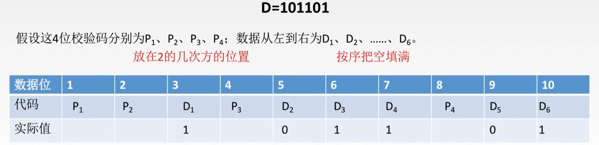
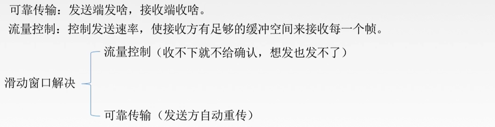
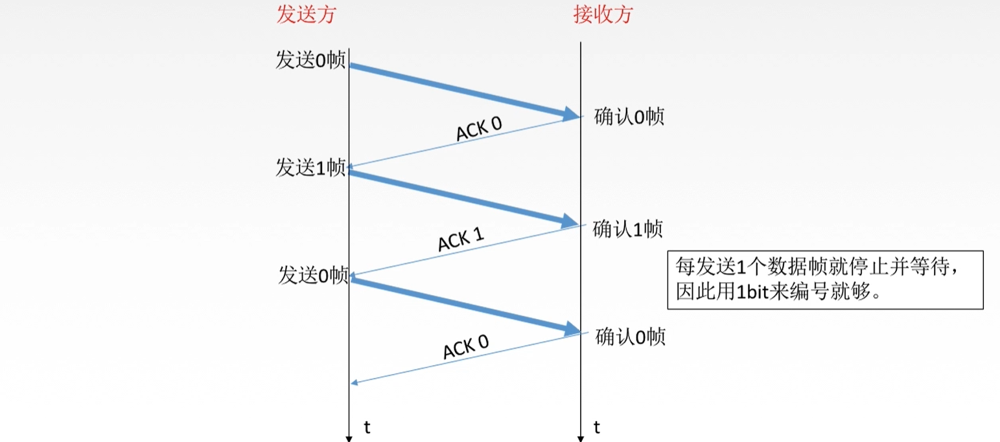
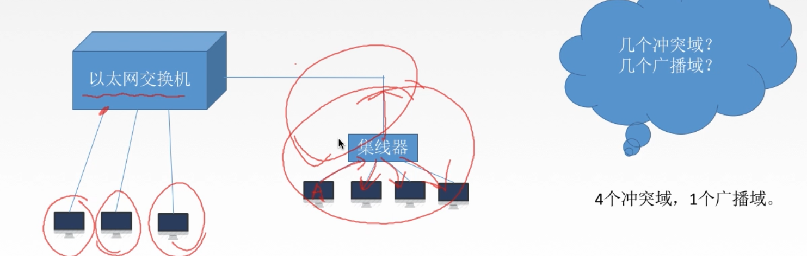

[TOC]

# 1. 基本概念

`结点`：主机、路由器

`链路`：网络中两个结点之间的**物理通道**，链路的传输介质主要有双绞线、光纤和微波。分为有线链路、无线链路

`数据链路`：网络中两个结点之间的**逻辑通道**，把实现控制数据传输协议的硬件和软件加到链路上就构成数据链路

`帧`：链路层的协议数据单元，封装网络层数据报

> `数据链路层`负责从一个结点(通过一条链路)向另一个物理链路直接相连的相邻结点传送数据报

# 2. 功能概述

​	在物理层提供的服务的基础上`向网络层提供服务`，其`最基本的服务`是将源自网络层的数据`可靠地`传输到相邻结点的目标机网络层。其`主要作用`是**加强物理层传输原始比特流的功能**，将物理层提供的可能出错的物理连接改造成为`逻辑上无差错的数据链路`，使之对网络层表现为一条无差错的链路。

`功能一`：为网络层提供服务。无确认无连接服务、有确认无连接服务、有确认面向连接服务。(有连接一定有确认)

`功能二`：链路管理，即连接的建立、维持、释放【用于面向连接的服务】

`功能三`：组帧

`功能四`：流量控制【限制发送方】

`功能五`：差错控制【帧错/位错】

# 3. 封装成帧

​	在一段数据的前后部分添加`首部和尾部`，构成一个帧。接收端在收到物理层上交的比特流后，就能根据首部和尾部的标记，从收到的比特流中`识别帧的开始和结束`。

​	首部和尾部包含许多的控制信息，他们的一个重要作用是`帧定界`【确定帧的界限】

​	`帧同步`：接收方应当能从接收到的二进制比特流中区分出帧的开始和终止

​	`组帧的四种方法`：字符计数法、字符（节）填充法、零比特填充法、违规编码法

# 4. 透明传输

## 4.1 简介

## 4.2 组帧方法

### 4.2.1 字符计数法

`缺点`：当首个计数字段出错时，会导致后续所有帧的识别错误

### 4.2.2 字符（节）填充法

**【此时有可能发生以下错误】**

**【解决方案】**

### 4.2.3 零比特填充法

### 4.2.4 违规编码法

# 5. 差错控制

## 5.1 差错来源

> `为什么要在链路层进行差错控制`：当两台主机通信需要经过一台交换机和20台路由器时，若经过第一个路由器时帧已经发生了错误，则此时路由器的链路层可以发现错误并丢弃，减少了错误帧继续传递所造成的资源浪费。
>
> 

## 5.2 比特错误

> 编码 VS 编码
>
> `数据链路层编码`和`物理层的数据编码与调制`不同。
>
> * 物理层编码针对的是`单个比特`，解决传输过程中比特的同步等问题，如曼彻斯特编码。
> * 数据链路层的编码针对的是`一组比特`，通过冗余码的技术实现一组二进制比特串在传输过程中是否出现了差错。
>
> 
>
> `冗余编码`：在数据发送之前，先按某种关系附加上一定的冗余位，构成一个符合某一规则的码字后再发送。当要发送的有效数据变化时，相应的冗余位也随之变化，使码字遵从不变的规则。接收端根据收到码字是否仍符合原规则来判断是否出错。

### 5.3.1 检错编码之奇偶校验码

### 5.3.2 检错编码之CRC循环冗余码

【冗余码计算】

【接收端检错】

【注意】

### 5.3.3 纠错编码--海明码

`海明码`：可以发现`双比特错误`，只能纠正`单比特错误`

工作原理：动一发而牵全身

工作流程：

计算过程：

【确定校验码位数r】

【确定检验码和数据的位置】

【求出校验码的值】

【检错并纠错】

# 6. 流量控制、可靠传输、滑动窗口

## 6.1 流量控制

### 6.1.1 缘由

​	发送端`较高的发送速度`和接收端`较低的接收能力`的不匹配，会造成传输出错，因此流量控制也是数据链路层一项重要工作。

> `数据链路层流量控制`与`传输层流量控制`区别：
>
> * 数据链路层的流量控制是点对点的，而传输层的流量控制是端到端的
> * 数据链路层流量控制的手段：接收方收不下就不回复确认
> * 传输层流量控制手段：接收端给发送端一个窗口公告

### 6.1.2 流量控制的方法

> 【各协议发送窗口与接收窗口的大小】
>
> `停止-等待协议`：发送窗口大小=1， 接收窗口大小=1
>
> `后退N帧协议(GBN)`：发送窗口大小>1，接收窗口大小=1
>
> `选择重传协议(SR)`：发送窗口大小>1，接收窗口大小>1
>
> 
>
> 在数据链路层，窗口大小是固定的。

## 6.2 流量控制之停止-等待协议

### 6.2.1 为什么需要该协议

1. 为了实现流量控制

2. 除了比特出差错，底层信道还会出现丢包问题

   `丢包`：由物理线路故障、设备故障、病毒攻击、路由信息错误等原因导致的数据包的丢失

### 6.2.2 研究的前提

* 虽然现在常用全双工通信方式，但是为了讨论的方便，仅考虑一方为发送方，一方为接收方的情况。
* 由于是在讨论可靠传输的原理，故暂不考虑数据是在哪一层次上传送的
* `停止-等待`就是每发送完一个分组就停止发送，等待对方确认后再发送下一个分组

### 6.2.3 停止-等待协议的应用情况

#### 6.2.3.1 无差错情况

#### 6.2.3.2 有差错情况

1. 数据帧丢失或者检测到帧出错

2. ACK丢失

3. ACK迟到

#### 6.2.3.3 性能分析

1. `停止-等待协议`简单易操作
2. 信道利用率太低

> **信道利用率：**
>
> 

## 6.3 流量控制之后退N帧协议【GBN】

### 6.3.1 滑动窗口

### 6.3.2 GBN发送方必须响应的三件事

【上层的调用】

​	上层要发送数据时，发送方先检查发送窗口是否已满。如果`未满`，则产生一个帧并将其发送；若果`窗口已满`，发送方只需将数据返回给上层，暗示上层窗口已满，上层等会再发。（实际实现中，发送方法可以缓存这些数据，窗口不满时再发送帧）。

【收到了一个ACK】

​	GBN协议中，对n号帧的确认采用`累积确认`的方式，表明接收方已经收到n号帧和它之前的全部帧。

【超时事件】

​	协议的名字为后退N帧/回退N帧，来源于`出现丢失帧`和`帧的时延过长`时，发送方的行为。就像在`停止-等待协议`中一样，定时器将再次用于恢复数据帧或确认帧的丢失。如果出现超时发送方将重传所有已发送但未被确认的帧。

> ​	`接收方按帧编号顺序接收帧，当某一编号帧无法收到时，将一直等待该帧，其后的帧直接丢弃。发送方经过一定时间后，将未接收确认的帧重传。`

### 6.3.3 GBN接收方的任务

1. 如果正确收到n号帧并且按序，接收方将为n帧发送一个ACK，并将该帧中是数据部分交付给上一层
2. 其余情况都丢弃帧，并为最近按序接收的帧重新发送ACK。接收方无需缓存任何失序帧，只需要维护一个信息：`expectedseqnum【下一个按序接收的帧序号】`

> 运行中的GBN：

### 6.3.4 滑动窗口长度

> 如：采用2个比特对帧编号，发送窗口大小为4【大于上述给定范围】，若第一次发送4个帧全部丢失，则发送发重传，此时接收端无法确认此时的4个帧是新帧还是旧帧。

【习题】

### 6.3.5 GBN性能分析

1. 因连续发送数据帧而提高了信道利用率
2. 在重传时必须把原来已经正确传送的数据帧重传，使得传送效率降低
3. 基于以上描述，引出`选择重传协议`

# 7. 信道划分介质访问控制

## 7.1 传输数据使用的两种链路

`点对点链路`：两个相邻节点通过一个链路相连，没有第三者。【应用：PPP协议，常用于`广域网`】

`广播式链路`：所有主机共享通信介质。【应用：早期的总线以太网、无限局域网、常用于`局域网`】

​					【典型拓扑结构：总线型、星型（逻辑总线型）】

## 7.2 介质访问控制

`介质访问控制`的内容就是，采取一定的措施，使得两对节点之间的通信不会发生互相干扰的情况。

## 7.3 信道划分介质访问控制

​	`信道划分介质访问控制`：将使用介质的每个设备与来自同一信道上的其他设备的**通信隔离开**，把`时域和频域资源`合理地分配给网络上的设备。

​	`多路复用技术`：把多个信号组合在一条物理信道上进行传输，使得多个计算机或终端设备`共享信道资源`，提高信道利用率。

## 7.4 静态划分信道

### 7.4.1 频分多路复用【FDM】

### 7.4.2 时分多路复用 【TDM】

### 7.4.3 统计时分复用【STDM】

`改进的时分复用`

> 若线路传输速率为`8000bit/s`，则对于TDM来说，每个用户【A、B、C、D】只能得到`2000bit/s`；而对于STDM，每个用户最高可以得到`8000bit/s`。

### 7.4.4 波分多路复用【WDM】

## 7.5 动态划分信道

### 7.5.1 ALOHA协议

`【纯ALOHA协议】`

​	不监听信道、不按时间槽发送、随机重发。

`【时隙ALOHA协议】`

​	把时间分成若干个相同的时间片，所有用户在时间片开始时刻同步接入网络信道，若发生冲突，则必须等到下一个时间片开始时刻再发送。`控制想发就发的随意性`

【区别】

### 7.5.2 CSMA协议

#### 7.5.2.1 1-坚持CSMA

#### 7.5.2.2 非坚持CSMA

#### 7.5.2.3 p-坚持CSMA

#### 7.5.2.4 对比

### 7.5.3 CSMA/CA协议

#### 7.5.3.1 介绍

#### 7.5.3.2 工作原理

#### 7.5.3.3 CSMA/CD与CSMA/CA对比

### 7.5.4 CSMA/CD协议

#### 7.5.4.1 介绍

#### 7.5.4.2 传播时延对载波监听的影响

#### 7.5.4.3 碰撞后的重传时机

【例题】

#### 7.5.4.4 最小帧长问题

`为了使CSMA/CD协议能发挥作用，即在帧发送完毕之前就可以检测到碰撞，需要定义一个最小帧长`

【最小帧长】

# 8. 轮询访问介质访问控制

## 8.1 对比

## 8.2 轮询协议

## 8.3 令牌传递协议

# 9. 局域网基本概念和体系结构

## 9.1 局域网

### 9.1.1 局域网拓扑结构

### 9.1.2 局域网传输介质

### 9.1.3 局域网介质访问控制方法

### 9.1.4 无限局域网划分

### 9.1.5 IEEE 802标准

[IEEE 802现有标准](https://baike.baidu.com/item/IEEE%20802/6808672?fr=aladdin#3_2)

### 9.1.6 MAC子层与LLC子层

## 9.2 以太网

### 9.2.1 以太网概述

> `以太网提供无连接、不可靠的服务`
>
> 

### 9.2.2 以太网传输介质与拓扑结构的发展

### 9.2.3 10 BASE-T以太网

### 9.2.4 适配器与MAC地址

### 9.2.5 以太网MAC帧

### 9.2.6 高速以太网

## 9.3 IEEE 802.11 无限局域网

### 9.3.1 IEEE 802.11

### 9.3.2 802.11的MAC帧头格式

【四种格式比对】

### 9.3.3 无线局域网分类

#### 9.3.3.1 有固定基础设施的无线局域网

#### 9.3.3.2 无固定基础设施无线局域网的自组织网络

# 10. PPP协议与HDLC协议

## 10.1 广域网

`广域网强调资源共享，局域网强调数据传输!`

## 10.2 PPP协议

### 10.2.1 特点

### 10.2.2 需满足的要求

### 10.2.3 无需满足的要求

* 无需纠错
* 无需流量控制
* 无需序号
* 不支持多点线路

### 10.2.4 三个组成部分

### 10.2.5 状态图

### 10.2.6 帧格式

## 10.3 HDLC协议

### 10.3.1 简介

### 10.3.2 HDLC的站

### 10.3.3 帧格式

## 10.4 PPP协议与HDLC协议对比

# 11. 链路层设备

## 11.1 物理层扩展以太网

`主机与集线器之间的距离超过100m后，失帧会变得非常严重`：

`为了实现远距离通信，需要扩展以太网`：

1. 把物理连接线路改为光纤

2. 使用主干集线器

​	可以形成更大的冲突域

> 缺点：
>
> 1. 发送冲突概率变高
> 2. 链路通信效率降低

## 11.2 链路层扩展以太网

### 11.2.1 网桥

#### 11.2.1.1 简介

#### 11.2.1.2 透明网桥

#### 11.2.1.3 源路由网桥

### 11.2.2 以太网交换机【多接口网桥】

> 以太网交换机的两种交换方式：
>
> 

## 11.3 冲突域和广播域

【例题】

