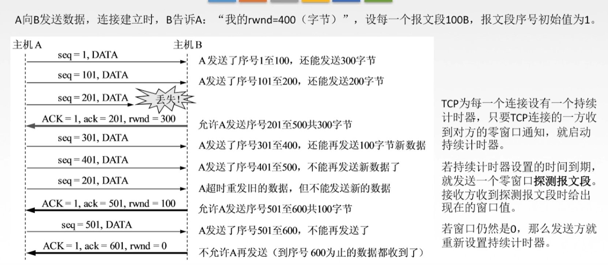

[TOC]

# 1. 传输层概述

## 1.1 介绍

## 1.2 传输层的两个协议

* `面向连接的传输控制协议TCP`：传送数据之前必须建立连接，数据传送结束后要释放连接。不提供广播或多播服务。由于TCP要提供可靠的面向连接的传输服务，因此不可避免增加了许多开销：**确认、流量控制、计时器及连接管理等**。【可靠、面向连接、时延大、适用于大文件】

* `无连接的用户数据报协议UDP`：传送数据之前不需要建立连接，收到UDP报文后也不需要给出任何确认。【不可靠、无连接、时延小、适用于小文件】

## 1.3 传输层的寻址与端口

`复用`：应用层所有的应用进程都可以通过传输层再传输到网络层

`分用`：传输层从网络层收到数据后交付给指明的应用进程

`端口【逻辑端口/软件端口】`：是传输层的SAP，标识主机的应用进程

> 端口号只有本地意义，在因特网中不同计算机的相同端口号是没有联系的
>
> 端口号长度为16bit，能表示65536个不同的端口号
>
> 
>
> 

# 2. UDP协议

`用户数据报协议`

## 2.1 UDP概述

## 2.2 UDP首部格式

### 2.2.1 图解

### 2.2.2 UDP校验

# 3. TCP协议

## 3.1 TCP协议特点

## 3.2 TCP报文段首部格式

## 3.3 TCP连接管理

### 3.3.1 TCP的连接建立

### 3.3.2 SYN洪泛攻击

[解决办法：SYN cookie](https://baike.baidu.com/item/syn%20cookie/6898884?fr=aladdin)

### 3.3.3 TCP连接的释放

### 3.3.4 TCP可靠传输

#### 3.3.4.1 校验

​	与UDP校验一样，增加伪首部

#### 3.3.4.2 序号

#### 3.3.4.3 确认

#### 3.3.4.4 重传

### 3.3.5 TCP流量控制

### 3.3.6 TCP拥塞控制

#### 3.3.6.1 介绍

#### 3.3.6.2 四种算法

##### 慢开始和拥塞避免

##### 快重传和快恢复

