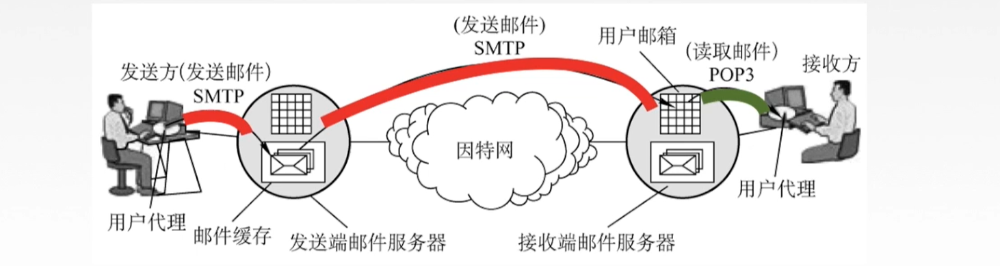
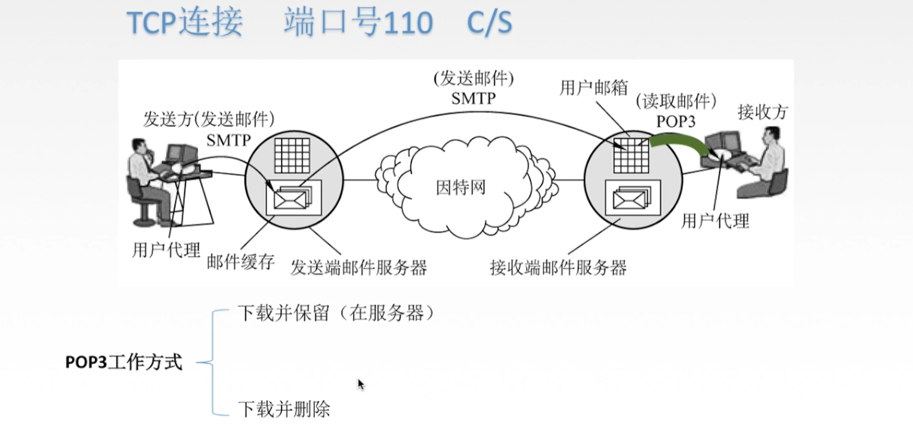

[TOC]

# 1. 应用层概述

# 2. 网络应用模型

## 2.1 客户服务器（C/S）模型

## 2.2 P2P模型

# 3. 域名解析系统DNS

## 3.1 域名

## 3.2 域名服务器

## 3.3 域名解析过程

# 4.文件传输协议FTP

## 4.1 FTP与TFTP

## 4.2 FTP服务器与客户端

## 4.3 FTP工作原理

# 5. 电子邮件

## 5.1 电子邮件系统概述

### 5.1.2 信息格式

### 5.1.3 组成结构

## 5.2 简单电子邮件传送协议SMTP

### 5.2.1 介绍

### 5.2.2 通信过程

### 5.2.3 MIME

## 5.3 邮局协议POP3

## 5.4 网际报文存取协议IMAP

## 5.5 基于万维网的电子邮件

# 6. 万维网和HTTP协议

## 6.1 万维网概述

## 6.2 超文本传输协议HTTP

### 6.2.1 介绍

### 6.2.2 HTTP特点

### 6.2.3 HTTP协议的连接方式

### 6.2.4 报文结构

