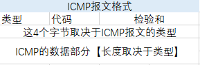
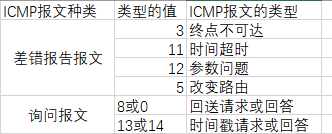
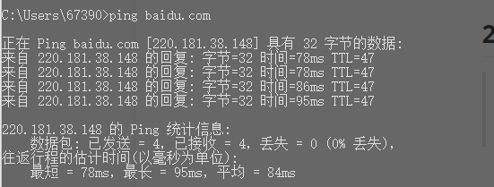
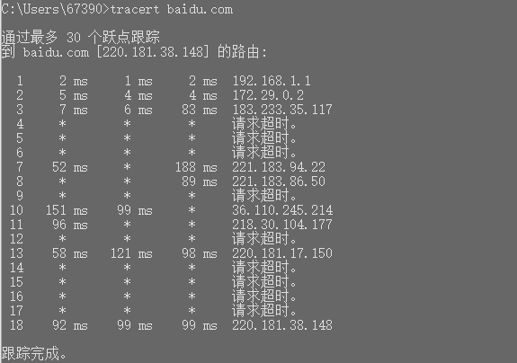

# ping原理

## 1. 网际控制报文协议ICMP

### 1.1 简介

> * 有效转发IP报文和提高交付成功的机会
>
> * ICMP报文作为IP报文的数据部分被发送出去，属于网络层协议
>
> * ICMP报文格式：
>
>   
>
> * ICMP允许主机或路由器报告差错情况和提供有关异常情况的报告

### 1.2 种类

> * ICMP报文分为两种：ICMP差错报告报文 和 ICMP询问报文
>
> * 几种常用的报文类型：
>
>   
>
> * `代码字段`：进一步区分某种类型的几种不同的情况
> * `检验和字段`：检验整个报文
> * IP报文首部的检验和字段，并不检验数据部分，因此，经过IP报文传输并不保证ICMP报文没有差错

### 1.3 差错报告报文

> * 终点不可达：当路由器或者主机不能交付数据报时就向源点发送终点不可达报文
> * 时间超时：
>   * 当路由器或主机收到生存时间为 0 的数据报时，会丢弃数据报并向源点发送时间超时报文
>   * 当终点在规定时间内不能接收到全部的数据报片时，会丢弃所有已收到的数据报片并向源点发送时间超时报文
> * 参数问题：当路由器或者主机收到的数据报的首部中有的字段不正确时，丢弃数据报并向源点发送参数问题报文
> * 改变路由【重定向】：路由器把改变路由报文发送给主机，让主机知道下一次应该将数据报发送给另外的路由器【可通过更好的路由】

### 1.4 不应该发送ICMP差错报告报文的情况

> * 对ICMP差错报告报文，不再发送ICMP差错报告报文
> * 对第一个数据报片的所有后续报片，都不发送ICMP差错报告报文
> * 对具有多播地址的数据报，都不发送ICMP差错报告报文
> * 对具有特殊地址的数据报【127.0.0 或 0.0.0.0】，不发送ICMP差错报告报文

### 1.5询问报文

> * 回送请求和回答报文：用来测试目的站是否可达及了解其相关信息。ICMP回送请求报文由主机或者路由器向特定目的主机发出的询问，收到此报文的木器主机必须给源主机或路由器发送ICMP回送回答报文。
> * 时间戳请求和回答报文：用于时钟同步和时间测量。ICMP时间戳请求报文是请求某台主机或路由器回答当前的日期和时间。在ICMP时间戳回答报文中有一个32位的字段，其中写入的整数代表从1900年1月1日到当前时刻一共有多少秒。

## 2. ICMP的应用-PING

> * ICMP的一个重要的应用就是`分组网间探测PING`，用来测试两台主机之间的连通性。
> * PING使用了ICMP回送请求和回答报文，是应用层直接使用网络层ICMP的一个例子，没有通过传输层的TCP或UDP。

## 3. PING测试

> * 一共发送四个ICMP回送请求报文
> * 由于往返的ICMP报文上都有时间戳，因此很容易计算出往返时间

## 4. 拓展

### 4.1 tracert

> * ICMP的另外一个应用
> * 用来跟踪一个分组从源点到终点的路径
> * tracert命令从源主机向目的主机发送一连串的IP数据报，数据报中封装的是无法交付的UDP用户数据报【使用了非法的端口号】。
> * 第一个数据报P１的生存时间TTL设置为1，当P１到达路径上的第一个路由器R１时，路由器R１先收下它，接着把TTL值减去1。由于TTL等于0，R１把P１丢弃，并向源主机发送一个**ICMP时间超时差错报告报文**
> * 源主机接着发送第二个数据报P２，并把TTL设置为２.当P2到达R２时，TTL为0.　此时发回**ICMP时间超时差错报文**。
> * 如此继续下去，直到最后一个数据报到达目的主机，TTL为1，主机不转发数据报也不把TTL减1。但因IP数据报中封装的是无法交付的运输层UDP报文，因此目的主机要向源主机发送**ICMP终点不可达差错报文**
> * 如此，源主机达到了自己的目的，因为这些路由器和最后的目的主机发来的ICMP报文正好给出了源主机想知道的路由信息－－到达目的主机所经过的路由器的IP地址，以及到达其中的每一个路由器的往返时间。

### 4.2 测试

> * 图中每一行有三个时间出现，是因为对应与每一个TTL值，源主机要发送三次相同的IP数据报
> * 原则上，IP数据报经过的路由器越多，所花费的时间也会越多。但有时正好相反，这是因为互联网的拥塞程度随时都在变化，也很难预料到。
> * 因此完全有可能经过更多的路由器反而花费的时间更少