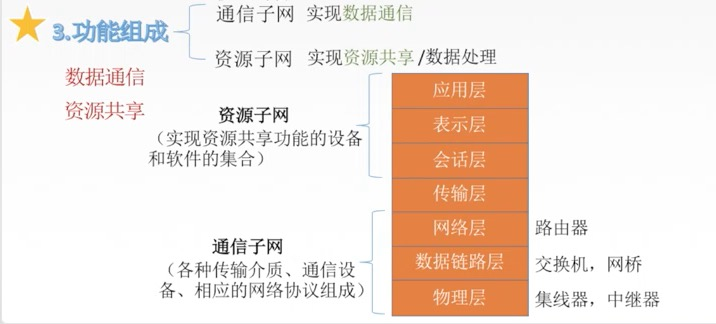
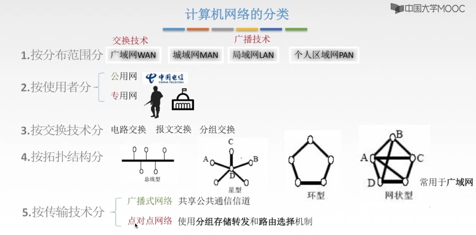
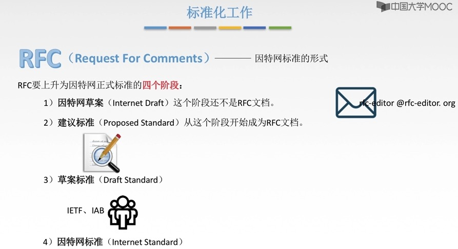
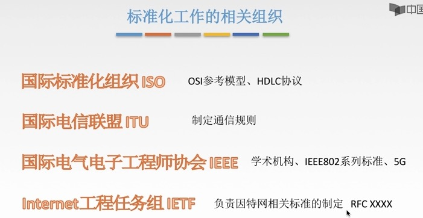
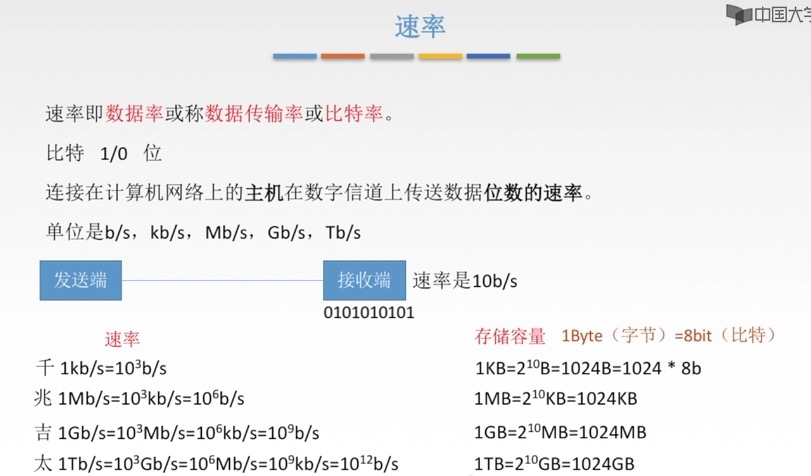
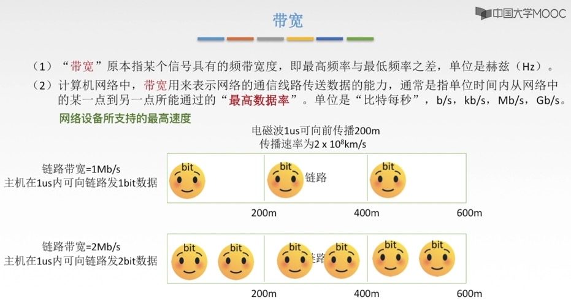
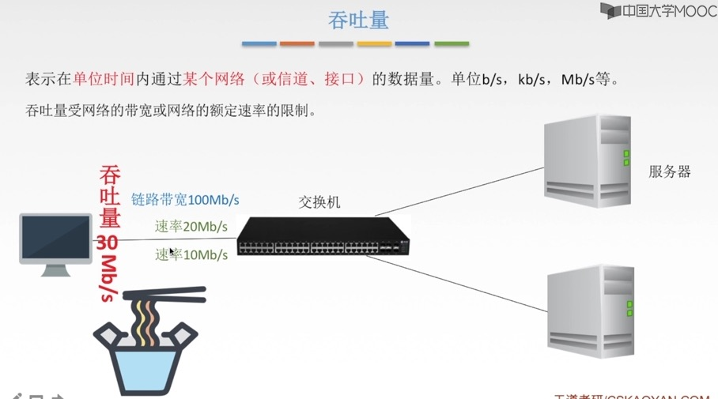
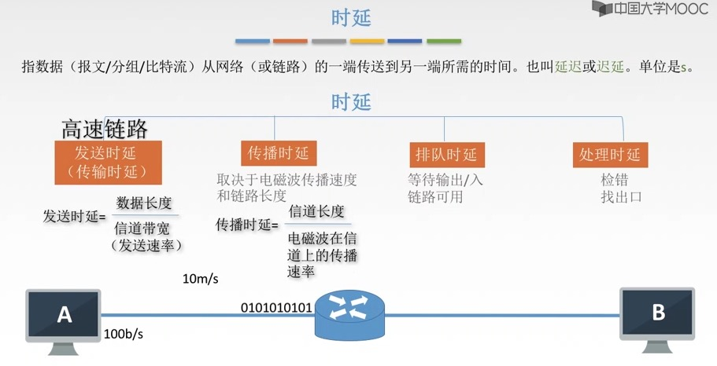
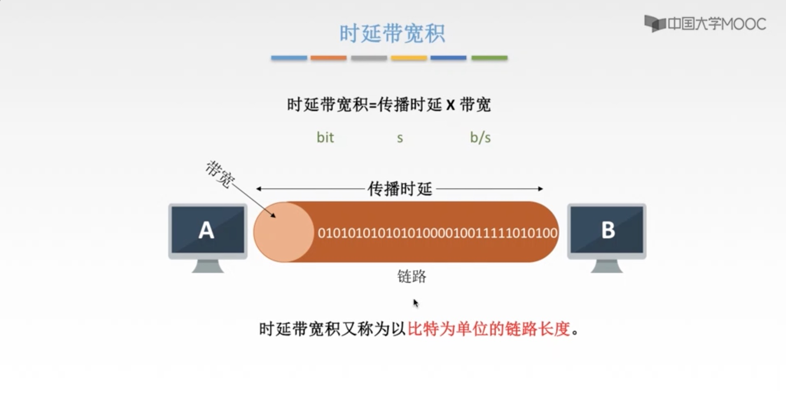

大纲：

1. 掌握计算机网络的<font color=red>基本概念、基本原理和基本方法</font>；
2. 掌握计算机网络的<font color=green>体系结构、典型的网络协议</font>，了解典型的<font color=green>网络设备</font>的组成与特点，理解<font color=green>网络设备</font>的工作原理；
3. 能够运用计算机网络知识进行<font color=blue>网络系统的分析、设计与应用</font>。


# 第一章、计算机网络体系结构

## 常识

ISP（Internet Service Provider）：互联网服务提供商


计算机网络组成：硬件 + 软件 + 协议


工作方式：

* 边缘部分：用户直接使用的
  * C/S 、B/S （Client/Server、Browser/Servier）
  * P2P（peer to peer）
* 核心部分：为边缘部分服务的，如：路由器等







电路交换：占着专线，其他人插入不进来。

报文交换、分组交换：存储转发，一段一段的转发。


标准化工作







## 性能指标

* 速率
* 带宽
* 吞吐量
* 时延
* 时延带宽积
* 往返直接RTT
* 利用率





1.1、单位转换

>在计算机科学中，bit是表示信息的最小单位，叫做二进制位；一般用0和1表示。
>Byte叫做字节，由8个位（8bit）组成一个字节(1Byte)，用于表示计算机中的一个字符

```
1T  = 1024G 
1G  = 1024M 
1M  = 1024KB 
1KB = 1024B
1B  = 1Byte = 8 bit 
```


1.2、【疑问】电脑硬盘500G，打开却只有480G ？？

* G、M、K之间的进制是1024，这是由于2进制的原因而定义的。而在IT产品行业多数是按1000进制计算，即1GB＝1000MB，这就是我们常看到的硬盘格式化以后为什么缩水了的原因，且硬盘越大差别越大。因为厂家是按1GB＝1000MB计算的硬盘容量，而格式化时系统是按1GB＝1024MB计量的。


1.3、带宽与网速

[网速单位换算](https://zhidao.baidu.com/question/495451667151530524.html?qbl=relate_question_0&word=%CD%F8%C2%E7M%D7%AA%BB%BB)

>在计算机网络或者是网络运营商中，一般，宽带速率的单位用bps(或b/s)表示；bps表示比特每秒即表示每秒钟传输多少位信息，是bit per second的缩写。在实际所说的1M带宽的意思是1Mbps（是兆比特每秒Mbps不是兆字节每秒MBps）。


* 线路单位是bps，表示bit(比特)/second(秒)
* 用户在网上下载时显示的速率单位往往是Byte(字节)/s(秒)，注意是大写字母B

```
带宽16Mbps = 16/8MBps = 2MBps (理论下载速度)
```




```
1s = 1000ms = 1000,000us
```







```
高速链路：提高了发送，不改变传播。
```





往返时延


## ISO/OSI、TCP/IP、5层模型


* OSI模型
  * 应用层
  * 表示层
  * 会话层
  * 传输层
  * 网络层
  * 数据链路层
  * 物理层


